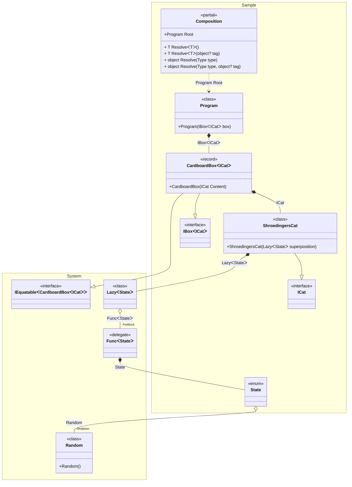
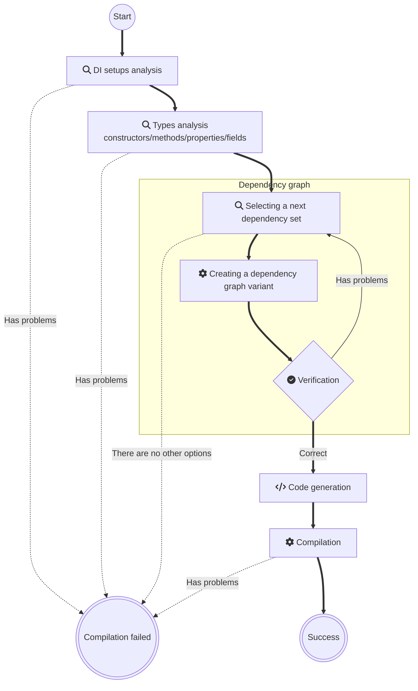

# Pure DI for .NET

<a href="https://t.me/pure_di"></a>
[](https://www.nuget.org/packages/Pure.DI)
[](LICENSE)


**Pure.DI is a compile-time dependency injection (DI) code generator**. _Supports .NET starting with [.NET Framework 2.0](https://www.microsoft.com/en-us/download/details.aspx?id=6041), released 2005-10-27, and all newer versions._

## Usage Requirements

- **[.NET SDK 6.0.4+](https://dotnet.microsoft.com/download/dotnet/6.0)**  
  Required for compilation. Projects can target older frameworks (e.g., .NET Framework 2.0).
- **[C# 8+](https://docs.microsoft.com/en-us/dotnet/csharp/whats-new/csharp-version-history#c-version-80)**  
  Only required for projects using the Pure.DI source generator. Other projects support any C# version.

## Key Features

### ✔️ Zero Overhead
Pure.DI is a .NET code generator designed to produce clean, efficient dependency injection logic. By leveraging basic language constructs, it generates straightforward code indistinguishable from manual implementation—essentially composing objects through nested constructor invocations. Unlike traditional DI frameworks, Pure.DI avoids reflection and dynamic instantiation entirely, eliminating performance penalties associated with runtime overhead.
### ✔️ Compile-Time Validation
All analysis of object, constructor, and method graphs occurs at compile time. Pure.DI proactively detects and alerts developers to issues such as missing dependencies, cyclic references, or dependencies unsuitable for injection—ensuring these errors are resolved before execution. This approach guarantees that developers cannot produce a program vulnerable to runtime crashes caused by faulty dependency wiring. The validation process operates seamlessly alongside code development, creating an immediate feedback loop: as you modify your code, Pure.DI verifies its integrity in real time, effectively delivering tested, production-ready logic the moment changes are implemented.
### ✔️ Works everywhere
The pure dependency injection approach introduces no runtime dependencies and avoids .NET reflection , ensuring consistent execution across all supported platforms. This includes the Full .NET Framework 2.0+, .NET Core, .NET 5+, UWP/Xbox, .NET IoT, Unity, Xamarin, Native AOT, and beyond. By decoupling runtime constraints, it preserves predictable behavior regardless of the target environment.
### ✔️ Familiar Syntax
The Pure.DI API is intentionally designed to closely mirror the APIs of mainstream IoC/DI frameworks. This approach ensures developers can leverage their existing knowledge of dependency injection patterns without requiring significant adaptation to a proprietary syntax.
### ✔️ Precise Generics
Pure.DI recommends utilizing dedicated marker types rather than relying on open generics. This approach enables more precise construction of object graphs while allowing developers to fully leverage the capabilities of generic types.
### ✔️ Transparency
Pure.DI allows to view and debug the generated code, making debugging and testing easier.
### ✔️ Built-in BCL Support
Pure.DI provides native [support](#base-class-library) for numerous [Base Class Library (BCL)](https://docs.microsoft.com/en-us/dotnet/standard/framework-libraries#base-class-libraries) types out of the box without any extra effort.

## When to Use Pure.DI

### ✔️ High-Performance Applications
Pure.DI is designed for high-performance applications where speed and minimal memory consumption are critical.
### ✔️ Projects with a Focus on Clean Code
Pure.DI is suitable for projects where code cleanliness and minimalism are important factors.
### ✔️ Applications with Complex Dependencies
Pure.DI can handle complex dependencies and provides flexible configuration options.
### ✔️ Ideal for Libraries
Its high performance, zero memory consumption/preparation overhead, and lack of dependencies make it ideal for building libraries and frameworks.

## NuGet packages

| NuGet package                                                               | Description                                                         |
|-----------------------------------------------------------------------------|:--------------------------------------------------------------------|
| [Pure.DI](https://www.nuget.org/packages/Pure.DI)                           | DI source code generator                                            |
| [Pure.DI.Abstractions](https://www.nuget.org/packages/Pure.DI.Abstractions) | Abstractions for Pure.DI                                            |
| [Pure.DI.Templates](https://www.nuget.org/packages/Pure.DI.Templates)       | Template package, for creating projects from the shell/command line |
| [Pure.DI.MS](https://www.nuget.org/packages/Pure.DI.MS)                     | Add-ons on Pure.DI to work with Microsoft DI                        |


## Schrödinger's cat will demonstrate how it all works [](samples/ShroedingersCat)

### The reality is


### Let's create an abstraction

```c#
interface IBox<out T>
{
    T Content { get; }
}

interface ICat
{
    State State { get; }
}

enum State { Alive, Dead }
```

### Here's our implementation

```c#
record CardboardBox<T>(T Content): IBox<T>;

class ShroedingersCat(Lazy<State> superposition): ICat
{
    // The decoherence of the superposition
    // at the time of observation via an irreversible process
    public State State => superposition.Value;
}
```

> [!IMPORTANT]
> Our abstraction and implementation knows nothing about the magic of DI or any frameworks.

### Let's glue it all together

Add the Pure.DI package to your project:

[](https://www.nuget.org/packages/Pure.DI)

Let's bind the abstractions to their implementations and set up the creation of the object graph:

```c#
DI.Setup(nameof(Composition))
    // Models a random subatomic event that may or may not occur
    .Bind().As(Singleton).To<Random>()
    // Quantum superposition of two states: Alive or Dead
    .Bind().To((Random random) => (State)random.Next(2))
    .Bind().To<ShroedingersCat>()
    // Cardboard box with any contents
    .Bind().To<CardboardBox<TT>>()
    // Composition Root
    .Root<Program>("Root");
```

> [!NOTE]
> In fact, the `Bind().As(Singleton).To<Random>()` binding is unnecessary since Pure.DI supports many .NET BCL types out of the box, including [Random](https://github.com/DevTeam/Pure.DI/blob/27a1ccd604b2fdd55f6bfec01c24c86428ddfdcb/src/Pure.DI.Core/Features/Default.g.cs#L289). It was added just for the example of using the _Singleton_ lifetime.

The above code specifies the generation of a partial class named *__Composition__*, this name is defined in the `DI.Setup(nameof(Composition))` call. This class contains a *__Root__* property that returns a graph of objects with an object of type *__Program__* as the root. The type and name of the property is defined by calling `Root<Program>("Root")`. The code of the generated class looks as follows:

```c#
partial class Composition
{
    private readonly Lock _lock = new Lock();
    private Random? _random;
    
    public Program Root
    {
      get
      {
        var stateFunc = new Func<State>(() => {
              if (_random is null)
                lock (_lock)
                  if (_random is null)
                    _random = new Random();

              return (State)_random.Next(2)
            });

        return new Program(
          new CardboardBox<ICat>(
            new ShroedingersCat(
              new Lazy<State>(
                stateFunc))));    
      }
    }

    public T Resolve<T>() { ... }
    public T Resolve<T>(object? tag) { ... }

    public object Resolve(Type type) { ... }
    public object Resolve(Type type, object? tag)) { ... }
}
```

<details>
<summary>Class diagram</summary>



You can see the class diagram at any time by following the link in the comment of the generated class:


</details>

Obviously, this code does not depend on other libraries, does not use type reflection or any other tricks that can negatively affect performance and memory consumption. It looks like an efficient code written by hand. At any given time, you can study it and understand how it works.

The `public Program Root { get; }` property here is a [*__Composition Root__*](https://blog.ploeh.dk/2011/07/28/CompositionRoot/), the only place in the application where the composition of the object graph for the application takes place. Each instance is created by only basic language constructs, which compiles with all optimizations with minimal impact on performance and memory consumption. In general, applications may have multiple composition roots and thus such properties. Each composition root must have its own unique name, which is defined when the `Root<T>(string name)` method is called, as shown in the above code.

### Time to open boxes!

```c#
class Program(IBox<ICat> box)
{
  // Composition Root, a single place in an application
  // where the composition of the object graphs
  // for an application take place
  static void Main() => new Composition().Root.Run();

  private void Run() => Console.WriteLine(box);
}
```

Pure.DI creates efficient code in a pure DI paradigm, using only basic language constructs as if you were writing code by hand. This allows you to take full advantage of Dependency Injection everywhere and always, without any compromise!

The full analog of this application with top-level statements can be found [here](samples/ShroedingersCatTopLevelStatements).

<details>
<summary>Just try creating a project from scratch!</summary>

Install the [projects template](https://www.nuget.org/packages/Pure.DI.Templates)

```shell
dotnet new install Pure.DI.Templates
```

In some directory, create a console application

```shell
dotnet new di
```

And run it

```shell
dotnet run
```

</details>


## Examples

### Basics
- [Auto-bindings](readme/auto-bindings.md)
- [Injections of abstractions](readme/injections-of-abstractions.md)
- [Composition roots](readme/composition-roots.md)
- [Resolve methods](readme/resolve-methods.md)
- [Simplified binding](readme/simplified-binding.md)
- [Factory](readme/factory.md)
- [Simplified factory](readme/simplified-factory.md)
- [Injection on demand](readme/injection-on-demand.md)
- [Injections on demand with arguments](readme/injections-on-demand-with-arguments.md)
- [Composition arguments](readme/composition-arguments.md)
- [Root arguments](readme/root-arguments.md)
- [Tags](readme/tags.md)
- [Smart tags](readme/smart-tags.md)
- [Simplified lifetime-specific bindings](readme/simplified-lifetime-specific-bindings.md)
- [Simplified lifetime-specific factory](readme/simplified-lifetime-specific-factory.md)
- [Build up of an existing object](readme/build-up-of-an-existing-object.md)
- [Builder](readme/builder.md)
- [Builder with arguments](readme/builder-with-arguments.md)
- [Builders](readme/builders.md)
- [Builders with a name template](readme/builders-with-a-name-template.md)
- [Field injection](readme/field-injection.md)
- [Method injection](readme/method-injection.md)
- [Property injection](readme/property-injection.md)
- [Default values](readme/default-values.md)
- [Required properties or fields](readme/required-properties-or-fields.md)
- [Overrides](readme/overrides.md)
- [Root binding](readme/root-binding.md)
- [Static root](readme/static-root.md)
- [Async Root](readme/async-root.md)
- [Consumer type](readme/consumer-type.md)
- [Ref dependencies](readme/ref-dependencies.md)
- [Roots](readme/roots.md)
- [Roots with filter](readme/roots-with-filter.md)
### Lifetimes
- [Transient](readme/transient.md)
- [Singleton](readme/singleton.md)
- [PerResolve](readme/perresolve.md)
- [PerBlock](readme/perblock.md)
- [Scope](readme/scope.md)
- [Auto scoped](readme/auto-scoped.md)
- [Default lifetime](readme/default-lifetime.md)
- [Default lifetime for a type](readme/default-lifetime-for-a-type.md)
- [Default lifetime for a type and a tag](readme/default-lifetime-for-a-type-and-a-tag.md)
- [Disposable singleton](readme/disposable-singleton.md)
- [Async disposable singleton](readme/async-disposable-singleton.md)
- [Async disposable scope](readme/async-disposable-scope.md)
### Base Class Library
- [Func](readme/func.md)
- [Enumerable](readme/enumerable.md)
- [Enumerable generics](readme/enumerable-generics.md)
- [Array](readme/array.md)
- [Lazy](readme/lazy.md)
- [Task](readme/task.md)
- [ValueTask](readme/valuetask.md)
- [Manually started tasks](readme/manually-started-tasks.md)
- [Span and ReadOnlySpan](readme/span-and-readonlyspan.md)
- [Tuple](readme/tuple.md)
- [Weak Reference](readme/weak-reference.md)
- [Async Enumerable](readme/async-enumerable.md)
- [Service collection](readme/service-collection.md)
- [Func with arguments](readme/func-with-arguments.md)
- [Func with tag](readme/func-with-tag.md)
- [Keyed service provider](readme/keyed-service-provider.md)
- [Service provider](readme/service-provider.md)
- [Service provider with scope](readme/service-provider-with-scope.md)
- [Overriding the BCL binding](readme/overriding-the-bcl-binding.md)
### Generics
- [Generics](readme/generics.md)
- [Generic composition roots](readme/generic-composition-roots.md)
- [Complex generics](readme/complex-generics.md)
- [Generic composition roots with constraints](readme/generic-composition-roots-with-constraints.md)
- [Generic async composition roots with constraints](readme/generic-async-composition-roots-with-constraints.md)
- [Custom generic argument](readme/custom-generic-argument.md)
- [Build up of an existing generic object](readme/build-up-of-an-existing-generic-object.md)
- [Generic root arguments](readme/generic-root-arguments.md)
- [Complex generic root arguments](readme/complex-generic-root-arguments.md)
- [Generic builder](readme/generic-builder.md)
- [Generic builders](readme/generic-builders.md)
- [Generic roots](readme/generic-roots.md)
- [Generic injections on demand](readme/generic-injections-on-demand.md)
- [Generic injections on demand with arguments](readme/generic-injections-on-demand-with-arguments.md)
### Attributes
- [Constructor ordinal attribute](readme/constructor-ordinal-attribute.md)
- [Dependency attribute](readme/dependency-attribute.md)
- [Member ordinal attribute](readme/member-ordinal-attribute.md)
- [Tag attribute](readme/tag-attribute.md)
- [Type attribute](readme/type-attribute.md)
- [Inject attribute](readme/inject-attribute.md)
- [Custom attributes](readme/custom-attributes.md)
- [Custom universal attribute](readme/custom-universal-attribute.md)
- [Custom generic argument attribute](readme/custom-generic-argument-attribute.md)
- [Bind attribute](readme/bind-attribute.md)
- [Bind attribute with lifetime and tag](readme/bind-attribute-with-lifetime-and-tag.md)
- [Bind attribute for a generic type](readme/bind-attribute-for-a-generic-type.md)
### Interception
- [Decorator](readme/decorator.md)
- [Interception](readme/interception.md)
- [Advanced interception](readme/advanced-interception.md)
### Hints
- [Resolve hint](readme/resolve-hint.md)
- [ThreadSafe hint](readme/threadsafe-hint.md)
- [OnDependencyInjection regular expression hint](readme/ondependencyinjection-regular-expression-hint.md)
- [OnDependencyInjection wildcard hint](readme/ondependencyinjection-wildcard-hint.md)
- [OnCannotResolve regular expression hint](readme/oncannotresolve-regular-expression-hint.md)
- [OnCannotResolve wildcard hint](readme/oncannotresolve-wildcard-hint.md)
- [OnNewInstance regular expression hint](readme/onnewinstance-regular-expression-hint.md)
- [OnNewInstance wildcard hint](readme/onnewinstance-wildcard-hint.md)
- [ToString hint](readme/tostring-hint.md)
- [Check for a root](readme/check-for-a-root.md)
### Advanced
- [Composition root kinds](readme/composition-root-kinds.md)
- [Factory with thread synchronization](readme/factory-with-thread-synchronization.md)
- [Root with name template](readme/root-with-name-template.md)
- [Tag Any](readme/tag-any.md)
- [Tag Type](readme/tag-type.md)
- [Tag Unique](readme/tag-unique.md)
- [Tag on injection site](readme/tag-on-injection-site.md)
- [Tag on a constructor argument](readme/tag-on-a-constructor-argument.md)
- [Tag on a member](readme/tag-on-a-member.md)
- [Tag on a method argument](readme/tag-on-a-method-argument.md)
- [Tag on injection site with wildcards](readme/tag-on-injection-site-with-wildcards.md)
- [Dependent compositions](readme/dependent-compositions.md)
- [Inheritance of compositions](readme/inheritance-of-compositions.md)
- [Accumulators](readme/accumulators.md)
- [Global compositions](readme/global-compositions.md)
- [Partial class](readme/partial-class.md)
- [A few partial classes](readme/a-few-partial-classes.md)
- [Thread-safe overrides](readme/thread-safe-overrides.md)
- [Consumer types](readme/consumer-types.md)
- [Tracking disposable instances per a composition root](readme/tracking-disposable-instances-per-a-composition-root.md)
- [Tracking disposable instances in delegates](readme/tracking-disposable-instances-in-delegates.md)
- [Tracking disposable instances using pre-built classes](readme/tracking-disposable-instances-using-pre-built-classes.md)
- [Tracking disposable instances with different lifetimes](readme/tracking-disposable-instances-with-different-lifetimes.md)
- [Tracking async disposable instances per a composition root](readme/tracking-async-disposable-instances-per-a-composition-root.md)
- [Tracking async disposable instances in delegates](readme/tracking-async-disposable-instances-in-delegates.md)
- [Exposed roots](readme/exposed-roots.md)
- [Exposed roots with tags](readme/exposed-roots-with-tags.md)
- [Exposed roots via arg](readme/exposed-roots-via-arg.md)
- [Exposed roots via root arg](readme/exposed-roots-via-root-arg.md)
- [Exposed generic roots](readme/exposed-generic-roots.md)
- [Exposed generic roots with args](readme/exposed-generic-roots-with-args.md)
### Use Cases
- [AutoMapper](readme/automapper.md)
- [JSON serialization](readme/json-serialization.md)
- [Serilog](readme/serilog.md)
### Unity
- [Unity Basics](readme/unity-basics.md)
- [Unity with prefabs](readme/unity-with-prefabs.md)
### Applications
- Console
  - [Schrödinger's cat](readme/Console.md)
  - [Top level statements](readme/ConsoleTopLevelStatements.md)
  - [Native AOT](readme/ConsoleNativeAOT.md)
  - [Entity Framework](readme/EntityFramework.md)
- [Unity](readme/Unity.md) 
- UI
  - [MAUI](readme/Maui.md)
  - [WPF](readme/Wpf.md)
  - [Avalonia](readme/Avalonia.md)
  - [Win Forms Net Core](readme/WinFormsAppNetCore.md)
  - [Win Forms](readme/WinFormsApp.md)
- Web
  - [Web](readme/WebApp.md)
  - [Minimal Web API](readme/MinimalWebAPI.md)
  - [Web API](readme/WebAPI.md)
  - [gRPC service](readme/GrpcService.md)
  - [Blazor Server](readme/BlazorServerApp.md)
  - [Blazor WebAssembly](readme/BlazorWebAssemblyApp.md)
    - [https://devteam.github.io/Pure.DI/](https://devteam.github.io/Pure.DI/)
- Git repo with examples
  - [Schrödinger's cat](https://github.com/DevTeam/Pure.DI.Example) 
  - [How to use Pure.DI to create and test libraries](https://github.com/DevTeam/Pure.DI.Solution) 

## Generated Code

Each generated class, hereafter called a _composition_, must be customized. Setup starts with a call to the `Setup(string compositionTypeName)` method:

```c#
DI.Setup("Composition")
    .Bind<IDependency>().To<Dependency>()
    .Bind<IService>().To<Service>()
    .Root<IService>("Root");
```

<details>
<summary>The following class will be generated</summary>

```c#
partial class Composition
{
    // Composition root
    public IService Root
    {
        get
        {
            return new Service(new Dependency());
        }
    }
}
```

The _compositionTypeName_ parameter can be omitted

- if the setup is performed inside a partial class, then the composition will be created for this partial class
- for the case of a class with composition kind `CompositionKind.Global`, see [this example](readme/global-compositions.md)

</details>

<details>
<summary>Setup arguments</summary>

The first parameter is used to specify the name of the composition class. All sets with the same name will be combined to create one composition class. Alternatively, this name may contain a namespace, e.g. a composition class is generated for `Sample.Composition`:

```c#
namespace Sample
{
    partial class Composition
    {
        ...
    }
}
```

The second optional parameter may have multiple values to determine the kind of composition.

### CompositionKind.Public

This value is used by default. If this value is specified, a normal composition class will be created.

### CompositionKind.Internal

If you specify this value, the class will not be generated, but this setup can be used by others as a base setup. For example:

```c#
DI.Setup("BaseComposition", CompositionKind.Internal)
    .Bind().To<Dependency>();

DI.Setup("Composition").DependsOn("BaseComposition")
    .Bind().To<Service>();    
```

If the _CompositionKind.Public_ flag is set in the composition setup, it can also serve as the base for other compositions, as in the example above.

### CompositionKind.Global

No composition class will be created when this value is specified, but this setup is the base setup for all setups in the current project, and `DependsOn(...)` is not required.

</details>

<details>
<summary>Constructors</summary>

By default, starting with version 2.3.0, no constructors are generated for a composition. The actual set of constructors depends on the composition arguments and lifetime scopes.

#### Parameterized constructor (automatic generation)
   
If the composition has any arguments defined, Pure.DI automatically generates a public parameterized constructor that includes all specified arguments.

Example configuration:

```c#
DI.Setup("Composition")
  .Arg<string>("name")
  .Arg<int>("id")
  // ...
```

Resulting constructor:

```c#
public Composition(string name, int id) { /* ... */ }
```

Important notes:

- Only arguments that are actually used in the object graph appear in the constructor.
- Unused arguments are omitted to optimize resource usage.
- If no arguments are specified, no parameterized constructor is created.

#### Scope‑related constructors (conditional generation)
   
If there is at least one binding with `Lifetime.Scoped`, Pure.DI generates two constructors:

1. Public default constructor

> Used for creating the root scope instance.
>  ```c#
> public Composition() { /* ... */ }
> ```

2. Internal constructor with parent scope

> Used for creating child scope instances. This constructor is internal and accepts a single parameter — the parent scope.
> ```c#
> internal Composition(Composition parentScope) { /* ... */ }
> ```
> Important notes:
> - The public default constructor enables initialization of the root composition.
> - The internal constructor with parent reference enables proper scoping hierarchy for `Lifetime.Scoped` dependencies.
> - These constructors are only generated when `Lifetime.Scoped` bindings exist in the composition.

#### Summary of constructor generation rules

- No arguments + no _Scoped_ lifetimes: no constructors generated.
- Arguments present: public parameterized constructor with all used arguments.
- At least one _Scoped_ lifetime: two constructors (public default + internal with parent).
- Both arguments and Scoped lifetimes: all three constructors (parameterized, public default, internal with parent).
</details>

<details>
<summary>Composition Roots</summary>

### Regular Composition Roots

To create an object graph quickly and conveniently, a set of properties (or a methods) is formed. These properties/methods are here called roots of compositions. The type of a property/method is the type of the root object created by the composition. Accordingly, each invocation of a property/method leads to the creation of a composition with a root element of this type.

```c#
DI.Setup("Composition")
    .Bind<IService>().To<Service>()
    .Root<IService>("MyService");

var composition = new Composition();
var service = composition.MyService;
service = composition.Resolve<IService>();
service = composition.Resolve(typeof(IService));
```

In this case, the property for the _IService_ type will be named _MyService_ and will be available for direct use. The result of its use will be the creation of a composition of objects with the root of _IService_ type:

```c#
public IService MyService
{
    get
    { 
        ...
        return new Service(...);
    }
}
```

This is [recommended way](https://blog.ploeh.dk/2011/07/28/CompositionRoot/) to create a composition root. A composition class can contain any number of roots.

In addition, the composition  roots can be resolved using the `Resolve()` methods:

```c#
service = composition.Resolve<IService>();
service = composition.Resolve(typeof(IService));
```

>![TIP]
>- There is no limit to the number of roots, but you should consider limiting the number of roots. Ideally, an application should have a single composition root
>- The name of the composition root is arbitrarily chosen depending on its purpose, but should be restricted by the property naming conventions in C# since it is the same name as a property in the composition class
>- It is recommended that composition roots be resolved using normal properties or methods instead of methods of type `Resolve()`.

### Anonymous Composition Roots

If the root name is empty, an anonymous composition root with a random name is created:

```c#
private IService RootM07D16di_0001
{
    get { ... }
}
```

These properties (or methods) have an arbitrary name and access modifier `private` and cannot be used directly from the code. Do not attempt to use them, as their names are arbitrarily changed. Anonymous composition roots can be resolved by `Resolve` methods:

```c#
DI.Setup("Composition")
    .Bind<IService>().To<Service>()
    .Root<IService>();

var composition = new Composition();
var service = composition.Resolve<IService>();
service = composition.Resolve(typeof(IService));
```

</details>

<details>
<summary>Methods "Resolve"</summary>

### Methods "Resolve"

By default, a set of four _Resolve_ methods is generated:

```c#
public T Resolve<T>() { ... }

public T Resolve<T>(object? tag) { ... }

public object Resolve(Type type) { ... }

public object Resolve(Type type, object? tag) { ... }
```

These methods can resolve both public and anonymous composition roots that do not depend on any arguments of the composition roots. They are useful when using the [Service Locator](https://martinfowler.com/articles/injection.html) approach, where the code resolves composition roots in place:

```c#
var composition = new Composition();

composition.Resolve<IService>();
```

This is a [not recommended](https://blog.ploeh.dk/2010/02/03/ServiceLocatorisanAnti-Pattern/) way to create composition roots because _Resolve_ methods have a number of disadvantages:
- They provide access to an unlimited set of dependencies.
- Their use can potentially lead to runtime exceptions, for example, when the corresponding root has not been defined.
- Lead to performance degradation because they search for the root of a composition based on its type.

To control the generation of these methods, see the [Resolve](#resolve-hint) hint.

### Dispose and DisposeAsync

Provides a mechanism to release unmanaged resources. These methods are generated only if the composition contains at least one singleton/scoped instance that implements either the [IDisposable](https://learn.microsoft.com/en-us/dotnet/api/system.idisposable) and/or [DisposeAsync](https://learn.microsoft.com/en-us/dotnet/api/system.iasyncdisposable.disposeasync) interface. The `Dispose()` or `DisposeAsync()` method of the composition should be called to dispose of all created singleton/scoped objects:

```c#
using var composition = new Composition();
```

or

```c#
await using var composition = new Composition();
```

To dispose objects of other lifetimes please see [this](readme/tracking-disposable-instances-per-a-composition-root.md) or [this](readme/tracking-disposable-instances-in-delegates.md) examples.

</details>

<details>

<summary>Bindings</summary>

## Bindings

Bindings are the core mechanism of Pure.DI, used to define how types are created and which contracts they fulfill.

### Overview

#### For Implementations

To bind a contract to a specific implementation:

```c#
.Bind<Contract1>(tags).Bind<ContractN>(tags)
    .Tags(tags)
    .As(Lifetime)
    .To<Implementation>()
```

Alternatively, you can bind multiple contracts at once:

```c#
.Bind<Contract1, Contract2>(tags)
    .To<Implementation>()
```

Example:

```c#
.Bind<IService>().To<Service>()
```

#### For Factories

To use a custom factory logic via `IContext`:

```c#
.Bind<Contract1>(tags).Bind<ContractN>(tags)
    .Tags(tags)
    .As(Lifetime)
    .To(ctx => new Implementation(ctx.Resolve<Dependency>()))
```

Example:

```c#
.Bind<IService>().To(ctx => new Service(ctx.Resolve<IDependency>()))
```

#### For Simplified Factories

When you only need to inject specific dependencies without accessing the full context:

```c#
.Bind<Contract1>(tags).Bind<ContractN>(tags)
    .Tags(tags)
    .As(Lifetime)
    .To<Implementation>((Dependency1 dep1, Dependency2 dep2) => new Implementation(dep1, dep2))
```

Example:

```c#
.Bind<IService>().To((IDependency dep) => new Service(dep))
```

### Lifetimes

Lifetimes control how long an object lives and how it is reused:
- **Transient**: A new instance is created for every injection (default).
- **Singleton**: A single instance is created for the entire composition.
- **PerResolve**: A single instance is reused within a single `Resolve` (composition root).
- **PerBlock**: Reuses instances within a code block to reduce allocations.
- **Scoped**: A single instance is reused within a specific scope.

### Default Lifetimes

You can set a default lifetime for all subsequent bindings in a setup:

```c#
.DefaultLifetime(Lifetime.Singleton)
// This will be a Singleton
.Bind<IInterface>().To<Implementation>()
```

Alternatively, you can set a default lifetime for a specific contract type:

```c#
.DefaultLifetime<IDisposable>(Lifetime.Singleton)
```

### Tags

Tags allow you to distinguish between multiple implementations of the same contract.

- Use `.Bind<T>(tags)` or `.Tags(tags)` to apply tags to a binding.
- Use the `[Tag(tag)]` attribute or `ctx.Resolve<T>(tag)` to consume a tagged dependency.

Example:

```c#
.Bind<IService>("MyTag").To<Service>()
```

## Implementation Bindings

Implementation bindings allow for a more concise syntax where the implementation type itself serves as the contract or where you want the binder to automatically infer suitable base types and interfaces.

### For Implementations

```c#
// Infers all suitable base types and interfaces automatically
.Bind(tags).Tags(tags).As(Lifetime).To<Implementation>()
```

Alternatively, you can use the implementation type as the contract:

```c#
.Bind().To<Implementation>()
```

Example:

```c#
.Bind().To<Service>()
```

### For Factories

```c#
.Bind(tags).Tags(tags).To(ctx => new Implementation())
```

Example:

```c#
.Bind().To(ctx => new Service())
```

### For Simplified Factories

```c#
.Bind(tags).Tags(tags).To((Dependency dep) => new Implementation(dep))
```

Example:

```c#
.Bind().To((IDependency dep) => new Service(dep))
```

## Special types will not be added to bindings

By default, Pure.DI avoids binding tospecial types during auto-inference to prevent polluting the container with unintended bindings for types like `IDisposable`, `IEnumerable`, or `object`. Special types will not be added to bindings by default:

- `System.Object`
- `System.Enum`
- `System.MulticastDelegate`
- `System.Delegate`
- `System.Collections.IEnumerable`
- `System.Collections.Generic.IEnumerable<T>`
- `System.Collections.Generic.IList<T>`
- `System.Collections.Generic.ICollection<T>`
- `System.Collections.IEnumerator`
- `System.Collections.Generic.IEnumerator<T>`
- `System.Collections.Generic.IReadOnlyList<T>`
- `System.Collections.Generic.IReadOnlyCollection<T>`
- `System.IDisposable`
- `System.IAsyncResult`
- `System.AsyncCallback`

If you want to add your own special type, use the `SpecialType<T>()` call, for example:

```c#
.SpecialType<MonoBehaviour>()
.Bind().To<MyMonoBehaviourImplementation>()
// Now MonoBehaviour will not be added to the contracts
```

## Simplified Lifetime-Specific Bindings

Pure.DI provides semantic sugar for common lifetimes. These methods combine `Bind()`, `.Tags(tags)`, `As(Lifetime)`, and `To()` into a single call.

### For Implementations

```c#
// Equivalent to Bind<T, T1, ...>(tags).As(Lifetime.Transient).To<Implementation>()
.Transient<T>(tags)
// or multiple types at once
.PerResolve<T, T1, ...>(tags)
```

Example:

```c#
.Transient<Service>()
.Singleton<Service2, Service3, Service4>()
```

### For Factories

```c#
// Equivalent to Bind(tags).As(Lifetime.Singleton).To(ctx => ...)
.Singleton<Implementation>(ctx => new Implementation(), tags)
```

Example:

```c#
.Singleton<IService>(ctx => new Service())
```

### For Simplified Factories

```c#
// Equivalent to Bind(tags).As(Lifetime.PerResolve).To((Dependency dep) => ...)
.PerResolve((Dependency dep) => new Implementation(dep), tags)
```

Example:

```c#
.PerResolve((IDependency dep) => new Service(dep))
```

Equivalent shortcuts exist for all lifetimes:

- `Transient<T>(...)`
- `Singleton<T>(...)`
- `Scoped<T>(...)`
- `PerResolve<T>(...)`
- `PerBlock<T>(...)`

</details>

<details>

<summary>Setup hints</summary>

## Setup hints

Hints are used to fine-tune code generation. Setup hints can be used as shown in the following example:

```c#
DI.Setup("Composition")
    .Hint(Hint.Resolve, "Off")
    .Hint(Hint.ThreadSafe, "Off")
    .Hint(Hint.ToString, "On")
    ...
```

In addition, setup hints can be commented out before the _Setup_ method as `hint = value`. For example:

```c#
// Resolve = Off
// ThreadSafe = Off
DI.Setup("Composition")
    ...
```

Both approaches can be mixed:

```c#
// Resolve = Off
DI.Setup("Composition")
    .Hint(Hint.ThreadSafe, "Off")
    ...
```

| Hint                                                                                                                               | Values                                     | C# version | Default   |
|------------------------------------------------------------------------------------------------------------------------------------|--------------------------------------------|------------|-----------|
| [Resolve](#resolve-hint)                                                                                                           | _On_ or _Off_                              |            | _On_      |
| [OnNewInstance](#onnewinstance-hint)                                                                                               | _On_ or _Off_                              | 9.0        | _Off_     |
| [OnNewInstancePartial](#onnewinstance-hint)                                                                                        | _On_ or _Off_                              |            | _On_      |
| [OnNewInstanceImplementationTypeNameRegularExpression](#onnewinstanceimplementationtypenameregularexpression-hint)                 | Regular expression                         |            | .+        |
| [OnNewInstanceImplementationTypeNameWildcard](#onnewinstanceimplementationtypenamewildcard-hint)                                   | Wildcard                                   |            | *         |
| [OnNewInstanceTagRegularExpression](#onnewinstancetagregularexpression-hint)                                                       | Regular expression                         |            | .+        |
| [OnNewInstanceTagWildcard](#onnewinstancetagwildcard-hint)                                                                         | Wildcard                                   |            | *         |
| [OnNewInstanceLifetimeRegularExpression](#onnewinstancelifetimeregularexpression-hint)                                             | Regular expression                         |            | .+        |
| [OnNewInstanceLifetimeWildcard](#onnewinstancelifetimewildcard-hint)                                                               | Wildcard                                   |            | *         |
| [OnDependencyInjection](#ondependencyinjection-hint)                                                                               | _On_ or _Off_                              | 9.0        | _Off_     | 
| [OnDependencyInjectionPartial](#ondependencyinjectionpartial-hint)                                                                 | _On_ or _Off_                              |            | _On_      |
| [OnDependencyInjectionImplementationTypeNameRegularExpression](#OnDependencyInjectionImplementationTypeNameRegularExpression-Hint) | Regular expression                         |            | .+        |
| [OnDependencyInjectionImplementationTypeNameWildcard](#OnDependencyInjectionImplementationTypeNameWildcard-Hint)                   | Wildcard                                   |            | *         |
| [OnDependencyInjectionContractTypeNameRegularExpression](#ondependencyinjectioncontracttypenameregularexpression-hint)             | Regular expression                         |            | .+        |
| [OnDependencyInjectionContractTypeNameWildcard](#ondependencyinjectioncontracttypenameWildcard-hint)                               | Wildcard                                   |            | *         |
| [OnDependencyInjectionTagRegularExpression](#ondependencyinjectiontagregularexpression-hint)                                       | Regular expression                         |            | .+        |
| [OnDependencyInjectionTagWildcard](#ondependencyinjectiontagWildcard-hint)                                                         | Wildcard                                   |            | *         |
| [OnDependencyInjectionLifetimeRegularExpression](#ondependencyinjectionlifetimeregularexpression-hint)                             | Regular expression                         |            | .+        |
| [OnDependencyInjectionLifetimeWildcard](#ondependencyinjectionlifetimeWildcard-hint)                                               | Wildcard                                   |            | *         |
| [OnCannotResolve](#oncannotresolve-hint)                                                                                           | _On_ or _Off_                              | 9.0        | _Off_     |
| [OnCannotResolvePartial](#oncannotresolvepartial-hint)                                                                             | _On_ or _Off_                              |            | _On_      |
| [OnCannotResolveContractTypeNameRegularExpression](#oncannotresolvecontracttypenameregularexpression-hint)                         | Regular expression                         |            | .+        |
| [OnCannotResolveContractTypeNameWildcard](#oncannotresolvecontracttypenameцildcard-hint)                                           | Wildcard                                   |            | *         |
| [OnCannotResolveTagRegularExpression](#oncannotresolvetagregularexpression-hint)                                                   | Regular expression                         |            | .+        |
| [OnCannotResolveTagWildcard](#oncannotresolvetagWildcard-hint)                                                                     | Wildcard                                   |            | *         |
| [OnCannotResolveLifetimeRegularExpression](#oncannotresolvelifetimeregularexpression-hint)                                         | Regular expression                         |            | .+        |
| [OnCannotResolveLifetimeWildcard](#oncannotresolvelifetimeWildcard-hint)                                                           | Wildcard                                   |            | *         |
| [OnNewRoot](#onnewroot-hint)                                                                                                       | _On_ or _Off_                              |            | _Off_     |
| [OnNewRootPartial](#onnewrootpartial-hint)                                                                                         | _On_ or _Off_                              |            | _On_      |
| [ToString](#tostring-hint)                                                                                                         | _On_ or _Off_                              |            | _Off_     |
| [ThreadSafe](#threadsafe-hint)                                                                                                     | _On_ or _Off_                              |            | _On_      |
| [ResolveMethodModifiers](#resolvemethodmodifiers-hint)                                                                             | Method modifier                            |            | _public_  |
| [ResolveMethodName](#resolvemethodname-hint)                                                                                       | Method name                                |            | _Resolve_ |
| [ResolveByTagMethodModifiers](#resolvebytagmethodmodifiers-hint)                                                                   | Method modifier                            |            | _public_  |
| [ResolveByTagMethodName](#resolvebytagmethodname-hint)                                                                             | Method name                                |            | _Resolve_ |
| [ObjectResolveMethodModifiers](#objectresolvemethodmodifiers-hint)                                                                 | Method modifier                            |            | _public_  |
| [ObjectResolveMethodName](#objectresolvemethodname-hint)                                                                           | Method name                                |            | _Resolve_ |
| [ObjectResolveByTagMethodModifiers](#objectresolvebytagmethodmodifiers-hint)                                                       | Method modifier                            |            | _public_  |
| [ObjectResolveByTagMethodName](#objectresolvebytagmethodname-hint)                                                                 | Method name                                |            | _Resolve_ |
| [DisposeMethodModifiers](#disposemethodmodifiers-hint)                                                                             | Method modifier                            |            | _public_  |
| [DisposeAsyncMethodModifiers](#disposeasyncmethodmodifiers-hint)                                                                   | Method modifier                            |            | _public_  |
| [FormatCode](#formatcode-hint)                                                                                                     | _On_ or _Off_                              |            | _Off_     |
| [SeverityOfNotImplementedContract](#severityofnotimplementedcontract-hint)                                                         | _Error_ or _Warning_ or _Info_ or _Hidden_ |            | _Error_   |
| [Comments](#comments-hint)                                                                                                         | _On_ or _Off_                              |            | _On_      |
| SkipDefaultConstructor                                                                                                             | _On_ or _Off_                              |            | _Off_     | 
| SkipDefaultConstructorImplementationTypeNameRegularExpression                                                                      | Regular expression                         |            | .+        |
| SkipDefaultConstructorImplementationTypeNameWildcard                                                                               | Wildcard                                   |            | *         |
| SkipDefaultConstructorLifetimeRegularExpression                                                                                    | Regular expression                         |            | .+        |
| SkipDefaultConstructorLifetimeWildcard                                                                                             | Wildcard                                   |            | *         |
| DisableAutoBinding                                                                                                                 | _On_ or _Off_                              |            | _Off_     | 
| DisableAutoBindingImplementationTypeNameRegularExpression                                                                          | Regular expression                         |            | .+        |
| DisableAutoBindingImplementationTypeNameWildcard                                                                                   | Wildcard                                   |            | *         |
| DisableAutoBindingLifetimeRegularExpression                                                                                        | Regular expression                         |            | .+        |
| DisableAutoBindingLifetimeWildcard                                                                                                 | Wildcard                                   |            | *         |

The list of hints will be gradually expanded to meet the needs and desires for fine-tuning code generation. Please feel free to add your ideas.

### Resolve Hint

Determines whether to generate [_Resolve_ methods](#resolve). By default, a set of four _Resolve_ methods are generated. Set this hint to _Off_ to disable the generation of resolve methods. This will reduce the generation time of the class composition, and in this case no [anonymous composition roots](#private-composition-roots) will be generated. The class composition will be smaller and will only have [public roots](#public-composition-roots). When the _Resolve_ hint is disabled, only the public roots properties are available, so be sure to explicitly define them using the `Root<T>(string name)` method with an explicit composition root name.

### OnNewInstance Hint

Determines whether to use the _OnNewInstance_ partial method. By default, this partial method is not generated. This can be useful, for example, for logging purposes:

```c#
internal partial class Composition
{
    partial void OnNewInstance<T>(ref T value, object? tag, object lifetime) =>
        Console.WriteLine($"'{typeof(T)}'('{tag}') created.");
}
```

You can also replace the created instance with a `T` type, where `T` is the actual type of the created instance. To minimize performance loss when calling _OnNewInstance_, use the three hints below.

### OnNewInstancePartial Hint

Determines whether to generate the _OnNewInstance_ partial method. By default, this partial method is generated when the _OnNewInstance_ hint is ```On```.

### OnNewInstanceImplementationTypeNameRegularExpression Hint

This is a regular expression for filtering by instance type name. This hint is useful when _OnNewInstance_ is in _On_ state and it is necessary to limit the set of types for which the _OnNewInstance_ method will be called.

### OnNewInstanceImplementationTypeNameWildcard Hint

This is a Wildcard for filtering by instance type name. This hint is useful when _OnNewInstance_ is in _On_ state and it is necessary to limit the set of types for which the _OnNewInstance_ method will be called.

### OnNewInstanceTagRegularExpression Hint

This is a regular expression for filtering by _tag_. This hint is also useful when _OnNewInstance_ is in _On_ state and it is necessary to limit the set of _tags_ for which the _OnNewInstance_ method will be called.

### OnNewInstanceTagWildcard Hint

This is a wildcard for filtering by _tag_. This hint is also useful when _OnNewInstance_ is in _On_ state and it is necessary to limit the set of _tags_ for which the _OnNewInstance_ method will be called.

### OnNewInstanceLifetimeRegularExpression Hint

This is a regular expression for filtering by _lifetime_. This hint is also useful when _OnNewInstance_ is in _On_ state and it is necessary to restrict the set of _life_ times for which the _OnNewInstance_ method will be called.

### OnNewInstanceLifetimeWildcard Hint

This is a wildcard for filtering by _lifetime_. This hint is also useful when _OnNewInstance_ is in _On_ state and it is necessary to restrict the set of _life_ times for which the _OnNewInstance_ method will be called.

### OnDependencyInjection Hint

Determines whether to use the _OnDependencyInjection_ partial method when the _OnDependencyInjection_ hint is ```On``` to control dependency injection. By default it is ```On```.

```c#
// OnDependencyInjection = On
// OnDependencyInjectionPartial = Off
// OnDependencyInjectionContractTypeNameRegularExpression = ICalculator[\d]{1}
// OnDependencyInjectionTagRegularExpression = Abc
DI.Setup("Composition")
    ...
```

### OnDependencyInjectionPartial Hint

Determines whether to generate the _OnDependencyInjection_ partial method to control dependency injection. By default, this partial method is not generated. It cannot have an empty body because of the return value. It must be overridden when it is generated. This may be useful, for example, for [Interception Scenario](readme/interception.md).

```c#
// OnDependencyInjection = On
// OnDependencyInjectionContractTypeNameRegularExpression = ICalculator[\d]{1}
// OnDependencyInjectionTagRegularExpression = Abc
DI.Setup("Composition")
    ...
```

To minimize performance loss when calling _OnDependencyInjection_, use the three tips below.

### OnDependencyInjectionImplementationTypeNameRegularExpression Hint

This is a regular expression for filtering by instance type name. This hint is useful when _OnDependencyInjection_ is in _On_ state and it is necessary to restrict the set of types for which the _OnDependencyInjection_ method will be called.

### OnDependencyInjectionImplementationTypeNameWildcard Hint

This is a wildcard for filtering by instance type name. This hint is useful when _OnDependencyInjection_ is in _On_ state and it is necessary to restrict the set of types for which the _OnDependencyInjection_ method will be called.

### OnDependencyInjectionContractTypeNameRegularExpression Hint

This is a regular expression for filtering by the name of the resolving type. This hint is also useful when _OnDependencyInjection_ is in _On_ state and it is necessary to limit the set of permissive types for which the _OnDependencyInjection_ method will be called.

### OnDependencyInjectionContractTypeNameWildcard Hint

This is a wildcard for filtering by the name of the resolving type. This hint is also useful when _OnDependencyInjection_ is in _On_ state and it is necessary to limit the set of permissive types for which the _OnDependencyInjection_ method will be called.

### OnDependencyInjectionTagRegularExpression Hint

This is a regular expression for filtering by _tag_. This hint is also useful when _OnDependencyInjection_ is in the _On_ state and you want to limit the set of _tags_ for which the _OnDependencyInjection_ method will be called.

### OnDependencyInjectionTagWildcard Hint

This is a wildcard for filtering by _tag_. This hint is also useful when _OnDependencyInjection_ is in the _On_ state and you want to limit the set of _tags_ for which the _OnDependencyInjection_ method will be called.

### OnDependencyInjectionLifetimeRegularExpression Hint

This is a regular expression for filtering by _lifetime_. This hint is also useful when _OnDependencyInjection_ is in _On_ state and it is necessary to restrict the set of _lifetime_ for which the _OnDependencyInjection_ method will be called.

### OnDependencyInjectionLifetimeWildcard Hint

This is a wildcard for filtering by _lifetime_. This hint is also useful when _OnDependencyInjection_ is in _On_ state and it is necessary to restrict the set of _lifetime_ for which the _OnDependencyInjection_ method will be called.

### OnCannotResolve Hint

Determines whether to use the `OnCannotResolve<T>(...)` partial method to handle a scenario in which an instance cannot be resolved. By default, this partial method is not generated. Because of the return value, it cannot have an empty body and must be overridden at creation.

```c#
// OnCannotResolve = On
// OnCannotResolveContractTypeNameRegularExpression = string|DateTime
// OnDependencyInjectionTagRegularExpression = null
DI.Setup("Composition")
    ...
```

To avoid missing failed bindings by mistake, use the two relevant hints below.

### OnCannotResolvePartial Hint

Determines whether to generate the `OnCannotResolve<T>(...)` partial method when the _OnCannotResolve_ hint is <c>On</c> to handle a scenario in which an instance cannot be resolved. By default it is ```On```.

```c#
// OnCannotResolve = On
// OnCannotResolvePartial = Off
// OnCannotResolveContractTypeNameRegularExpression = string|DateTime
// OnDependencyInjectionTagRegularExpression = null
DI.Setup("Composition")
    ...
```

To avoid missing failed bindings by mistake, use the two relevant hints below.

### OnNewRoot Hint

Determines whether to use a static partial method `OnNewRoot<TContract, T>(...)` to handle the new composition root registration event.

```c#
// OnNewRoot = On
DI.Setup("Composition")
    ...
```

Be careful, this hint disables checks for the ability to resolve dependencies!

### OnNewRootPartial Hint

Determines whether to generate a static partial method `OnNewRoot<TContract, T>(...)` when the _OnNewRoot_ hint is ```On``` to handle the new composition root registration event.

```c#
// OnNewRootPartial = Off
DI.Setup("Composition")
    ...
```

### OnCannotResolveContractTypeNameRegularExpression Hint

This is a regular expression for filtering by the name of the resolving type. This hint is also useful when _OnCannotResolve_ is in _On_ state and it is necessary to limit the set of resolving types for which the _OnCannotResolve_ method will be called.

### OnCannotResolveContractTypeNameWildcard Hint

This is a wildcard for filtering by the name of the resolving type. This hint is also useful when _OnCannotResolve_ is in _On_ state and it is necessary to limit the set of resolving types for which the _OnCannotResolve_ method will be called.

### OnCannotResolveTagRegularExpression Hint

This is a regular expression for filtering by _tag_. This hint is also useful when _OnCannotResolve_ is in _On_ state and it is necessary to limit the set of _tags_ for which the _OnCannotResolve_ method will be called.

### OnCannotResolveTagWildcard Hint

This is a wildcard for filtering by _tag_. This hint is also useful when _OnCannotResolve_ is in _On_ state and it is necessary to limit the set of _tags_ for which the _OnCannotResolve_ method will be called.

### OnCannotResolveLifetimeRegularExpression Hint

This is a regular expression for filtering by _lifetime_. This hint is also useful when _OnCannotResolve_ is in the _On_ state and it is necessary to restrict the set of _lives_ for which the _OnCannotResolve_ method will be called.

### OnCannotResolveLifetimeWildcard Hint

This is a wildcard for filtering by _lifetime_. This hint is also useful when _OnCannotResolve_ is in the _On_ state and it is necessary to restrict the set of _lives_ for which the _OnCannotResolve_ method will be called.

### ToString Hint

Determines whether to generate the _ToString()_ method. This method provides a class diagram in [mermaid](https://mermaid.js.org/) format. To see this diagram, just call the ToString method and copy the text to [this site](https://mermaid.live/).

```c#
// ToString = On
DI.Setup("Composition")
    .Bind<IService>().To<Service>()
    .Root<IService>("MyService");
    
var composition = new Composition();
string classDiagram = composition.ToString(); 
```

### ThreadSafe Hint

This hint determines whether the composition of objects will be created in a thread-safe way. The default value of this hint is _On_. It is a good practice not to use threads when creating an object graph, in this case the hint can be disabled, which will result in a small performance gain. For example:

```c#
// ThreadSafe = Off
DI.Setup("Composition")
    .Bind<IService>().To<Service>()
    .Root<IService>("MyService");
```

### ResolveMethodModifiers Hint

Overrides the modifiers of the `public T Resolve<T>()` method.

### ResolveMethodName Hint

Overrides the method name for `public T Resolve<T>()`.

### ResolveByTagMethodModifiers Hint

Overrides the modifiers of the `public T Resolve<T>(object? tag)` method.

### ResolveByTagMethodName Hint

Overrides the method name for `public T Resolve<T>(object? tag)`.

### ObjectResolveMethodModifiers Hint

Overrides the modifiers of the `public object Resolve(Type type)` method.

### ObjectResolveMethodName Hint

Overrides the method name for `public object Resolve(Type type)`.

### ObjectResolveByTagMethodModifiers Hint

Overrides the modifiers of the `public object Resolve(Type type, object? tag)` method.

### ObjectResolveByTagMethodName Hint

Overrides the method name for `public object Resolve(Type type, object? tag)`.

### DisposeMethodModifiers Hint

Overrides the modifiers of the `public void Dispose()` method.

### DisposeAsyncMethodModifiers Hint

Overrides the modifiers of the `public ValueTask DisposeAsync()` method.

### FormatCode Hint

Specifies whether the generated code should be formatted. This option consumes a lot of CPU resources. This hint may be useful when studying the generated code or, for example, when making presentations.

### SeverityOfNotImplementedContract Hint

Indicates the severity level of the situation when, in the binding, an implementation does not implement a contract. Possible values:

- _"Error"_, it is default value.
- _"Warning"_ - something suspicious but allowed.
- _"Info"_ - information that does not indicate a problem.
- _"Hidden"_ - what's not a problem.

### Comments Hint

Specifies whether the generated code should be commented.

```c#
// Represents the composition class
DI.Setup(nameof(Composition))
    .Bind<IService>().To<Service>()
    // Provides a composition root of my service
    .Root<IService>("MyService");
```

Appropriate comments will be added to the generated ```Composition``` class and the documentation for the class, depending on the IDE used, will look something like this:

### SystemThreadingLock Hint

Indicates whether `System.Threading.Lock` should be used whenever possible instead of the classic approach of synchronizing object access using `System.Threading.Monitor1. `On` by default.

```c#
DI.Setup(nameof(Composition))
    .Hint(Hint.SystemThreadingLock, "Off")
    .Bind().To<Service>()
    .Root<Service>("MyService");
```


Then documentation for the composition root:


</details>

<details>
<summary>Code generation workflow</summary>



</details>

## Project template

Install the DI template [Pure.DI.Templates](https://www.nuget.org/packages/Pure.DI.Templates)

```shell
dotnet new install Pure.DI.Templates
```

Create a "Sample" console application from the template *__di__*

```shell
dotnet new di -o ./Sample
```

And run it

```shell
dotnet run --project Sample
```

For more information about the template, please see [this page](https://github.com/DevTeam/Pure.DI/wiki/Project-templates).

## Troubleshooting

<details>
<summary>Version update</summary>

When updating the version, it is possible that the previous version of the code generator remains active and is used by compilation services. In this case, the old and new versions of the generator may conflict. For a project where the code generator is used, it is recommended to do the following:
- After updating the version, close the IDE if it is open
- Delete the _obj_ and _bin_ directories
- Execute the following commands one by one

```shell
dotnet build-server shutdown
```

```shell
dotnet restore
```

```shell
dotnet build
```

</details>

<details>
<summary>Disabling API generation</summary>

Pure.DI automatically generates its API. If an assembly already has the Pure.DI API, for example, from another assembly, it is sometimes necessary to disable its automatic generation to avoid ambiguity. To do this, you need to add a _DefineConstants_ element to the project files of these modules. For example:

```xml
<PropertyGroup>
    <DefineConstants>$(DefineConstants);PUREDI_API_SUPPRESSION</DefineConstants>
</PropertyGroup>
```

</details>

<details>
<summary>Display generated files</summary>

You can set project properties to save generated files and control their storage location. In the project file, add the `<EmitCompilerGeneratedFiles>` element to the `<PropertyGroup>` group and set its value to `true`. Build the project again. The generated files are now created in the _obj/Debug/netX.X/generated/Pure.DI/Pure.DI/Pure.DI.SourceGenerator_ directory. The path components correspond to the build configuration, the target framework, the source generator project name, and the full name of the generator type. You can choose a more convenient output folder by adding the `<CompilerGeneratedFilesOutputPath>` element to the application project file. For example:

```xml
<Project Sdk="Microsoft.NET.Sdk">
    
    <PropertyGroup>
        <EmitCompilerGeneratedFiles>true</EmitCompilerGeneratedFiles>
        <CompilerGeneratedFilesOutputPath>$(BaseIntermediateOutputPath)Generated</CompilerGeneratedFilesOutputPath>
    </PropertyGroup>
    
</Project>
```

</details>

<details>
<summary>Performance profiling</summary>

Please install the [JetBrains.dotTrace.GlobalTools](https://www.nuget.org/packages/JetBrains.dotTrace.GlobalTools) dotnet tool globally, for example:

```shell
dotnet tool install --global JetBrains.dotTrace.GlobalTools --version 2024.3.3
```

Or make sure it is installed. Add the following sections to the project:

```xml
<Project Sdk="Microsoft.NET.Sdk">

  <PropertyGroup>
    <PureDIProfilePath>c:\profiling</PureDIProfilePath>
  </PropertyGroup>

  <ItemGroup>
    <CompilerVisibleProperty Include="PureDIProfilePath" />
  </ItemGroup>

</Project>
```

Replace the path like *c:\profiling* with the path where the profiling results will be saved.

Start the project build and wait until a file like *c:\profiling\pure_di_????.dtt* appears in the directory.

</details>

## Additional resources

Examples of how to set up a composition
- [Pure.DI](https://github.com/DevTeam/Pure.DI/blob/master/src/Pure.DI.Core/Generator.cs)
- [C# interactive](https://github.com/DevTeam/csharp-interactive/blob/master/CSharpInteractive/Composition.cs)
- [Immutype](https://github.com/DevTeam/Immutype/blob/master/Immutype/Composition.cs)
- [MSBuild logger](https://github.com/JetBrains/teamcity-msbuild-logger/blob/master/TeamCity.MSBuild.Logger/Composition.cs)

Articles
- [RU New in Pure.DI by the end of 2024](https://habr.com/ru/articles/868744/)
- [RU New in Pure.DI](https://habr.com/ru/articles/808297/)
- [RU Pure.DI v2.1](https://habr.com/ru/articles/795809/)
- [RU Pure.DI next step](https://habr.com/ru/articles/554236/)
- [RU Pure.DI for .NET](https://habr.com/ru/articles/552858/)

RU DotNext video

<a href="http://www.youtube.com/watch?feature=player_embedded&v=nrp9SH-gLqg" target="_blank"></a>

## AI Context

AI needs to understand the situation it’s in (context). This means knowing details like API, usage scenarios, etc. This helps the AI give more relevant and personalized responses. So Markdown docs below can be useful if you or your team rely on an AI assistant to write code using Pure.DI:

| AI context file | Size | Tokens |
| --------------- | ---- | ------ |
| [AGENTS_SMALL.md](AGENTS_SMALL.md) | 33KB | 8K |
| [AGENTS_MEDIUM.md](AGENTS_MEDIUM.md) | 121KB | 30K |
| [AGENTS.md](AGENTS.md) | 335KB | 85K |

For different IDEs, you can use the _AGENTS.md_ file as is by simply copying it to the root directory. For use with _JetBrains Rider_ and _Junie_, please refer to [these instructions](https://www.jetbrains.com/help/junie/customize-guidelines.html). For example, you can copy any _AGENTS.md_ file into your project (using _Pure.DI_) as _.junie/guidelines.md._
## How to contribute to Pure.DI

Thank you for your interest in contributing to the Pure.DI project! First of all, if you are going to make a big change or feature, please open a problem first. That way, we can coordinate and understand if the change you're going to work on fits with current priorities and if we can commit to reviewing and merging it within a reasonable timeframe. We don't want you to waste a lot of your valuable time on something that may not align with what we want for Pure.DI.

Contribution prerequisites: [.NET SDK 10.0](https://dotnet.microsoft.com/en-us/download/dotnet/10.0) or later is installed.

This repository contains the following directories and files:

```
📁 .github                       GitHub related files and main.yml for building using GitGub actions
📁 .logs                         temporary files for generating the README.md file
📁 .run                          configuration files for the Rider IDE
📁 benchmarks                    projects for performance measurement
📁 build                         application for building locally and using CI/CD
📁 docs                          resources for the README.md file
📁 readme                        sample scripts and examples of application implementations
📁 samples                       sample projects
📁 src                           source codes of the code generator and all libraries
|- 📂 Pure.DI                    source code generator project
|- 📂 Pure.DI.Abstractions       abstraction library for Pure.DI
|- 📂 Pure.DI.Core               basic implementation of the source code generator
|- 📂 Pure.DI.MS                 project for integration with Microsoft DI
|- 📂 Pure.DI.Templates          project templates for creating .NET projects using Pure.DI
|- 📄 Directory.Build.props      common MSBUILD properties for all source code generator projects
|- 📄 Library.props              common MSBUILD properties for library projects such as Pure.DI.Abstractions
📁 tests                         contains projects for testing
|- 📂 Pure.DI.Example            project for testing some integration scenarios
|- 📂 Pure.DI.IntegrationTests   integration tests
|- 📂 Pure.DI.Tests              unit tests for basic functionality
|- 📂 Pure.DI.UsageTests         usage tests, used for examples in README.md
|- 📄 Directory.Build.props      common MSBUILD properties for all test projects
📄 LICENSE                       license file
📄 build.cmd                     Windows script file to run one of the build steps, see description below
📄 build.sh                      Linux/Mac OS script file to run one of the build steps, see description below
📄 .space.kts                    build file using JetBrains space actions
📄 README.md                     this README.md file
📄 SECURITY.md                   policy file for handling security bugs and vulnerabilities
📄 Directory.Build.props         basic MSBUILD properties for all projects
📄 Pure.DI.sln                   .NET solution file
```

The entire build logic is a regular [console .NET application](/build). You can use the [build.cmd](/build.cmd) and [build.sh](/build.sh) files with the appropriate command in the parameters to perform all basic actions on the project, e.g:

| Commands | Description |
|----------|-------------|
|  | Generate AI context |
| bm | Run benchmarks |
| c | Compatibility checks |
| dp | Package deployment |
| e | Create examples |
| g | Build and test the source code generator |
| i | Install templates |
| l | Build and test libraries |
| p | Create NuGet packages |
| perf | Performance tests |
| pb | Publish the balazor web sssembly example |
| r | Generate README.md |
| t | Create and deploy templates |
| te | Test examples |
| u | Upgrading the internal version of DI to the latest public version |

For example, to build and test the source code generator: 

```shell
./build.sh generator
```

or to run benchmarks:

```shell
./build.cmd benchmarks
```

If you are using the Rider IDE, it already has a set of configurations to run these commands. This project uses [C# interactive](https://github.com/DevTeam/csharp-interactive) build automation system for .NET. This tool helps to make .NET builds more efficient.


### State of build

| Tests                                                                                                                                                                                                                                                                  | Examples                                                                                                                                                                                                                                                | Performance                                                                                                                                                                                                                                                        |
|------------------------------------------------------------------------------------------------------------------------------------------------------------------------------------------------------------------------------------------------------------------------|---------------------------------------------------------------------------------------------------------------------------------------------------------------------------------------------------------------------------------------------------------|--------------------------------------------------------------------------------------------------------------------------------------------------------------------------------------------------------------------------------------------------------------------|
| [/statusIcon)](https://teamcity.jetbrains.com/viewType.html?buildTypeId=OpenSourceProjects_DevTeam_PureDi_BuildAndTestBuildType&guest=1) | [/statusIcon)](https://teamcity.jetbrains.com/viewType.html?buildTypeId=OpenSourceProjects_DevTeam_PureDi_TestExamples&guest=1) | [/statusIcon)](https://teamcity.jetbrains.com/viewType.html?buildTypeId=OpenSourceProjects_DevTeam_PureDi_PerformanceTests&guest=1) |

Thanks!

## Benchmarks

BenchmarkDotNet v0.15.8, Windows 10 (10.0.19045.6332/22H2/2022Update)
AMD Ryzen 9 5900X 4.20GHz, 1 CPU, 24 logical and 12 physical cores
.NET SDK 10.0.100

<details>
<summary>Transient</summary>

| Method |                                            Mean | Error | StdDev | Ratio | RatioSD | Gen0 | Gen1 | Allocated | Alloc Ratio |
|--:|--:|--:|--:|--:|--:|--:|--:|--:|--:|
| Pure.DI Resolve<T>() | 2.910 ns | 0.1065 ns | 0.0996 ns | 1.00 | 0.04 | 0.0014 | 0.0000 | 24 B | 1.00 |
| Hand Coded | 2.916 ns | 0.0735 ns | 0.0687 ns | 1.00 | 0.03 | 0.0014 | 0.0000 | 24 B | 1.00 |
| Pure.DI composition root | 3.107 ns | 0.0600 ns | 0.0561 ns | 1.07 | 0.03 | 0.0014 | 0.0000 | 24 B | 1.00 |
| Pure.DI Resolve(Type) | 6.366 ns | 0.1763 ns | 0.3179 ns | 2.18 | 0.12 | 0.0014 | 0.0000 | 24 B | 1.00 |
| LightInject | 7.202 ns | 0.1494 ns | 0.1324 ns | 2.47 | 0.07 | 0.0014 | 0.0000 | 24 B | 1.00 |
| Microsoft DI | 8.868 ns | 0.2258 ns | 0.2112 ns | 3.04 | 0.10 | 0.0014 | 0.0000 | 24 B | 1.00 |
| Simple Injector | 10.358 ns | 0.1446 ns | 0.1208 ns | 3.55 | 0.09 | 0.0014 | 0.0000 | 24 B | 1.00 |
| DryIoc | 11.306 ns | 0.1354 ns | 0.1267 ns | 3.88 | 0.10 | 0.0014 | 0.0000 | 24 B | 1.00 |
| Unity | 3,392.103 ns | 28.5980 ns | 25.3514 ns | 1,164.06 | 27.75 | 0.3090 | 0.0000 | 5176 B | 215.67 |
| Autofac | 13,076.143 ns | 56.7879 ns | 50.3410 ns | 4,487.33 | 103.31 | 1.8158 | 0.0916 | 30424 B | 1,267.67 |
| Castle Windsor | 26,189.705 ns | 275.4301 ns | 257.6375 ns | 8,987.49 | 221.40 | 3.0518 | 0.0000 | 51520 B | 2,146.67 |
| Ninject | 132,893.609 ns | 3,993.3789 ns | 11,457.7536 ns | 45,604.97 | 4,047.89 | 6.9580 | 1.3428 | 116872 B | 4,869.67 |

[Transient details](readme/TransientDetails.md)

</details>

<details>
<summary>Singleton</summary>

| Method |                                            Mean | Error | StdDev | Ratio | RatioSD | Gen0 | Gen1 | Allocated | Alloc Ratio |
|--:|--:|--:|--:|--:|--:|--:|--:|--:|--:|
| Hand Coded | 3.094 ns | 0.0191 ns | 0.0170 ns | 1.00 | 0.01 | 0.0014 | 0.0000 | 24 B | 1.00 |
| Pure.DI composition root | 3.249 ns | 0.0399 ns | 0.0354 ns | 1.05 | 0.01 | 0.0014 | 0.0000 | 24 B | 1.00 |
| Pure.DI Resolve<T>() | 3.297 ns | 0.1143 ns | 0.1486 ns | 1.07 | 0.05 | 0.0014 | 0.0000 | 24 B | 1.00 |
| Pure.DI Resolve(Type) | 7.764 ns | 0.2040 ns | 0.3978 ns | 2.51 | 0.13 | 0.0014 | 0.0000 | 24 B | 1.00 |
| Microsoft DI | 9.433 ns | 0.0607 ns | 0.0474 ns | 3.05 | 0.02 | 0.0014 | 0.0000 | 24 B | 1.00 |
| DryIoc | 11.085 ns | 0.1281 ns | 0.1199 ns | 3.58 | 0.04 | 0.0014 | 0.0000 | 24 B | 1.00 |
| Simple Injector | 11.684 ns | 0.1633 ns | 0.1448 ns | 3.78 | 0.05 | 0.0014 | 0.0000 | 24 B | 1.00 |
| LightInject | 370.381 ns | 0.9639 ns | 0.8545 ns | 119.72 | 0.69 | 0.0014 | 0.0000 | 24 B | 1.00 |
| Unity | 2,288.160 ns | 33.5301 ns | 31.3641 ns | 739.60 | 10.58 | 0.1869 | 0.0000 | 3184 B | 132.67 |
| Autofac | 8,512.423 ns | 92.7824 ns | 82.2492 ns | 2,751.47 | 29.60 | 1.3123 | 0.0458 | 22048 B | 918.67 |
| Castle Windsor | 13,022.901 ns | 157.0231 ns | 146.8795 ns | 4,209.39 | 51.18 | 1.3733 | 0.0000 | 23112 B | 963.00 |
| Ninject | 63,164.000 ns | 1,228.4213 ns | 3,170.9478 ns | 20,416.50 | 1,024.64 | 3.9063 | 0.9766 | 67040 B | 2,793.33 |

[Singleton details](readme/SingletonDetails.md)

</details>

<details>
<summary>Func</summary>

| Method |                                            Mean | Error | StdDev | Ratio | RatioSD | Gen0 | Gen1 | Allocated | Alloc Ratio |
|--:|--:|--:|--:|--:|--:|--:|--:|--:|--:|
| Pure.DI Resolve<T>() | 3.025 ns | 0.0603 ns | 0.0535 ns | 0.97 | 0.02 | 0.0014 | 0.0000 | 24 B | 1.00 |
| Hand Coded | 3.122 ns | 0.0366 ns | 0.0343 ns | 1.00 | 0.02 | 0.0014 | 0.0000 | 24 B | 1.00 |
| Pure.DI composition root | 3.142 ns | 0.1144 ns | 0.1123 ns | 1.01 | 0.04 | 0.0014 | 0.0000 | 24 B | 1.00 |
| Pure.DI Resolve(Type) | 7.027 ns | 0.1910 ns | 0.4350 ns | 2.25 | 0.14 | 0.0014 | 0.0000 | 24 B | 1.00 |
| DryIoc | 22.635 ns | 0.3097 ns | 0.2897 ns | 7.25 | 0.12 | 0.0072 | 0.0000 | 120 B | 5.00 |
| LightInject | 99.318 ns | 1.6077 ns | 1.4252 ns | 31.82 | 0.56 | 0.0148 | 0.0000 | 248 B | 10.33 |
| Unity | 1,396.159 ns | 27.6920 ns | 25.9031 ns | 447.28 | 9.33 | 0.1507 | 0.0000 | 2552 B | 106.33 |
| Autofac | 4,912.463 ns | 47.3750 ns | 39.5602 ns | 1,573.79 | 20.68 | 0.7782 | 0.0076 | 13128 B | 547.00 |

[Func details](readme/FuncDetails.md)

</details>

<details>
<summary>Enum</summary>

| Method |                                            Mean | Error | StdDev | Ratio | RatioSD | Gen0 | Gen1 | Allocated | Alloc Ratio |
|--:|--:|--:|--:|--:|--:|--:|--:|--:|--:|
| Pure.DI composition root | 8.294 ns | 0.0461 ns | 0.0431 ns | 0.96 | 0.01 | 0.0014 | 0.0000 | 24 B | 1.00 |
| Hand Coded | 8.650 ns | 0.0854 ns | 0.0799 ns | 1.00 | 0.01 | 0.0014 | 0.0000 | 24 B | 1.00 |
| Pure.DI Resolve<T>() | 8.731 ns | 0.1504 ns | 0.1407 ns | 1.01 | 0.02 | 0.0014 | 0.0000 | 24 B | 1.00 |
| Pure.DI Resolve(Type) | 10.197 ns | 0.0790 ns | 0.0739 ns | 1.18 | 0.01 | 0.0014 | 0.0000 | 24 B | 1.00 |
| Microsoft DI | 20.587 ns | 0.4628 ns | 0.8105 ns | 2.38 | 0.09 | 0.0072 | 0.0000 | 120 B | 5.00 |
| LightInject | 54.667 ns | 1.1294 ns | 1.1093 ns | 6.32 | 0.14 | 0.0244 | 0.0000 | 408 B | 17.00 |
| DryIoc | 59.448 ns | 0.7289 ns | 0.6818 ns | 6.87 | 0.10 | 0.0243 | 0.0000 | 408 B | 17.00 |
| Unity | 1,493.509 ns | 18.1381 ns | 15.1462 ns | 172.68 | 2.28 | 0.1278 | 0.0000 | 2168 B | 90.33 |
| Autofac | 12,682.524 ns | 102.3646 ns | 95.7519 ns | 1,466.36 | 16.86 | 1.5717 | 0.0610 | 26496 B | 1,104.00 |

[Enum details](readme/EnumDetails.md)

</details>

<details>
<summary>Array</summary>

| Method |                                            Mean | Error | StdDev | Ratio | RatioSD | Gen0 | Gen1 | Allocated | Alloc Ratio |
|--:|--:|--:|--:|--:|--:|--:|--:|--:|--:|
| Pure.DI composition root | 49.61 ns | 0.483 ns | 0.428 ns | 0.98 | 0.01 | 0.0244 | 0.0000 | 408 B | 1.00 |
| Hand Coded | 50.56 ns | 0.390 ns | 0.346 ns | 1.00 | 0.01 | 0.0244 | 0.0000 | 408 B | 1.00 |
| Pure.DI Resolve<T>() | 51.30 ns | 0.933 ns | 0.827 ns | 1.01 | 0.02 | 0.0244 | 0.0000 | 408 B | 1.00 |
| Pure.DI Resolve(Type) | 55.49 ns | 0.742 ns | 0.657 ns | 1.10 | 0.01 | 0.0243 | 0.0000 | 408 B | 1.00 |
| LightInject | 55.79 ns | 0.795 ns | 0.744 ns | 1.10 | 0.02 | 0.0244 | 0.0000 | 408 B | 1.00 |
| DryIoc | 58.43 ns | 1.044 ns | 0.926 ns | 1.16 | 0.02 | 0.0243 | 0.0000 | 408 B | 1.00 |
| Unity | 3,264.04 ns | 61.563 ns | 127.139 ns | 64.55 | 2.53 | 0.8659 | 0.0076 | 14520 B | 35.59 |
| Autofac | 12,973.81 ns | 114.629 ns | 95.721 ns | 256.59 | 2.49 | 1.5717 | 0.0610 | 26496 B | 64.94 |

[Array details](readme/ArrayDetails.md)

</details>

