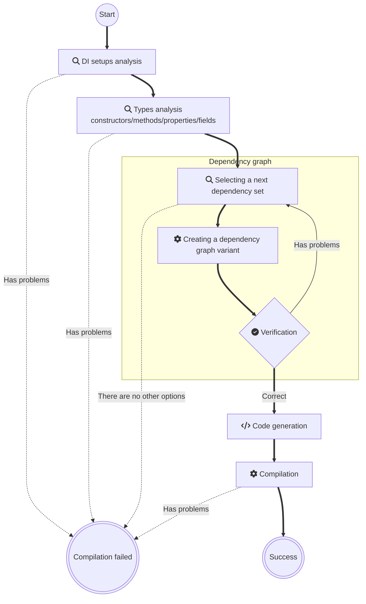

### Applications
- Console
  - [Schrödinger's cat](readme/Console.md)
  - [Top-level statements](readme/ConsoleTopLevelStatements.md)
  - [Native AOT](readme/ConsoleNativeAOT.md)
  - [Entity Framework](readme/EntityFramework.md)
- [Unity](readme/Unity.md)
- UI
  - [MAUI](readme/Maui.md)
  - [WPF](readme/Wpf.md)
  - [Avalonia](readme/Avalonia.md)
  - [Win Forms Net Core](readme/WinFormsAppNetCore.md)
  - [Win Forms](readme/WinFormsApp.md)
- Web
  - [Web](readme/WebApp.md)
  - [Minimal Web API](readme/MinimalWebAPI.md)
  - [Web API](readme/WebAPI.md)
  - [gRPC service](readme/GrpcService.md)
  - [Blazor Server](readme/BlazorServerApp.md)
  - [Blazor WebAssembly](readme/BlazorWebAssemblyApp.md)
    - [https://devteam.github.io/Pure.DI/](https://devteam.github.io/Pure.DI/)
- GitHub repos with examples
  - [Schrödinger's cat](https://github.com/DevTeam/Pure.DI.Example)
  - [How to use Pure.DI to create and test libraries](https://github.com/DevTeam/Pure.DI.Solution)

## Generated Code

Each generated class (a _composition_) is configured via `Setup(string compositionTypeName)`:

```c#
DI.Setup("Composition")
    .Bind<IDependency>().To<Dependency>()
    .Bind<IService>().To<Service>()
    .Root<IService>("Root");
```

<details>
<summary>The following class will be generated</summary>

```c#
partial class Composition
{
    // Composition root
    public IService Root
    {
        get
        {
            return new Service(new Dependency());
        }
    }
}
```

The _compositionTypeName_ parameter can be omitted:

- If the setup is performed inside a partial class, the composition will be created for that partial class.
- For a class with composition kind `CompositionKind.Global`, see [this example](readme/global-compositions.md).

</details>

<details>
<summary>Setup arguments</summary>

The first parameter is used to specify the name of the composition class. All sets with the same name will be combined to create one composition class. Alternatively, this name may contain a namespace, e.g. a composition class is generated for `Sample.Composition`:

```c#
namespace Sample
{
    partial class Composition
    {
        ...
    }
}
```

The second optional parameter may have multiple values to determine the kind of composition.

### CompositionKind.Public

This value is used by default. If this value is specified, a normal composition class will be created.

### CompositionKind.Internal

If you specify this value, the class will not be generated, but this setup can be used by others as a base setup. For example:

```c#
DI.Setup("BaseComposition", CompositionKind.Internal)
    .Bind().To<Dependency>();

DI.Setup("Composition").DependsOn("BaseComposition")
    .Bind().To<Service>();
```

If the _CompositionKind.Public_ flag is set in the composition setup, it can also serve as the base for other compositions, as in the example above.

### CompositionKind.Global

No composition class will be created when this value is specified, but this setup is the base setup for all setups in the current project, and `DependsOn(...)` is not required.

</details>

<details>
<summary>Constructors</summary>

By default, starting with version 2.3.0, no constructors are generated for a composition. The actual set of constructors depends on the composition arguments and lifetime scopes.

#### Parameterized constructor (automatic generation)

If the composition has any arguments defined, Pure.DI automatically generates a public parameterized constructor that includes all specified arguments.

Example configuration:

```c#
DI.Setup("Composition")
  .Arg<string>("name")
  .Arg<int>("id")
  // ...
```

Resulting constructor:

```c#
public Composition(string name, int id) { /* ... */ }
```

Important notes:

- Only arguments that are actually used in the object graph appear in the constructor.
- Unused arguments are omitted to optimize resource usage.
- If no arguments are specified, no parameterized constructor is created.

#### Scope-related constructors (conditional generation)

If there is at least one binding with `Lifetime.Scoped`, Pure.DI generates two constructors:

1. Public default constructor

> Used for creating the root scope instance.
>  ```c#
> public Composition() { /* ... */ }
> ```

2. Internal constructor with parent scope

> Used for creating child scope instances. This constructor is internal and accepts a single parameter — the parent scope.
> ```c#
> internal Composition(Composition parentScope) { /* ... */ }
> ```
> Important notes:
> - The public default constructor enables initialization of the root composition.
> - The internal constructor with parent reference enables proper scoping hierarchy for `Lifetime.Scoped` dependencies.
> - These constructors are only generated when `Lifetime.Scoped` bindings exist in the composition.

#### Summary of constructor generation rules

- No arguments + no _Scoped_ lifetimes: no constructors generated.
- Arguments present: public parameterized constructor with all used arguments.
- At least one _Scoped_ lifetime: two constructors (public default + internal with parent).
- Both arguments and Scoped lifetimes: all three constructors (parameterized, public default, internal with parent).
</details>

<details>
<summary>Composition Roots</summary>

### Regular Composition Roots

To create an object graph quickly and conveniently, a set of properties (or methods) is formed. These properties/methods are here called composition roots. The type of a property/method is the type of the root object created by the composition. Accordingly, each invocation of a property/method leads to the creation of an object graph with a root element of this type.

```c#
DI.Setup("Composition")
    .Bind<IService>().To<Service>()
    .Root<IService>("MyService");

var composition = new Composition();
var service = composition.MyService;
service = composition.Resolve<IService>();
service = composition.Resolve(typeof(IService));
```

In this case, the property for the _IService_ type will be named _MyService_ and will be available for direct use. The result of its use will be the creation of an object graph with the root of _IService_ type:

```c#
public IService MyService
{
    get
    {
        ...
        return new Service(...);
    }
}
```

This is the [recommended way](https://blog.ploeh.dk/2011/07/28/CompositionRoot/) to create a composition root. A composition class can contain any number of roots.

In addition, the composition roots can be resolved using the `Resolve`/`ResolveByTag` methods:

```c#
service = composition.Resolve<IService>();
service = composition.Resolve(typeof(IService));
```

> [!TIP]
>- There is no limit to the number of roots, but you should consider limiting the number of roots. Ideally, an application should have a single composition root.
>- The name of the composition root is arbitrarily chosen depending on its purpose, but should follow C# property naming conventions since it becomes a property name in the composition class.
>- It is recommended that composition roots be resolved using normal properties or methods instead of `Resolve`/`ResolveByTag` methods.

### Anonymous Composition Roots

If the root name is empty, an anonymous composition root with a random name is created:

```c#
private IService RootM07D16di_0001
{
    get { ... }
}
```

These properties (or methods) have an arbitrary name and access modifier `private` and cannot be used directly from the code. Do not attempt to use them, as their names can change between builds. Anonymous composition roots can be resolved by `Resolve`/`ResolveByTag` methods:

```c#
DI.Setup("Composition")
    .Bind<IService>().To<Service>()
    .Root<IService>();

var composition = new Composition();
var service = composition.Resolve<IService>();
service = composition.Resolve(typeof(IService));
```

</details>

<details>
<summary>Resolve/ResolveByTag methods</summary>

### Resolve/ResolveByTag methods

By default, a set of four _Resolve_/_ResolveByTag_ methods is generated:

```c#
public T Resolve<T>() { ... }

public T Resolve<T>(object? tag) { ... }

public object Resolve(Type type) { ... }

public object Resolve(Type type, object? tag) { ... }
```

These methods can resolve both public and anonymous composition roots that do not depend on root arguments. They are useful when using the [Service Locator](https://martinfowler.com/articles/injection.html) approach, where the code resolves composition roots in place:

```c#
var composition = new Composition();

composition.Resolve<IService>();
```

This is [not recommended](https://blog.ploeh.dk/2010/02/03/ServiceLocatorisanAnti-Pattern/) because _Resolve_/_ResolveByTag_ methods have a number of disadvantages:
- They provide access to an unlimited set of dependencies.
- Their use can potentially lead to runtime exceptions, for example, when the corresponding root has not been defined.
- Can be slower because they perform a lookup by type and tag.

To control the generation of these methods, see the [Resolve](#resolve-hint) hint.

### Dispose and DisposeAsync

Provides a mechanism to release unmanaged resources. These methods are generated only if the composition contains at least one singleton/scoped instance that implements either [IDisposable](https://learn.microsoft.com/en-us/dotnet/api/system.idisposable) or [IAsyncDisposable](https://learn.microsoft.com/en-us/dotnet/api/system.iasyncdisposable). The `Dispose()` or `DisposeAsync()` method of the composition should be called to dispose of all created singleton/scoped objects:

```c#
using var composition = new Composition();
```

or

```c#
await using var composition = new Composition();
```

To dispose objects of other lifetimes, see [this](readme/tracking-disposable-instances-per-a-composition-root.md) or [this](readme/tracking-disposable-instances-in-delegates.md) example.

</details>

<details>

<summary>Bindings</summary>

## Bindings

Bindings are the core mechanism of Pure.DI, used to define how types are created and which contracts they fulfill.

### Overview

#### For Implementations

To bind a contract to a specific implementation:

```c#
.Bind<Contract1>(tags).Bind<ContractN>(tags)
    .Tags(tags)
    .As(Lifetime)
    .To<Implementation>()
```

Alternatively, you can bind multiple contracts at once:

```c#
.Bind<Contract1, Contract2>(tags)
    .To<Implementation>()
```

Example:

```c#
.Bind<IService>().To<Service>()
```

#### For Factories

To use a custom factory logic via `IContext`:

```c#
.Bind<Contract1>(tags).Bind<ContractN>(tags)
    .Tags(tags)
    .As(Lifetime)
    .To(ctx => new Implementation(ctx.Resolve<Dependency>()))
```

Example:

```c#
.Bind<IService>().To(ctx => new Service(ctx.Resolve<IDependency>()))
```

#### Override Depth in Factories

Use `Let` to keep an override at the current injection level:

```c#
DI.Setup(nameof(Composition))
    .Bind().To<int>(_ => 7)
    .Bind().To<Dependency>()
    .Bind().To<Service>(ctx =>
    {
        // Override only the immediate injection
        ctx.Let(42);
        ctx.Inject(out Service service);
        return service;
    })
    .Root<Service>("Service");
```

Override precedence:
- The nearest override wins for nested dependencies.
- If multiple overrides target the same type and tag in one factory, the last call wins.
- `Let` applies only to the current injection level.

#### For Simplified Factories

When you only need to inject specific dependencies without accessing the full context:

```c#
.Bind<Contract1>(tags).Bind<ContractN>(tags)
    .Tags(tags)
    .As(Lifetime)
    .To<Implementation>((Dependency1 dep1, Dependency2 dep2) => new Implementation(dep1, dep2))
```

Example:

```c#
.Bind<IService>().To((IDependency dep) => new Service(dep))
```

### Lifetimes

Lifetimes control how long an object lives and how it is reused:
- **Transient**: A new instance is created for every injection (default).
- **Singleton**: A single instance is created for the entire composition.
- **PerResolve**: A single instance is reused within a single composition root (or a `Resolve`/`ResolveByTag` call).
- **PerBlock**: Reuses instances within a code block to reduce allocations.
- **Scoped**: A single instance is reused within a specific scope.

### Default Lifetimes

You can set a default lifetime for all subsequent bindings in a setup:

```c#
.DefaultLifetime(Lifetime.Singleton)
// This will be a Singleton
.Bind<IInterface>().To<Implementation>()
```

Alternatively, you can set a default lifetime for a specific contract type:

```c#
.DefaultLifetime<IDisposable>(Lifetime.Singleton)
```

### Tags

Tags allow you to distinguish between multiple implementations of the same contract.

- Use `.Bind<T>(tags)` or `.Tags(tags)` to apply tags to a binding.
- Use the `[Tag(tag)]` attribute or `ctx.Resolve<T>(tag)` to consume a tagged dependency.

Example:

```c#
.Bind<IService>("MyTag").To<Service>()
```

## Implementation Bindings

Implementation bindings allow for a more concise syntax where the implementation type itself serves as the contract or where you want the binder to automatically infer suitable base types and interfaces.

### For Implementations

```c#
// Infers all suitable base types and interfaces automatically
.Bind(tags).Tags(tags).As(Lifetime).To<Implementation>()
```

Alternatively, you can use the implementation type as the contract:

```c#
.Bind().To<Implementation>()
```

Example:

```c#
.Bind().To<Service>()
```

### For Factories

```c#
.Bind(tags).Tags(tags).To(ctx => new Implementation())
```

Example:

```c#
.Bind().To(ctx => new Service())
```

### For Simplified Factories

```c#
.Bind(tags).Tags(tags).To((Dependency dep) => new Implementation(dep))
```

Example:

```c#
.Bind().To((IDependency dep) => new Service(dep))
```

## Special types will not be added to bindings

By default, Pure.DI avoids binding to special types during auto-inference to prevent polluting the container with unintended bindings for types like `IDisposable`, `IEnumerable`, or `object`. Special types will not be added to bindings by default:

- `System.Object`
- `System.Enum`
- `System.MulticastDelegate`
- `System.Delegate`
- `System.Collections.IEnumerable`
- `System.Collections.Generic.IEnumerable<T>`
- `System.Collections.Generic.IList<T>`
- `System.Collections.Generic.ICollection<T>`
- `System.Collections.IEnumerator`
- `System.Collections.Generic.IEnumerator<T>`
- `System.Collections.Generic.IReadOnlyList<T>`
- `System.Collections.Generic.IReadOnlyCollection<T>`
- `System.IDisposable`
- `System.IAsyncResult`
- `System.AsyncCallback`

If you want to add your own special type, use the `SpecialType<T>()` call, for example:

```c#
.SpecialType<MonoBehaviour>()
.Bind().To<MyMonoBehaviourImplementation>()
// Now MonoBehaviour will not be added to the contracts
```

## Simplified Lifetime-Specific Bindings

Pure.DI provides syntactic sugar for common lifetimes. These methods combine `Bind()`, `.Tags(tags)`, `As(Lifetime)`, and `To()` into a single call.

### For Implementations

```c#
// Equivalent to Bind<T, T1, ...>(tags).As(Lifetime.Transient).To<Implementation>()
.Transient<T>(tags)
// or multiple types at once
.PerResolve<T, T1, ...>(tags)
```

Example:

```c#
.Transient<Service>()
.Singleton<Service2, Service3, Service4>()
```

### For Factories

```c#
// Equivalent to Bind(tags).As(Lifetime.Singleton).To(ctx => ...)
.Singleton<Implementation>(ctx => new Implementation(), tags)
```

Example:

```c#
.Singleton<IService>(ctx => new Service())
```

### For Simplified Factories

```c#
// Equivalent to Bind(tags).As(Lifetime.PerResolve).To((Dependency dep) => ...)
.PerResolve((Dependency dep) => new Implementation(dep), tags)
```

Example:

```c#
.PerResolve((IDependency dep) => new Service(dep))
```

Equivalent shortcuts exist for all lifetimes:

- `Transient<T>(...)`
- `Singleton<T>(...)`
- `Scoped<T>(...)`
- `PerResolve<T>(...)`
- `PerBlock<T>(...)`

</details>

<details>

<summary>Setup hints</summary>

## Setup hints

Hints are per-setup switches and filters that control how the composition code is generated (for example, whether `Resolve` methods are emitted, thread-safety, diagnostics hooks, or `ToString()` diagrams). Think of them as generator settings that let you trade off features, diagnostics, and compile-time cost.

Guidelines:
- Prefer the fluent API for discoverability and refactoring safety; use comment directives for quick local overrides.
- Hints affect only the `DI.Setup(...)` they are attached to (unless you use a global composition).
- If you set the same hint multiple times, the last value wins.

```c#
DI.Setup("Composition")
    .Hint(Hint.Resolve, "Off")
    .Hint(Hint.ThreadSafe, "Off")
    .Hint(Hint.ToString, "On")
    ...
```

As an alternative to the fluent API, you can place comment directives before the _Setup_ method in the form `hint = value`. For example:

```c#
// Resolve = Off
// ThreadSafe = Off
DI.Setup("Composition")
    ...
```

Both approaches can be mixed when it improves readability:

```c#
// Resolve = Off
DI.Setup("Composition")
    .Hint(Hint.ThreadSafe, "Off")
    ...
```

| Hint                                                                                                                                 | Values                                     | C# version | Default   |
|--------------------------------------------------------------------------------------------------------------------------------------|--------------------------------------------|------------|-----------|
| [Resolve](#resolve-hint)                                                                                                             | _On_ or _Off_                              |            | _On_      |
| [OnNewInstance](#onnewinstance-hint)                                                                                                 | _On_ or _Off_                              | 9.0        | _Off_     |
| [OnNewInstancePartial](#onnewinstance-hint)                                                                                          | _On_ or _Off_                              |            | _On_      |
| [OnNewInstanceImplementationTypeNameRegularExpression](#onnewinstanceimplementationtypenameregularexpression-hint)                   | Regular expression                         |            | .+        |
| [OnNewInstanceImplementationTypeNameWildcard](#onnewinstanceimplementationtypenamewildcard-hint)                                     | Wildcard                                   |            | *         |
| [OnNewInstanceTagRegularExpression](#onnewinstancetagregularexpression-hint)                                                         | Regular expression                         |            | .+        |
| [OnNewInstanceTagWildcard](#onnewinstancetagwildcard-hint)                                                                           | Wildcard                                   |            | *         |
| [OnNewInstanceLifetimeRegularExpression](#onnewinstancelifetimeregularexpression-hint)                                               | Regular expression                         |            | .+        |
| [OnNewInstanceLifetimeWildcard](#onnewinstancelifetimewildcard-hint)                                                                 | Wildcard                                   |            | *         |
| [OnDependencyInjection](#ondependencyinjection-hint)                                                                                 | _On_ or _Off_                              | 9.0        | _Off_     |
| [OnDependencyInjectionPartial](#ondependencyinjectionpartial-hint)                                                                   | _On_ or _Off_                              |            | _On_      |
| [OnDependencyInjectionImplementationTypeNameRegularExpression](#ondependencyinjectionimplementationtypenameregularexpression-hint)   | Regular expression                         |            | .+        |
| [OnDependencyInjectionImplementationTypeNameWildcard](#ondependencyinjectionimplementationtypenamewildcard-hint)                     | Wildcard                                   |            | *         |
| [OnDependencyInjectionContractTypeNameRegularExpression](#ondependencyinjectioncontracttypenameregularexpression-hint)               | Regular expression                         |            | .+        |
| [OnDependencyInjectionContractTypeNameWildcard](#ondependencyinjectioncontracttypenamewildcard-hint)                                 | Wildcard                                   |            | *         |
| [OnDependencyInjectionTagRegularExpression](#ondependencyinjectiontagregularexpression-hint)                                         | Regular expression                         |            | .+        |
| [OnDependencyInjectionTagWildcard](#ondependencyinjectiontagwildcard-hint)                                                           | Wildcard                                   |            | *         |
| [OnDependencyInjectionLifetimeRegularExpression](#ondependencyinjectionlifetimeregularexpression-hint)                               | Regular expression                         |            | .+        |
| [OnDependencyInjectionLifetimeWildcard](#ondependencyinjectionlifetimewildcard-hint)                                                 | Wildcard                                   |            | *         |
| [OnCannotResolve](#oncannotresolve-hint)                                                                                             | _On_ or _Off_                              | 9.0        | _Off_     |
| [OnCannotResolvePartial](#oncannotresolvepartial-hint)                                                                               | _On_ or _Off_                              |            | _On_      |
| [OnCannotResolveContractTypeNameRegularExpression](#oncannotresolvecontracttypenameregularexpression-hint)                           | Regular expression                         |            | .+        |
| [OnCannotResolveContractTypeNameWildcard](#oncannotresolvecontracttypenamewildcard-hint)                                             | Wildcard                                   |            | *         |
| [OnCannotResolveTagRegularExpression](#oncannotresolvetagregularexpression-hint)                                                     | Regular expression                         |            | .+        |
| [OnCannotResolveTagWildcard](#oncannotresolvetagwildcard-hint)                                                                       | Wildcard                                   |            | *         |
| [OnCannotResolveLifetimeRegularExpression](#oncannotresolvelifetimeregularexpression-hint)                                           | Regular expression                         |            | .+        |
| [OnCannotResolveLifetimeWildcard](#oncannotresolvelifetimewildcard-hint)                                                             | Wildcard                                   |            | *         |
| [OnNewRoot](#onnewroot-hint)                                                                                                         | _On_ or _Off_                              |            | _Off_     |
| [OnNewRootPartial](#onnewrootpartial-hint)                                                                                           | _On_ or _Off_                              |            | _On_      |
| [ToString](#tostring-hint)                                                                                                           | _On_ or _Off_                              |            | _Off_     |
| [ThreadSafe](#threadsafe-hint)                                                                                                       | _On_ or _Off_                              |            | _On_      |
| [ResolveMethodModifiers](#resolvemethodmodifiers-hint)                                                                               | Method modifier                            |            | _public_  |
| [ResolveMethodName](#resolvemethodname-hint)                                                                                         | Method name                                |            | _Resolve_ |
| [ResolveByTagMethodModifiers](#resolvebytagmethodmodifiers-hint)                                                                     | Method modifier                            |            | _public_  |
| [ResolveByTagMethodName](#resolvebytagmethodname-hint)                                                                               | Method name                                |            | _Resolve_ |
| [ObjectResolveMethodModifiers](#objectresolvemethodmodifiers-hint)                                                                   | Method modifier                            |            | _public_  |
| [ObjectResolveMethodName](#objectresolvemethodname-hint)                                                                             | Method name                                |            | _Resolve_ |
| [ObjectResolveByTagMethodModifiers](#objectresolvebytagmethodmodifiers-hint)                                                         | Method modifier                            |            | _public_  |
| [ObjectResolveByTagMethodName](#objectresolvebytagmethodname-hint)                                                                   | Method name                                |            | _Resolve_ |
| [DisposeMethodModifiers](#disposemethodmodifiers-hint)                                                                               | Method modifier                            |            | _public_  |
| [DisposeAsyncMethodModifiers](#disposeasyncmethodmodifiers-hint)                                                                     | Method modifier                            |            | _public_  |
| [FormatCode](#formatcode-hint)                                                                                                       | _On_ or _Off_                              |            | _Off_     |
| [SeverityOfNotImplementedContract](#severityofnotimplementedcontract-hint)                                                           | _Error_ or _Warning_ or _Info_ or _Hidden_ |            | _Error_   |
| [Comments](#comments-hint)                                                                                                           | _On_ or _Off_                              |            | _On_      |
| [SkipDefaultConstructor](#skipdefaultconstructor-hint)                                                                               | _On_ or _Off_                              |            | _Off_     |
| [SkipDefaultConstructorImplementationTypeNameRegularExpression](#skipdefaultconstructorimplementationtypenameregularexpression-hint) | Regular expression                         |            | .+        |
| [SkipDefaultConstructorImplementationTypeNameWildcard](#skipdefaultconstructorimplementationtypenamewildcard-hint)                   | Wildcard                                   |            | *         |
| [SkipDefaultConstructorLifetimeRegularExpression](#skipdefaultconstructorlifetimeregularexpression-hint)                             | Regular expression                         |            | .+        |
| [SkipDefaultConstructorLifetimeWildcard](#skipdefaultconstructorlifetimewildcard-hint)                                               | Wildcard                                   |            | *         |
| [DisableAutoBinding](#disableautobinding-hint)                                                                                       | _On_ or _Off_                              |            | _Off_     |
| [DisableAutoBindingImplementationTypeNameRegularExpression](#disableautobindingimplementationtypenameregularexpression-hint)         | Regular expression                         |            | .+        |
| [DisableAutoBindingImplementationTypeNameWildcard](#disableautobindingimplementationtypenamewildcard-hint)                           | Wildcard                                   |            | *         |
| [DisableAutoBindingLifetimeRegularExpression](#disableautobindinglifetimeregularexpression-hint)                                     | Regular expression                         |            | .+        |
| [DisableAutoBindingLifetimeWildcard](#disableautobindinglifetimewildcard-hint)                                                       | Wildcard                                   |            | *         |

The list of hints will be gradually expanded to meet the needs and desires for fine-tuning code generation. Please feel free to add your ideas.

### Resolve Hint

Controls whether [_Resolve_/_ResolveByTag_ methods](#resolve-resolvebytag-methods) are generated. By default they are enabled. Turn this _Off_ to reduce generated code size and compilation time, but note that anonymous roots are not created and only explicitly named roots are available. When disabled, always define public roots via `Root<T>(string name)`.

```c#
// Resolve = Off
DI.Setup("Composition")
    .Bind<IService>().To<Service>()
    .Root<IService>("Root");
```

### OnNewInstance Hint

Enables the `OnNewInstance` callback to observe or replace newly created instances (for example, logging, diagnostics, or decoration). It is _Off_ by default to avoid overhead.

```c#
internal partial class Composition
{
    partial void OnNewInstance<T>(ref T value, object? tag, object lifetime) =>
        Console.WriteLine($"'{typeof(T)}'('{tag}') created.");
}
```

You can also replace the created instance with a `T` type, where `T` is the actual type of the created instance. To minimize performance loss when calling _OnNewInstance_, use the three hints below.

### OnNewInstancePartial Hint

Controls whether the `OnNewInstance` partial method signature is generated when `OnNewInstance` is enabled. Turn it _Off_ if you want to enable filtering hints without emitting the partial method.

```c#
// OnNewInstance = On
// OnNewInstancePartial = Off
DI.Setup("Composition")
    .Bind<IService>().To<Service>();
```

### OnNewInstanceImplementationTypeNameRegularExpression Hint

This is a regular expression for filtering by instance type name. This hint is useful when _OnNewInstance_ is in _On_ state and it is necessary to limit the set of types for which the _OnNewInstance_ method will be called.

```c#
// OnNewInstance = On
// OnNewInstanceImplementationTypeNameRegularExpression = .*Service
DI.Setup("Composition")
    .Bind<IService>().To<Service>();
```

### OnNewInstanceImplementationTypeNameWildcard Hint

This is a Wildcard for filtering by instance type name. This hint is useful when _OnNewInstance_ is in _On_ state and it is necessary to limit the set of types for which the _OnNewInstance_ method will be called.

```c#
// OnNewInstance = On
// OnNewInstanceImplementationTypeNameWildcard = *Service
DI.Setup("Composition")
    .Bind<IService>().To<Service>();
```

### OnNewInstanceTagRegularExpression Hint

This is a regular expression for filtering by _tag_. This hint is also useful when _OnNewInstance_ is in _On_ state and it is necessary to limit the set of _tags_ for which the _OnNewInstance_ method will be called.

```c#
// OnNewInstance = On
// OnNewInstanceTagRegularExpression = Internal|Public
DI.Setup("Composition")
    .Bind<IService>("Internal").To<Service>();
```

### OnNewInstanceTagWildcard Hint

This is a wildcard for filtering by _tag_. This hint is also useful when _OnNewInstance_ is in _On_ state and it is necessary to limit the set of _tags_ for which the _OnNewInstance_ method will be called.

```c#
// OnNewInstance = On
// OnNewInstanceTagWildcard = *Internal
DI.Setup("Composition")
    .Bind<IService>("Internal").To<Service>();
```

### OnNewInstanceLifetimeRegularExpression Hint

This is a regular expression for filtering by _lifetime_. This hint is also useful when _OnNewInstance_ is in _On_ state and it is necessary to restrict the set of _lifetimes_ for which the _OnNewInstance_ method will be called.

```c#
// OnNewInstance = On
// OnNewInstanceLifetimeRegularExpression = Singleton|Scoped
DI.Setup("Composition")
    .Bind<IService>().As(Lifetime.Singleton).To<Service>();
```

### OnNewInstanceLifetimeWildcard Hint

This is a wildcard for filtering by _lifetime_. This hint is also useful when _OnNewInstance_ is in _On_ state and it is necessary to restrict the set of _lifetimes_ for which the _OnNewInstance_ method will be called.

```c#
// OnNewInstance = On
// OnNewInstanceLifetimeWildcard = *Singleton
DI.Setup("Composition")
    .Bind<IService>().As(Lifetime.Singleton).To<Service>();
```

### OnDependencyInjection Hint

Enables the `OnDependencyInjection` callback that can intercept dependency injection and return an alternative instance. Use for advanced scenarios like interception, conditional injection, or diagnostics. It is _Off_ by default.

```c#
// OnDependencyInjection = On
// OnDependencyInjectionPartial = Off
// OnDependencyInjectionContractTypeNameRegularExpression = ICalculator[\d]{1}
// OnDependencyInjectionTagRegularExpression = Abc
DI.Setup("Composition")
    ...
```

### OnDependencyInjectionPartial Hint

Controls whether the `OnDependencyInjection` partial method is generated. Because it returns a value, the method must be implemented when generated. Turn it _Off_ to rely on filters without emitting the method body.

```c#
// OnDependencyInjection = On
// OnDependencyInjectionContractTypeNameRegularExpression = ICalculator[\d]{1}
// OnDependencyInjectionTagRegularExpression = Abc
DI.Setup("Composition")
    ...
```

To minimize performance loss when calling _OnDependencyInjection_, use the three tips below.

### OnDependencyInjectionImplementationTypeNameRegularExpression Hint

This is a regular expression for filtering by instance type name. This hint is useful when _OnDependencyInjection_ is in _On_ state and it is necessary to restrict the set of types for which the _OnDependencyInjection_ method will be called.

```c#
// OnDependencyInjection = On
// OnDependencyInjectionImplementationTypeNameRegularExpression = .*Service
DI.Setup("Composition")
    .Bind<IService>().To<Service>();
```

### OnDependencyInjectionImplementationTypeNameWildcard Hint

This is a wildcard for filtering by instance type name. This hint is useful when _OnDependencyInjection_ is in _On_ state and it is necessary to restrict the set of types for which the _OnDependencyInjection_ method will be called.

```c#
// OnDependencyInjection = On
// OnDependencyInjectionImplementationTypeNameWildcard = *Service
DI.Setup("Composition")
    .Bind<IService>().To<Service>();
```

### OnDependencyInjectionContractTypeNameRegularExpression Hint

This is a regular expression for filtering by the name of the resolving type. This hint is also useful when _OnDependencyInjection_ is in _On_ state and it is necessary to limit the set of permissive types for which the _OnDependencyInjection_ method will be called.

```c#
// OnDependencyInjection = On
// OnDependencyInjectionContractTypeNameRegularExpression = I.*Service
DI.Setup("Composition")
    .Bind<IService>().To<Service>();
```

### OnDependencyInjectionContractTypeNameWildcard Hint

This is a wildcard for filtering by the name of the resolving type. This hint is also useful when _OnDependencyInjection_ is in _On_ state and it is necessary to limit the set of permissive types for which the _OnDependencyInjection_ method will be called.

```c#
// OnDependencyInjection = On
// OnDependencyInjectionContractTypeNameWildcard = I*Service
DI.Setup("Composition")
    .Bind<IService>().To<Service>();
```

### OnDependencyInjectionTagRegularExpression Hint

This is a regular expression for filtering by _tag_. This hint is also useful when _OnDependencyInjection_ is in the _On_ state and you want to limit the set of _tags_ for which the _OnDependencyInjection_ method will be called.

```c#
// OnDependencyInjection = On
// OnDependencyInjectionTagRegularExpression = Internal|Public
DI.Setup("Composition")
    .Bind<IService>("Internal").To<Service>();
```

### OnDependencyInjectionTagWildcard Hint

This is a wildcard for filtering by _tag_. This hint is also useful when _OnDependencyInjection_ is in the _On_ state and you want to limit the set of _tags_ for which the _OnDependencyInjection_ method will be called.

```c#
// OnDependencyInjection = On
// OnDependencyInjectionTagWildcard = *Internal
DI.Setup("Composition")
    .Bind<IService>("Internal").To<Service>();
```

### OnDependencyInjectionLifetimeRegularExpression Hint

This is a regular expression for filtering by _lifetime_. This hint is also useful when _OnDependencyInjection_ is in _On_ state and it is necessary to restrict the set of _lifetime_ for which the _OnDependencyInjection_ method will be called.

```c#
// OnDependencyInjection = On
// OnDependencyInjectionLifetimeRegularExpression = Singleton|Scoped
DI.Setup("Composition")
    .Bind<IService>().As(Lifetime.Singleton).To<Service>();
```

### OnDependencyInjectionLifetimeWildcard Hint

This is a wildcard for filtering by _lifetime_. This hint is also useful when _OnDependencyInjection_ is in _On_ state and it is necessary to restrict the set of _lifetime_ for which the _OnDependencyInjection_ method will be called.

```c#
// OnDependencyInjection = On
// OnDependencyInjectionLifetimeWildcard = *Singleton
DI.Setup("Composition")
    .Bind<IService>().As(Lifetime.Singleton).To<Service>();
```

### OnCannotResolve Hint

Enables the `OnCannotResolve<T>(...)` callback, allowing you to provide a fallback instance or custom error handling when a root cannot be resolved. It is _Off_ by default. The generated method must be implemented because it returns a value.

```c#
// OnCannotResolve = On
// OnCannotResolveContractTypeNameRegularExpression = string|DateTime
// OnDependencyInjectionTagRegularExpression = null
DI.Setup("Composition")
    ...
```

To avoid missing failed bindings by mistake, use the two relevant hints below.

### OnCannotResolvePartial Hint

Controls whether the `OnCannotResolve<T>(...)` partial method is generated when `OnCannotResolve` is enabled. Turn it _Off_ to enable filters without emitting the partial method.

```c#
// OnCannotResolve = On
// OnCannotResolvePartial = Off
// OnCannotResolveContractTypeNameRegularExpression = string|DateTime
// OnDependencyInjectionTagRegularExpression = null
DI.Setup("Composition")
    ...
```

To avoid missing failed bindings by mistake, use the two relevant hints below.

### OnNewRoot Hint

Enables the static `OnNewRoot<TContract, T>(...)` callback that runs when a new root is registered. This is useful for logging or custom validation, but it bypasses some dependency resolution checks.

```c#
// OnNewRoot = On
DI.Setup("Composition")
    ...
```

Be careful, this hint disables checks for the ability to resolve dependencies!

### OnNewRootPartial Hint

Controls whether the `OnNewRoot<TContract, T>(...)` partial method is generated when `OnNewRoot` is enabled.

```c#
// OnNewRootPartial = Off
DI.Setup("Composition")
    ...
```

### OnCannotResolveContractTypeNameRegularExpression Hint

This is a regular expression for filtering by the name of the resolving type. This hint is also useful when _OnCannotResolve_ is in _On_ state and it is necessary to limit the set of resolving types for which the _OnCannotResolve_ method will be called.

```c#
// OnCannotResolve = On
// OnCannotResolveContractTypeNameRegularExpression = string|DateTime
DI.Setup("Composition")
    .Bind<IService>().To<Service>();
```

### OnCannotResolveContractTypeNameWildcard Hint

This is a wildcard for filtering by the name of the resolving type. This hint is also useful when _OnCannotResolve_ is in _On_ state and it is necessary to limit the set of resolving types for which the _OnCannotResolve_ method will be called.

```c#
// OnCannotResolve = On
// OnCannotResolveContractTypeNameWildcard = *Service
DI.Setup("Composition")
    .Bind<IService>().To<Service>();
```

### OnCannotResolveTagRegularExpression Hint

This is a regular expression for filtering by _tag_. This hint is also useful when _OnCannotResolve_ is in _On_ state and it is necessary to limit the set of _tags_ for which the _OnCannotResolve_ method will be called.

```c#
// OnCannotResolve = On
// OnCannotResolveTagRegularExpression = Internal|Public
DI.Setup("Composition")
    .Bind<IService>("Internal").To<Service>();
```

### OnCannotResolveTagWildcard Hint

This is a wildcard for filtering by _tag_. This hint is also useful when _OnCannotResolve_ is in _On_ state and it is necessary to limit the set of _tags_ for which the _OnCannotResolve_ method will be called.

```c#
// OnCannotResolve = On
// OnCannotResolveTagWildcard = *Internal
DI.Setup("Composition")
    .Bind<IService>("Internal").To<Service>();
```

### OnCannotResolveLifetimeRegularExpression Hint

This is a regular expression for filtering by _lifetime_. This hint is also useful when _OnCannotResolve_ is in the _On_ state and it is necessary to restrict the set of _lifetimes_ for which the _OnCannotResolve_ method will be called.

```c#
// OnCannotResolve = On
// OnCannotResolveLifetimeRegularExpression = Singleton|Scoped
DI.Setup("Composition")
    .Bind<IService>().As(Lifetime.Singleton).To<Service>();
```

### OnCannotResolveLifetimeWildcard Hint

This is a wildcard for filtering by _lifetime_. This hint is also useful when _OnCannotResolve_ is in the _On_ state and it is necessary to restrict the set of _lifetimes_ for which the _OnCannotResolve_ method will be called.

```c#
// OnCannotResolve = On
// OnCannotResolveLifetimeWildcard = *Singleton
DI.Setup("Composition")
    .Bind<IService>().As(Lifetime.Singleton).To<Service>();
```

### ToString Hint

Controls generation of `ToString()` that returns a Mermaid class diagram of the composition. Useful for documentation and debugging, but disabled by default to reduce generated code.

```c#
// ToString = On
DI.Setup("Composition")
    .Bind<IService>().To<Service>()
    .Root<IService>("MyService");

var composition = new Composition();
string classDiagram = composition.ToString();
```

### ThreadSafe Hint

Controls whether object graph creation uses synchronization. It is _On_ by default for safety. Turn it _Off_ if you know composition creation is single-threaded and want a small performance gain.

```c#
// ThreadSafe = Off
DI.Setup("Composition")
    .Bind<IService>().To<Service>()
    .Root<IService>("MyService");
```

### ResolveMethodModifiers Hint

Overrides the modifiers of the `public T Resolve<T>()` method.

```c#
DI.Setup("Composition")
    .Hint(Hint.ResolveMethodModifiers, "internal")
    .Bind<IService>().To<Service>()
    .Root<IService>("Root");
```

### ResolveMethodName Hint

Overrides the method name for `public T Resolve<T>()`.

```c#
DI.Setup("Composition")
    .Hint(Hint.ResolveMethodName, "GetRoot")
    .Bind<IService>().To<Service>()
    .Root<IService>("Root");
```

### ResolveByTagMethodModifiers Hint

Overrides the modifiers of the `public T Resolve<T>(object? tag)` method.

```c#
DI.Setup("Composition")
    .Hint(Hint.ResolveByTagMethodModifiers, "internal")
    .Bind<IService>().To<Service>()
    .Root<IService>("Root");
```

### ResolveByTagMethodName Hint

Overrides the method name for `public T Resolve<T>(object? tag)`.

```c#
DI.Setup("Composition")
    .Hint(Hint.ResolveByTagMethodName, "GetRootByTag")
    .Bind<IService>().To<Service>()
    .Root<IService>("Root");
```

### ObjectResolveMethodModifiers Hint

Overrides the modifiers of the `public object Resolve(Type type)` method.

```c#
DI.Setup("Composition")
    .Hint(Hint.ObjectResolveMethodModifiers, "internal")
    .Bind<IService>().To<Service>()
    .Root<IService>("Root");
```

### ObjectResolveMethodName Hint

Overrides the method name for `public object Resolve(Type type)`.

```c#
DI.Setup("Composition")
    .Hint(Hint.ObjectResolveMethodName, "GetObject")
    .Bind<IService>().To<Service>()
    .Root<IService>("Root");
```

### ObjectResolveByTagMethodModifiers Hint

Overrides the modifiers of the `public object Resolve(Type type, object? tag)` method.

```c#
DI.Setup("Composition")
    .Hint(Hint.ObjectResolveByTagMethodModifiers, "internal")
    .Bind<IService>().To<Service>()
    .Root<IService>("Root");
```

### ObjectResolveByTagMethodName Hint

Overrides the method name for `public object Resolve(Type type, object? tag)`.

```c#
DI.Setup("Composition")
    .Hint(Hint.ObjectResolveByTagMethodName, "GetObjectByTag")
    .Bind<IService>().To<Service>()
    .Root<IService>("Root");
```

### DisposeMethodModifiers Hint

Overrides the modifiers of the `public void Dispose()` method.

```c#
DI.Setup("Composition")
    .Hint(Hint.DisposeMethodModifiers, "internal")
    .Bind<IService>().To<Service>()
    .Root<IService>("Root");
```

### DisposeAsyncMethodModifiers Hint

Overrides the modifiers of the `public ValueTask DisposeAsync()` method.

```c#
DI.Setup("Composition")
    .Hint(Hint.DisposeAsyncMethodModifiers, "internal")
    .Bind<IService>().To<Service>()
    .Root<IService>("Root");
```

### FormatCode Hint

Enables formatting of generated code. This can significantly increase compilation time and memory usage, so it is best reserved for debugging or presentation scenarios.

```c#
// FormatCode = On
DI.Setup("Composition")
    .Bind<IService>().To<Service>();
```

### SeverityOfNotImplementedContract Hint

Controls the diagnostic severity emitted when a binding declares a contract that the implementation does not actually implement. Possible values:

- _"Error"_ - this is the default value.
- _"Warning"_ - something suspicious but allowed.
- _"Info"_ - information that does not indicate a problem.
- _"Hidden"_ - not a problem.

```c#
DI.Setup("Composition")
    .Hint(Hint.SeverityOfNotImplementedContract, "Warning")
    .Bind<IService>().To<Service>();
```

### Comments Hint

Specifies whether the generated code should be commented.

```c#
// Represents the composition class
DI.Setup(nameof(Composition))
    .Bind<IService>().To<Service>()
    // Provides a composition root of my service
    .Root<IService>("MyService");
```

Appropriate comments will be added to the generated ```Composition``` class and the documentation for the class, depending on the IDE used, will look something like this:


Then documentation for the composition root:


### SkipDefaultConstructor Hint

Enables/disables skipping the default constructor. Default: `Off` (meaning the default constructor is used when available).

```c#
// SkipDefaultConstructor = On
DI.Setup("Composition")
    .Bind<IDependency>().To<Dependency>();
```

### SkipDefaultConstructorImplementationTypeNameRegularExpression Hint

Regular expression filter for implementation type names when skipping default constructors. Default: `.+`.

```c#
// SkipDefaultConstructor = On
// SkipDefaultConstructorImplementationTypeNameRegularExpression = .*Repository
DI.Setup("Composition")
    .Bind().To<OrderRepository>();
```

### SkipDefaultConstructorImplementationTypeNameWildcard Hint

Wildcard filter for implementation type names when skipping default constructors. Default: `*`.

```c#
// SkipDefaultConstructor = On
// SkipDefaultConstructorImplementationTypeNameWildcard = *Repository
DI.Setup("Composition")
    .Bind().To<OrderRepository>();
```

### SkipDefaultConstructorLifetimeRegularExpression Hint

Regular expression filter for lifetimes when skipping default constructors. Default: `.+`.

```c#
// SkipDefaultConstructor = On
// SkipDefaultConstructorLifetimeRegularExpression = Singleton|Scoped
DI.Setup("Composition")
    .Bind().As(Lifetime.Singleton).To<OrderRepository>();
```

### SkipDefaultConstructorLifetimeWildcard Hint

Wildcard filter for lifetimes when skipping default constructors. Default: `*`.

```c#
// SkipDefaultConstructor = On
// SkipDefaultConstructorLifetimeWildcard = *Singleton
DI.Setup("Composition")
    .Bind().As(Lifetime.Singleton).To<OrderRepository>();
```

Use these filters to restrict which implementation types or lifetimes are affected when `SkipDefaultConstructor` is enabled. You can apply them as comment directives or via the fluent API:

```c#
// SkipDefaultConstructor = On
// SkipDefaultConstructorImplementationTypeNameWildcard = *Repository
// SkipDefaultConstructorLifetimeRegularExpression = Singleton|Scoped
DI.Setup("Composition")
    .Bind().To<OrderRepository>()
    .Bind().To<CachedRepository>();
```

### DisableAutoBinding Hint

Disables automatic binding when no explicit binding exists. Default: `Off`.

```c#
// DisableAutoBinding = On
DI.Setup("Composition")
    .Bind<IDependency>().To<Dependency>();
```

### DisableAutoBindingImplementationTypeNameRegularExpression Hint

Regular expression filter for implementation type names to disable auto-binding. Default: `.+`.

```c#
// DisableAutoBinding = On
// DisableAutoBindingImplementationTypeNameRegularExpression = .*Service
DI.Setup("Composition")
    .Bind().To<OrderService>();
```

### DisableAutoBindingImplementationTypeNameWildcard Hint

Wildcard filter for implementation type names to disable auto-binding. Default: `*`.

```c#
// DisableAutoBinding = On
// DisableAutoBindingImplementationTypeNameWildcard = *Service
DI.Setup("Composition")
    .Bind().To<OrderService>();
```

### DisableAutoBindingLifetimeRegularExpression Hint

Regular expression filter for lifetimes to disable auto-binding. Default: `.+`.

```c#
// DisableAutoBinding = On
// DisableAutoBindingLifetimeRegularExpression = Singleton|Scoped
DI.Setup("Composition")
    .Bind().As(Lifetime.Singleton).To<OrderService>();
```

### DisableAutoBindingLifetimeWildcard Hint

Wildcard filter for lifetimes to disable auto-binding. Default: `*`.

```c#
// DisableAutoBinding = On
// DisableAutoBindingLifetimeWildcard = *Singleton
DI.Setup("Composition")
    .Bind().As(Lifetime.Singleton).To<OrderService>();
```

Use these filters to narrow which types or lifetimes are excluded from auto-binding when `DisableAutoBinding` is enabled:

```c#
// DisableAutoBinding = On
// DisableAutoBindingImplementationTypeNameRegularExpression = .*Service
DI.Setup("Composition")
    .Bind().To<OrderService>()
    .Bind().To<PaymentService>();
```

### SystemThreadingLock Hint

Indicates whether `System.Threading.Lock` should be used whenever possible instead of the classic approach of synchronizing object access using `System.Threading.Monitor`. `On` by default.

```c#
DI.Setup(nameof(Composition))
    .Hint(Hint.SystemThreadingLock, "Off")
    .Bind().To<Service>()
    .Root<Service>("MyService");
```

</details>

<details>
<summary>Code generation workflow</summary>



</details>

## Project template

Install the DI template [Pure.DI.Templates](https://www.nuget.org/packages/Pure.DI.Templates)

```shell
dotnet new install Pure.DI.Templates
```

Create a "Sample" console application from the __di__ template

```shell
dotnet new di -o ./Sample
```

Run it

```shell
dotnet run --project Sample
```

For more information about the template, please see [this page](https://github.com/DevTeam/Pure.DI/wiki/Project-templates).

## Troubleshooting

<details>
<summary>Version update</summary>

When updating the version, it is possible that the previous version of the code generator remains active and is used by compilation services. In this case, the old and new versions of the generator may conflict. For a project where the code generator is used, it is recommended to do the following:
- After updating the version, close the IDE if it is open
- Delete the _obj_ and _bin_ directories
- Run the following commands one by one

```shell
dotnet build-server shutdown
```

```shell
dotnet restore
```

```shell
dotnet build
```

</details>

<details>
<summary>Disabling API generation</summary>

Pure.DI automatically generates its API. If an assembly already has the Pure.DI API, for example, from another assembly, it is sometimes necessary to disable its automatic generation to avoid ambiguity. To do this, you need to add a _DefineConstants_ element to the project files of these modules. For example:

```xml
<PropertyGroup>
    <DefineConstants>$(DefineConstants);PUREDI_API_SUPPRESSION</DefineConstants>
</PropertyGroup>
```

</details>

<details>
<summary>Display generated files</summary>

You can set project properties to save generated files and control their storage location. In the project file, add the `<EmitCompilerGeneratedFiles>` element to the `<PropertyGroup>` group and set its value to `true`. Build the project again. The generated files are now created in the _obj/Debug/netX.X/generated/Pure.DI/Pure.DI/Pure.DI.SourceGenerator_ directory. The path components correspond to the build configuration, the target framework, the source generator project name, and the full name of the generator type. You can choose a more convenient output folder by adding the `<CompilerGeneratedFilesOutputPath>` element to the application project file. For example:

```xml
<Project Sdk="Microsoft.NET.Sdk">

    <PropertyGroup>
        <EmitCompilerGeneratedFiles>true</EmitCompilerGeneratedFiles>
        <CompilerGeneratedFilesOutputPath>$(BaseIntermediateOutputPath)Generated</CompilerGeneratedFilesOutputPath>
    </PropertyGroup>

</Project>
```

</details>

<details>
<summary>Performance profiling</summary>

Please install the [JetBrains.dotTrace.GlobalTools](https://www.nuget.org/packages/JetBrains.dotTrace.GlobalTools) dotnet tool globally, for example:

```shell
dotnet tool install --global JetBrains.dotTrace.GlobalTools --version 2024.3.3
```

Or make sure it is installed. Add the following sections to the project:

```xml
<Project Sdk="Microsoft.NET.Sdk">

  <PropertyGroup>
    <PureDIProfilePath>c:\profiling</PureDIProfilePath>
  </PropertyGroup>

  <ItemGroup>
    <CompilerVisibleProperty Include="PureDIProfilePath" />
  </ItemGroup>

</Project>
```

Replace a path like *c:\profiling* with the path where the profiling results will be saved.

Start a build and wait until a file like *c:\profiling\pure_di_????.dtt* appears in the directory.

</details>

## Additional resources

Examples of how to set up a composition
- [Pure.DI](https://github.com/DevTeam/Pure.DI/blob/master/src/Pure.DI.Core/Generator.cs)
- [C# interactive](https://github.com/DevTeam/csharp-interactive/blob/master/CSharpInteractive/Composition.cs)
- [Immutype](https://github.com/DevTeam/Immutype/blob/master/Immutype/Composition.cs)
- [MSBuild logger](https://github.com/JetBrains/teamcity-msbuild-logger/blob/master/TeamCity.MSBuild.Logger/Composition.cs)

Articles
- [RU New in Pure.DI by the end of 2024](https://habr.com/ru/articles/868744/)
- [RU New in Pure.DI](https://habr.com/ru/articles/808297/)
- [RU Pure.DI v2.1](https://habr.com/ru/articles/795809/)
- [RU Pure.DI next step](https://habr.com/ru/articles/554236/)
- [RU Pure.DI for .NET](https://habr.com/ru/articles/552858/)

RU DotNext video

<a href="http://www.youtube.com/watch?feature=player_embedded&v=nrp9SH-gLqg" target="_blank"></a>
