## Schrödinger's cat demonstrates how it all works [](samples/ShroedingersCat)

### The reality is


### Let's create an abstraction

```c#
interface IBox<out T>
{
    T Content { get; }
}

interface ICat
{
    State State { get; }
}

enum State { Alive, Dead }
```

### Here's our implementation

```c#
record CardboardBox<T>(T Content) : IBox<T>;

class ShroedingersCat(Lazy<State> superposition): ICat
{
    // The decoherence of the superposition
    // at the time of observation via an irreversible process
    public State State => superposition.Value;
}
```

> [!IMPORTANT]
> Our abstraction and implementation know nothing about the magic of DI or any frameworks.

### Let's glue it all together

Add the Pure.DI package to your project:

[](https://www.nuget.org/packages/Pure.DI)

Let's bind the abstractions to their implementations and set up the creation of the object graph:

```c#
DI.Setup(nameof(Composition))
    // Models a random subatomic event that may or may not occur
    .Bind().As(Singleton).To<Random>()
    // Represents a quantum superposition of two states: Alive or Dead
    .Bind().To((Random random) => (State)random.Next(2))
    .Bind().To<ShroedingersCat>()
    // Cardboard box with any contents
    .Bind().To<CardboardBox<TT>>()
    // Composition Root
    .Root<Program>("Root");
```

> [!NOTE]
> In fact, the `Bind().As(Singleton).To<Random>()` binding is unnecessary since Pure.DI supports many .NET BCL types out of the box, including [Random](https://github.com/DevTeam/Pure.DI/blob/27a1ccd604b2fdd55f6bfec01c24c86428ddfdcb/src/Pure.DI.Core/Features/Default.g.cs#L289). It was added just for the example of using the _Singleton_ lifetime.

The code above specifies the generation of a partial class named *__Composition__*. This name is defined in the `DI.Setup(nameof(Composition))` call. The class contains a *__Root__* property that returns an object graph with an object of type *__Program__* as the root. The type and name of the property are defined by calling `Root<Program>("Root")`. The generated code looks like this:

```c#
partial class Composition
{
    private readonly Lock _lock = new Lock();
    private Random? _random;
    
    public Program Root
    {
      get
      {
        var stateFunc = new Func<State>(() => {
              if (_random is null)
                lock (_lock)
                  if (_random is null)
                    _random = new Random();

              return (State)_random.Next(2)
            });

        return new Program(
          new CardboardBox<ICat>(
            new ShroedingersCat(
              new Lazy<State>(
                stateFunc))));    
      }
    }

    public T Resolve<T>() { ... }
    public T Resolve<T>(object? tag) { ... }

    public object Resolve(Type type) { ... }
    public object Resolve(Type type, object? tag) { ... }
}
```

<details>
<summary>Class diagram</summary>



```mermaid
classDiagram
    ShroedingersCat --|> ICat
    CardboardBoxᐸICatᐳ --|> IBoxᐸICatᐳ
    CardboardBoxᐸICatᐳ --|> IEquatableᐸCardboardBoxᐸICatᐳᐳ
    Composition ..> Program : Program Root
    State o-- "Singleton" Random : Random
    ShroedingersCat *--  LazyᐸStateᐳ : LazyᐸStateᐳ
    Program *--  CardboardBoxᐸICatᐳ : IBoxᐸICatᐳ
    CardboardBoxᐸICatᐳ *--  ShroedingersCat : ICat
    LazyᐸStateᐳ o-- "PerBlock" FuncᐸStateᐳ : FuncᐸStateᐳ
    FuncᐸStateᐳ *--  State : State
    
namespace Sample {
    class CardboardBoxᐸICatᐳ {
        <<record>>
        +CardboardBox(ICat Content)
    }
    
    class Composition {
        <<partial>>
        +Program Root
        + T ResolveᐸTᐳ()
        + T ResolveᐸTᐳ(object? tag)
        + object Resolve(Type type)
        + object Resolve(Type type, object? tag)
    }
    
    class IBoxᐸICatᐳ {
        <<interface>>
    }
    
    class ICat {
        <<interface>>
    }
    
    class Program {
        <<class>>
        +Program(IBoxᐸICatᐳ box)
    }
    
    class ShroedingersCat {
    <<class>>
        +ShroedingersCat(LazyᐸStateᐳ superposition)
    }
    
    class State {
        <<enum>>
    }
}
    
namespace System {
    class FuncᐸStateᐳ {
        <<delegate>>
    }
    
    class IEquatableᐸCardboardBoxᐸICatᐳᐳ {
        <<interface>>
    }
    
    class LazyᐸStateᐳ {
        <<class>>
    }
    
    class Random {
        <<class>>
        +Random()
    }
}
```

You can see the class diagram at any time by following the link in the comment of the generated class:


</details>

This code does not depend on other libraries, does not use type reflection, and avoids tricks that can negatively affect performance and memory consumption. It looks like efficient code written by hand. At any given time, you can study it and understand how it works.

The `public Program Root { get; }` property is a [*__Composition Root__*](https://blog.ploeh.dk/2011/07/28/CompositionRoot/), the only place in the application where the composition of the object graph takes place. Each instance is created using basic language constructs, which compile with all optimizations and minimal impact on performance and memory consumption. In general, applications may have multiple composition roots and thus such properties. Each composition root must have its own unique name, which is defined when the `Root<T>(string name)` method is called, as shown in the code above.

### Time to open boxes!

```c#
class Program(IBox<ICat> box)
{
  // Composition Root, a single place in an application
  // where the composition of the object graphs
  // for an application takes place
  static void Main() => new Composition().Root.Run();

  private void Run() => Console.WriteLine(box);
}
```

Pure.DI creates efficient code in a pure DI paradigm, using only basic language constructs as if you were writing code by hand. This allows you to take full advantage of Dependency Injection everywhere and always, without any compromise!

The full equivalent of this application with top-level statements can be found [here](samples/ShroedingersCatTopLevelStatements).

<details>
<summary>Just try creating a project from scratch!</summary>

Install the [project template](https://www.nuget.org/packages/Pure.DI.Templates)

```shell
dotnet new install Pure.DI.Templates
```

In a directory, create a console application

```shell
dotnet new di
```

Run it

```shell
dotnet run
```

</details>
