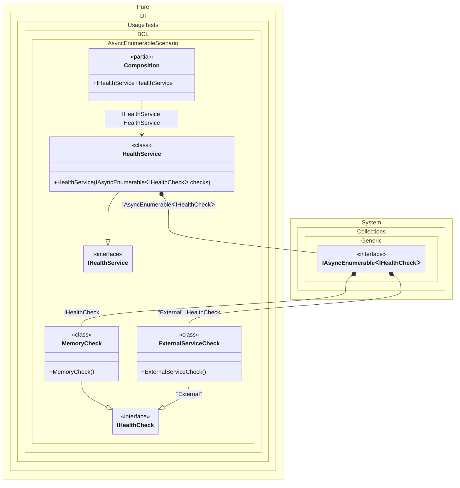

#### Async Enumerable

Specifying `IAsyncEnumerable<T>` as the injection type allows instances of all bindings implementing type `T` to be injected in an asynchronous-lazy manner - the instances will be provided one at a time, in an order corresponding to the sequence of the bindings.
When this occurs: you need this feature while building the composition and calling roots.
What it solves: provides a clear setup pattern and expected behavior without extra boilerplate or manual wiring.
How it is solved in the example: shows the minimal DI configuration and how the result is used in code.


```c#
using Shouldly;
using Pure.DI;

DI.Setup(nameof(Composition))
    .Bind<IHealthCheck>().To<MemoryCheck>()
    .Bind<IHealthCheck>("External").To<ExternalServiceCheck>()
    .Bind<IHealthService>().To<HealthService>()

    // Composition root
    .Root<IHealthService>("HealthService");

var composition = new Composition();
var healthService = composition.HealthService;
var checks = await healthService.GetChecksAsync();

checks[0].ShouldBeOfType<MemoryCheck>();
checks[1].ShouldBeOfType<ExternalServiceCheck>();

interface IHealthCheck;

class MemoryCheck : IHealthCheck;

class ExternalServiceCheck : IHealthCheck;

interface IHealthService
{
    Task<IReadOnlyList<IHealthCheck>> GetChecksAsync();
}

class HealthService(IAsyncEnumerable<IHealthCheck> checks) : IHealthService
{
    public async Task<IReadOnlyList<IHealthCheck>> GetChecksAsync()
    {
        var results = new List<IHealthCheck>();
        await foreach (var check in checks)
        {
            results.Add(check);
        }

        return results;
    }
}
```

<details>
<summary>Running this code sample locally</summary>

- Make sure you have the [.NET SDK 10.0](https://dotnet.microsoft.com/en-us/download/dotnet/10.0) or later installed
```bash
dotnet --list-sdk
```
- Create a net10.0 (or later) console application
```bash
dotnet new console -n Sample
```
- Add references to the NuGet packages
  - [Pure.DI](https://www.nuget.org/packages/Pure.DI)
  - [Shouldly](https://www.nuget.org/packages/Shouldly)
```bash
dotnet add package Pure.DI
dotnet add package Shouldly
```
- Copy the example code into the _Program.cs_ file

You are ready to run the example 🚀
```bash
dotnet run
```

</details>

What it shows:
- Demonstrates the scenario setup and resulting object graph in Pure.DI.

Important points:
- Highlights the key configuration choices and their effect on resolution.

Useful when:
- You want a concrete template for applying this feature in a composition.


The following partial class will be generated:

```c#
partial class Composition
{
  public IHealthService HealthService
  {
    [MethodImpl(MethodImplOptions.AggressiveInlining)]
    get
    {
      [MethodImpl(MethodImplOptions.AggressiveInlining)]
      async IAsyncEnumerable<IHealthCheck> EnumerationOf_transientIAsyncEnumerable341()
      {
        yield return new MemoryCheck();
        yield return new ExternalServiceCheck();
        await Task.CompletedTask;
      }

      return new HealthService(EnumerationOf_transientIAsyncEnumerable341());
    }
  }
}
```

Class diagram:



