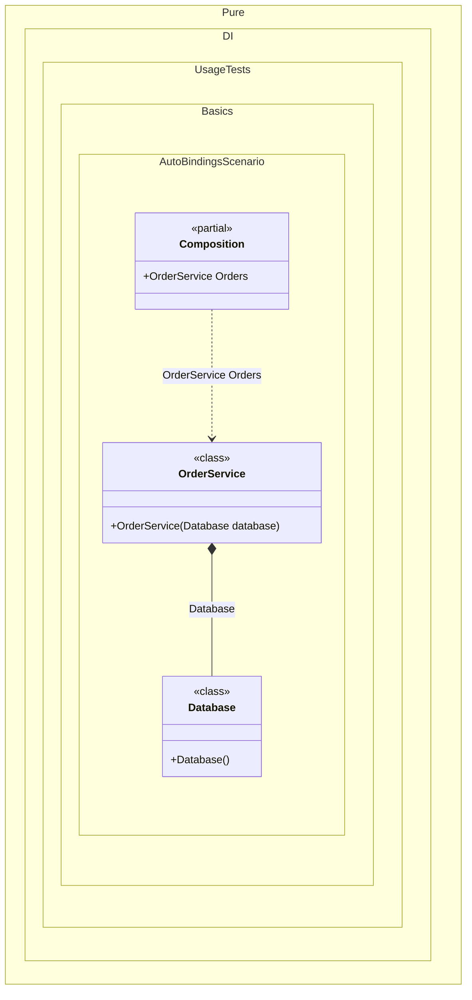

#### Auto-bindings

Non-abstract types can be injected without any additional bindings.


```c#
using Pure.DI;

// Specifies to create a partial class named "Composition"
DI.Setup("Composition")
    // with the root "Orders"
    .Root<OrderService>("Orders");

var composition = new Composition();

// service = new OrderService(new Database())
var orders = composition.Orders;

class Database;

class OrderService(Database database);
```

<details>
<summary>Running this code sample locally</summary>

- Make sure you have the [.NET SDK 10.0](https://dotnet.microsoft.com/en-us/download/dotnet/10.0) or later installed
```bash
dotnet --list-sdk
```
- Create a net10.0 (or later) console application
```bash
dotnet new console -n Sample
```
- Add a reference to the NuGet package
  - [Pure.DI](https://www.nuget.org/packages/Pure.DI)
```bash
dotnet add package Pure.DI
```
- Copy the example code into the _Program.cs_ file

You are ready to run the example 🚀
```bash
dotnet run
```

</details>

> [!WARNING]
> This approach is not recommended if you follow the dependency inversion principle or need precise lifetime control.

Prefer injecting abstractions (for example, interfaces) and map them to implementations as in most [other examples](injections-of-abstractions.md).

The following partial class will be generated:

```c#
partial class Composition
{
  public OrderService Orders
  {
    [MethodImpl(MethodImplOptions.AggressiveInlining)]
    get
    {
      return new OrderService(new Database());
    }
  }
}
```

Class diagram:



