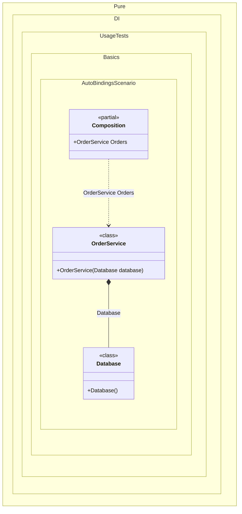

#### Auto-bindings

Auto-bindings are implicit bindings for non-abstract types, so the generator can build an object graph without explicit registrations.
Pros: fast to get started and low ceremony in small demos or spikes.
Cons: weaker adherence to dependency inversion and less explicit lifetime control, which can make larger graphs harder to reason about.
Recommendation: prefer explicit bindings for abstractions in production code and use auto-bindings sparingly for simple leaf types.
In this example, a composition is created with only a root; the `OrderService` and `Database` types are resolved implicitly.


```c#
using Pure.DI;

// Specifies to create a partial class named "Composition"
DI.Setup("Composition")
    // with the root "Orders"
    .Root<OrderService>("Orders");

var composition = new Composition();

// service = new OrderService(new Database())
var orders = composition.Orders;

class Database;

class OrderService(Database database);
```

<details>
<summary>Running this code sample locally</summary>

- Make sure you have the [.NET SDK 10.0](https://dotnet.microsoft.com/en-us/download/dotnet/10.0) or later installed
```bash
dotnet --list-sdk
```
- Create a net10.0 (or later) console application
```bash
dotnet new console -n Sample
```
- Add a reference to the NuGet package
  - [Pure.DI](https://www.nuget.org/packages/Pure.DI)
```bash
dotnet add package Pure.DI
```
- Copy the example code into the _Program.cs_ file

You are ready to run the example 🚀
```bash
dotnet run
```

</details>

> [!WARNING]
> This approach is not recommended if you follow the dependency inversion principle or need precise lifetime control.

Prefer injecting abstractions (for example, interfaces) and map them to implementations as in most [other examples](injections-of-abstractions.md).
What it shows:
- Demonstrates the scenario setup and resulting object graph in Pure.DI.

Important points:
- Highlights the key configuration choices and their effect on resolution.

Useful when:
- You want a concrete template for applying this feature in a composition.


The following partial class will be generated:

```c#
partial class Composition
{
  public OrderService Orders
  {
    [MethodImpl(MethodImplOptions.AggressiveInlining)]
    get
    {
      return new OrderService(new Database());
    }
  }
}
```

Class diagram:



