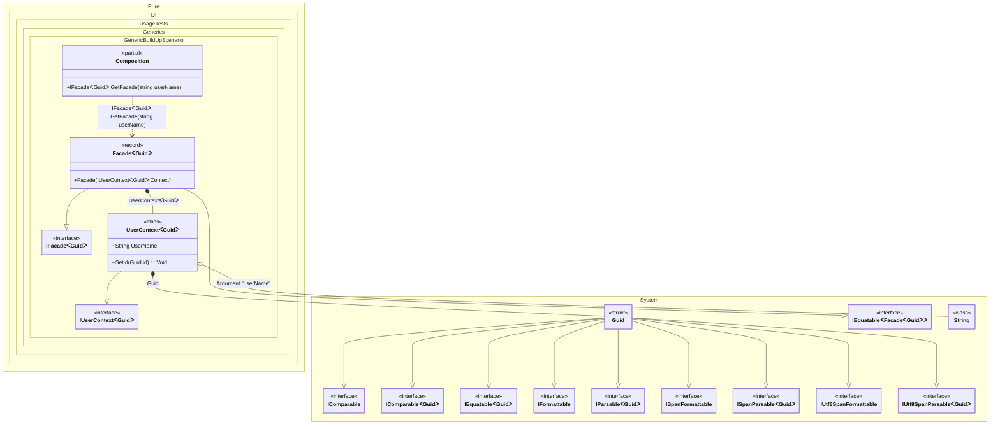

#### Build up of an existing generic object

In other words, injecting the necessary dependencies via methods, properties, or fields into an existing object.
When this occurs: you need this feature while building the composition and calling roots.
What it solves: provides a clear setup pattern and expected behavior without extra boilerplate or manual wiring.
How it is solved in the example: shows the minimal DI configuration and how the result is used in code.


```c#
using Shouldly;
using Pure.DI;

DI.Setup(nameof(Composition))
    .RootArg<string>("userName")
    .Bind().To(Guid.NewGuid)
    .Bind().To(ctx => {
        // The "BuildUp" method injects dependencies into an existing object.
        // This is useful when the object is created externally (e.g., by a UI framework
        // or an ORM) or requires specific initialization before injection.
        var context = new UserContext<TTS>();
        ctx.BuildUp(context);
        return context;
    })
    .Bind().To<Facade<TTS>>()

    // Composition root
    .Root<IFacade<Guid>>("GetFacade");

var composition = new Composition();
var facade = composition.GetFacade("Erik");

facade.Context.UserName.ShouldBe("Erik");
facade.Context.Id.ShouldNotBe(Guid.Empty);

interface IUserContext<out T>
    where T : struct
{
    string UserName { get; }

    T Id { get; }
}

class UserContext<T> : IUserContext<T>
    where T : struct
{
    // The Dependency attribute specifies to perform an injection
    [Dependency]
    public string UserName { get; set; } = "";

    public T Id { get; private set; }

    // The Dependency attribute specifies to perform an injection
    [Dependency]
    public void SetId(T id) => Id = id;
}

interface IFacade<out T>
    where T : struct
{
    IUserContext<T> Context { get; }
}

record Facade<T>(IUserContext<T> Context)
    : IFacade<T> where T : struct;
```

<details>
<summary>Running this code sample locally</summary>

- Make sure you have the [.NET SDK 10.0](https://dotnet.microsoft.com/en-us/download/dotnet/10.0) or later installed
```bash
dotnet --list-sdk
```
- Create a net10.0 (or later) console application
```bash
dotnet new console -n Sample
```
- Add references to the NuGet packages
  - [Pure.DI](https://www.nuget.org/packages/Pure.DI)
  - [Shouldly](https://www.nuget.org/packages/Shouldly)
```bash
dotnet add package Pure.DI
dotnet add package Shouldly
```
- Copy the example code into the _Program.cs_ file

You are ready to run the example 🚀
```bash
dotnet run
```

</details>

What it shows:
- Demonstrates the scenario setup and resulting object graph in Pure.DI.

Important points:
- Highlights the key configuration choices and their effect on resolution.

Useful when:
- You want a concrete template for applying this feature in a composition.


The following partial class will be generated:

```c#
partial class Composition
{
#if NET9_0_OR_GREATER
  private readonly Lock _lock = new Lock();
#else
  private readonly Object _lock = new Object();
#endif

  [MethodImpl(MethodImplOptions.AggressiveInlining)]
  public IFacade<Guid> GetFacade(string userName)
  {
    if (userName is null) throw new ArgumentNullException(nameof(userName));
    UserContext<Guid> transientUserContext454;
    // The "BuildUp" method injects dependencies into an existing object.
    // This is useful when the object is created externally (e.g., by a UI framework
    // or an ORM) or requires specific initialization before injection.
    UserContext<Guid> localContext = new UserContext<Guid>();
    Guid transientGuid456 = Guid.NewGuid();
    localContext.UserName = userName;
    localContext.SetId(transientGuid456);
    transientUserContext454 = localContext;
    return new Facade<Guid>(transientUserContext454);
  }
}
```

Class diagram:



