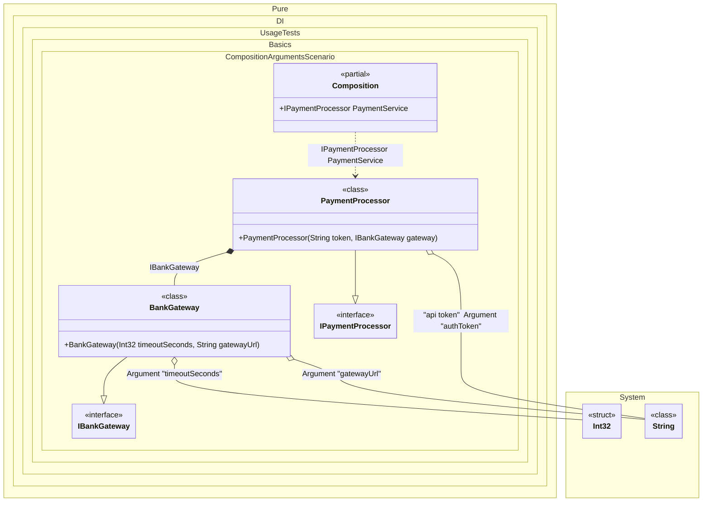

#### Composition arguments

Use composition arguments when you need to pass state into the composition. Define them with `Arg<T>(string argName)` (optionally with tags) and use them like any other dependency. Only arguments that are used in the object graph become constructor parameters.
>[!NOTE]
>Actually, composition arguments work like normal bindings. The difference is that they bind to the values of the arguments. These values will be injected wherever they are required.


```c#
using Shouldly;
using Pure.DI;

DI.Setup(nameof(Composition))
    .Bind<IBankGateway>().To<BankGateway>()
    .Bind<IPaymentProcessor>().To<PaymentProcessor>()

    // Composition root "PaymentService"
    .Root<IPaymentProcessor>("PaymentService")

    // Composition argument: Connection timeout (e.g., from config)
    .Arg<int>("timeoutSeconds")

    // Composition argument: API Token (using a tag to distinguish from other strings)
    .Arg<string>("authToken", "api token")

    // Composition argument: Bank gateway address
    .Arg<string>("gatewayUrl");

// Create the composition, passing real settings from outside
var composition = new Composition(
    timeoutSeconds: 30,
    authToken: "secret_token_123",
    gatewayUrl: "https://api.bank.com/v1");

var paymentService = composition.PaymentService;

paymentService.Token.ShouldBe("secret_token_123");
paymentService.Gateway.Timeout.ShouldBe(30);
paymentService.Gateway.Url.ShouldBe("https://api.bank.com/v1");

interface IBankGateway
{
    int Timeout { get; }

    string Url { get; }
}

// Simulation of a bank gateway client
class BankGateway(int timeoutSeconds, string gatewayUrl) : IBankGateway
{
    public int Timeout { get; } = timeoutSeconds;

    public string Url { get; } = gatewayUrl;
}

interface IPaymentProcessor
{
    string Token { get; }

    IBankGateway Gateway { get; }
}

// Payment processing service
class PaymentProcessor(
    // The tag allows specifying exactly which string to inject here
    [Tag("api token")] string token,
    IBankGateway gateway) : IPaymentProcessor
{
    public string Token { get; } = token;

    public IBankGateway Gateway { get; } = gateway;
}
```

<details>
<summary>Running this code sample locally</summary>

- Make sure you have the [.NET SDK 10.0](https://dotnet.microsoft.com/en-us/download/dotnet/10.0) or later installed
```bash
dotnet --list-sdk
```
- Create a net10.0 (or later) console application
```bash
dotnet new console -n Sample
```
- Add references to the NuGet packages
  - [Pure.DI](https://www.nuget.org/packages/Pure.DI)
  - [Shouldly](https://www.nuget.org/packages/Shouldly)
```bash
dotnet add package Pure.DI
dotnet add package Shouldly
```
- Copy the example code into the _Program.cs_ file

You are ready to run the example 🚀
```bash
dotnet run
```

</details>

>[!NOTE]
>Composition arguments provide a way to inject runtime values into the composition, making your DI configuration more flexible.

The following partial class will be generated:

```c#
partial class Composition
{
#if NET9_0_OR_GREATER
  private readonly Lock _lock;
#else
  private readonly Object _lock;
#endif

  private readonly int _argTimeoutSeconds;
  private readonly string _argAuthToken;
  private readonly string _argGatewayUrl;

  [OrdinalAttribute(128)]
  public Composition(int timeoutSeconds, string authToken, string gatewayUrl)
  {
    _argTimeoutSeconds = timeoutSeconds;
    _argAuthToken = authToken ?? throw new ArgumentNullException(nameof(authToken));
    _argGatewayUrl = gatewayUrl ?? throw new ArgumentNullException(nameof(gatewayUrl));
#if NET9_0_OR_GREATER
    _lock = new Lock();
#else
    _lock = new Object();
#endif
  }

  public IPaymentProcessor PaymentService
  {
    [MethodImpl(MethodImplOptions.AggressiveInlining)]
    get
    {
      return new PaymentProcessor(_argAuthToken, new BankGateway(_argTimeoutSeconds, _argGatewayUrl));
    }
  }
}
```

Class diagram:



