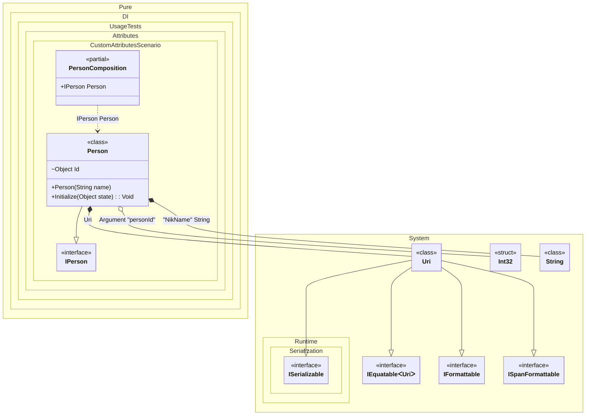

#### Custom attributes

To use custom attributes, derive from `System.Attribute` and register them with the setup API:
- `TagAttribute`
- `OrdinalAttribute`
- `TypeAttribute`
You can also use combined attributes. Each registration method can take an optional argument index (default is 0) that specifies where to read _tag_, _ordinal_, or _type_ metadata.


```c#
using Shouldly;
using Pure.DI;

DI.Setup(nameof(PersonComposition))
    .TagAttribute<MyTagAttribute>()
    .OrdinalAttribute<MyOrdinalAttribute>()
    .TypeAttribute<MyTypeAttribute>()
    .TypeAttribute<MyGenericTypeAttribute<TT>>()
    .Arg<int>("personId")
    .Bind().To(() => new Uri("https://github.com/DevTeam/Pure.DI"))
    .Bind("NikName").To(() => "Nik")
    .Bind().To<Person>()

    // Composition root
    .Root<IPerson>("Person");

var composition = new PersonComposition(personId: 123);
var person = composition.Person;
person.ToString().ShouldBe("123 Nik https://github.com/DevTeam/Pure.DI");

[AttributeUsage(
    AttributeTargets.Constructor
    | AttributeTargets.Method |
    AttributeTargets.Property |
    AttributeTargets.Field)]
class MyOrdinalAttribute(int ordinal) : Attribute;

[AttributeUsage(
    AttributeTargets.Parameter
    | AttributeTargets.Property
    | AttributeTargets.Field)]
class MyTagAttribute(object tag) : Attribute;

[AttributeUsage(
    AttributeTargets.Parameter
    | AttributeTargets.Property
    | AttributeTargets.Field)]
class MyTypeAttribute(Type type) : Attribute;

[AttributeUsage(
    AttributeTargets.Parameter
    | AttributeTargets.Property
    | AttributeTargets.Field)]
class MyGenericTypeAttribute<T> : Attribute;

interface IPerson;

class Person([MyTag("NikName")] string name) : IPerson
{
    private object? _state;

    [MyOrdinal(1)] [MyType(typeof(int))] internal object Id = "";

    [MyOrdinal(2)]
    public void Initialize([MyGenericType<Uri>] object state) =>
        _state = state;

    public override string ToString() => $"{Id} {name} {_state}";
}
```

<details>
<summary>Running this code sample locally</summary>

- Make sure you have the [.NET SDK 10.0](https://dotnet.microsoft.com/en-us/download/dotnet/10.0) or later installed
```bash
dotnet --list-sdk
```
- Create a net10.0 (or later) console application
```bash
dotnet new console -n Sample
```
- Add references to the NuGet packages
  - [Pure.DI](https://www.nuget.org/packages/Pure.DI)
  - [Shouldly](https://www.nuget.org/packages/Shouldly)
```bash
dotnet add package Pure.DI
dotnet add package Shouldly
```
- Copy the example code into the _Program.cs_ file

You are ready to run the example 🚀
```bash
dotnet run
```

</details>

>[!NOTE]
>Custom attributes provide extensibility for advanced scenarios where standard attributes don't meet specific requirements.

The following partial class will be generated:

```c#
partial class PersonComposition
{
#if NET9_0_OR_GREATER
  private readonly Lock _lock;
#else
  private readonly Object _lock;
#endif

  private readonly int _argPersonId;

  [OrdinalAttribute(128)]
  public PersonComposition(int personId)
  {
    _argPersonId = personId;
#if NET9_0_OR_GREATER
    _lock = new Lock();
#else
    _lock = new Object();
#endif
  }

  public IPerson Person
  {
    [MethodImpl(MethodImplOptions.AggressiveInlining)]
    get
    {
      string transientString169 = "Nik";
      Uri transientUri171 = new Uri("https://github.com/DevTeam/Pure.DI");
      var transientPerson168 = new Person(transientString169);
      transientPerson168.Id = _argPersonId;
      transientPerson168.Initialize(transientUri171);
      return transientPerson168;
    }
  }
}
```

Class diagram:



