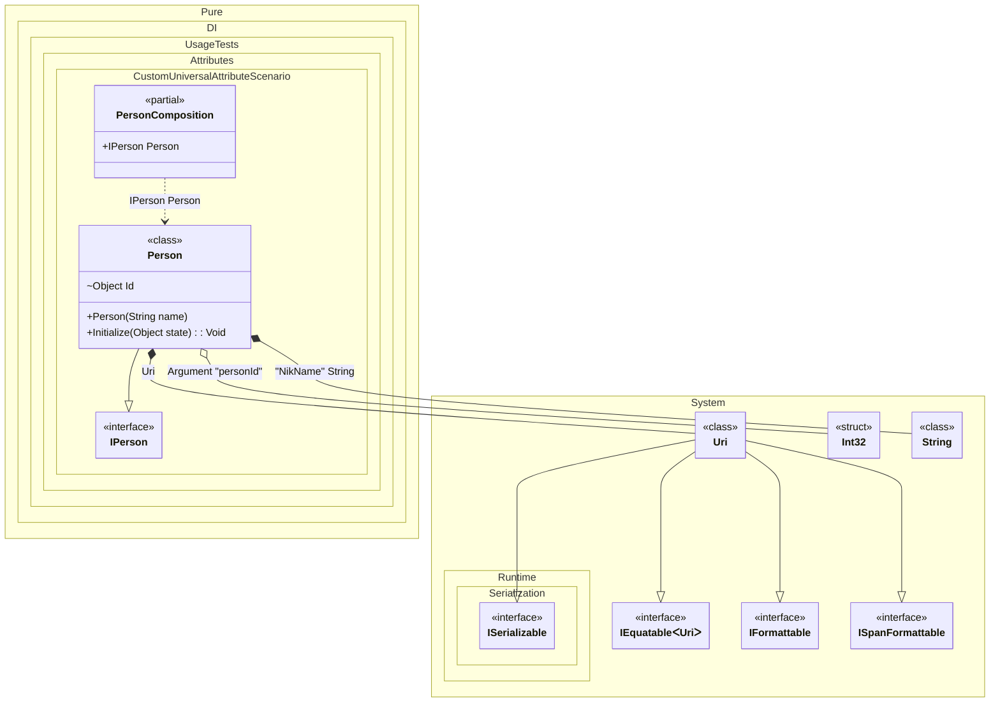

#### Custom universal attribute

A combined attribute can supply _tag_, _ordinal_, and _type_ metadata. Each registration method can take an optional argument index (default is 0) that specifies where to read the metadata.
When this occurs: you need this feature while building the composition and calling roots.
What it solves: provides a clear setup pattern and expected behavior without extra boilerplate or manual wiring.
How it is solved in the example: shows the minimal DI configuration and how the result is used in code.


```c#
using Shouldly;
using Pure.DI;

DI.Setup(nameof(PersonComposition))
    .TagAttribute<InjectAttribute<TT>>()
    .OrdinalAttribute<InjectAttribute<TT>>(1)
    .TypeAttribute<InjectAttribute<TT>>()
    .Arg<int>("personId")
    .Bind().To(() => new Uri("https://github.com/DevTeam/Pure.DI"))
    .Bind("NikName").To(() => "Nik")
    .Bind().To<Person>()

    // Composition root
    .Root<IPerson>("Person");

var composition = new PersonComposition(personId: 123);
var person = composition.Person;
person.ToString().ShouldBe("123 Nik https://github.com/DevTeam/Pure.DI");

[AttributeUsage(
    AttributeTargets.Constructor
    | AttributeTargets.Method
    | AttributeTargets.Parameter
    | AttributeTargets.Property
    | AttributeTargets.Field)]
class InjectAttribute<T>(object? tag = null, int ordinal = 0) : Attribute;

interface IPerson;

class Person([Inject<string>("NikName")] string name) : IPerson
{
    private object? _state;

    [Inject<int>(ordinal: 1)] internal object Id = "";

    public void Initialize([Inject<Uri>] object state) =>
        _state = state;

    public override string ToString() => $"{Id} {name} {_state}";
}
```

<details>
<summary>Running this code sample locally</summary>

- Make sure you have the [.NET SDK 10.0](https://dotnet.microsoft.com/en-us/download/dotnet/10.0) or later installed
```bash
dotnet --list-sdk
```
- Create a net10.0 (or later) console application
```bash
dotnet new console -n Sample
```
- Add references to the NuGet packages
  - [Pure.DI](https://www.nuget.org/packages/Pure.DI)
  - [Shouldly](https://www.nuget.org/packages/Shouldly)
```bash
dotnet add package Pure.DI
dotnet add package Shouldly
```
- Copy the example code into the _Program.cs_ file

You are ready to run the example 🚀
```bash
dotnet run
```

</details>

What it shows:
- Demonstrates the scenario setup and resulting object graph in Pure.DI.

Important points:
- Highlights the key configuration choices and their effect on resolution.

Useful when:
- You want a concrete template for applying this feature in a composition.


The following partial class will be generated:

```c#
partial class PersonComposition
{
#if NET9_0_OR_GREATER
  private readonly Lock _lock;
#else
  private readonly Object _lock;
#endif

  private readonly int _argPersonId;

  [OrdinalAttribute(128)]
  public PersonComposition(int personId)
  {
    _argPersonId = personId;
#if NET9_0_OR_GREATER
    _lock = new Lock();
#else
    _lock = new Object();
#endif
  }

  public IPerson Person
  {
    [MethodImpl(MethodImplOptions.AggressiveInlining)]
    get
    {
      string transientString172 = "Nik";
      Uri transientUri174 = new Uri("https://github.com/DevTeam/Pure.DI");
      var transientPerson171 = new Person(transientString172);
      transientPerson171.Initialize(transientUri174);
      transientPerson171.Id = _argPersonId;
      return transientPerson171;
    }
  }
}
```

Class diagram:



