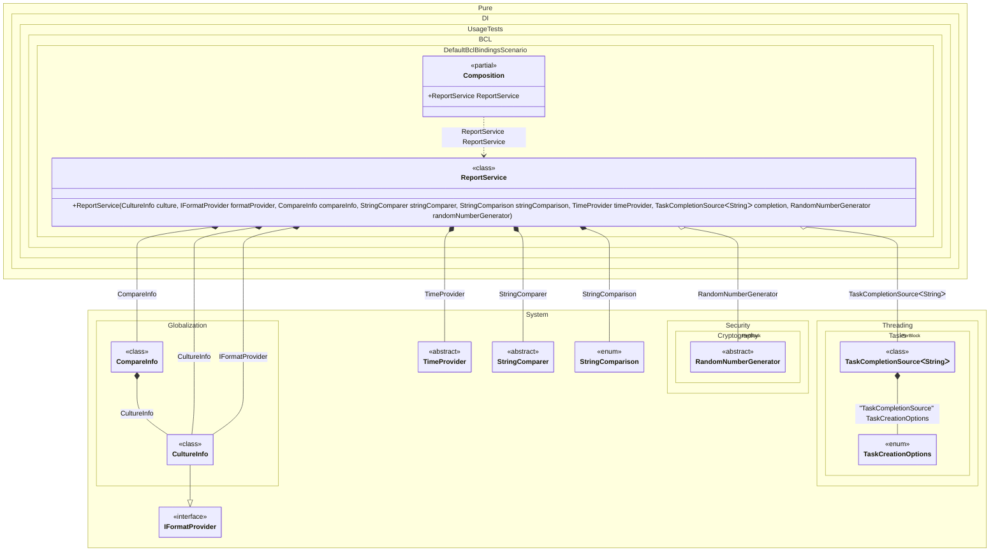

#### Default BCL bindings

Pure.DI provides default bindings for commonly used .NET BCL types, so they can be injected without extra setup code.


```c#
using Shouldly;
using Pure.DI;
using System.Globalization;
using System.Security.Cryptography;

DI.Setup(nameof(Composition))
    .Root<ReportService>("ReportService");

var composition = new Composition();
var reportService = composition.ReportService;

reportService.Culture.ShouldBe(CultureInfo.CurrentCulture);
reportService.FormatProvider.ShouldBe(reportService.Culture);
reportService.CompareInfo.ShouldBe(CultureInfo.CurrentCulture.CompareInfo);
reportService.StringComparer.ShouldBe(StringComparer.Ordinal);
reportService.StringComparison.ShouldBe(StringComparison.Ordinal);
reportService.TimeProvider.ShouldBe(TimeProvider.System);
reportService.Completion.Task.CreationOptions
    .HasFlag(TaskCreationOptions.RunContinuationsAsynchronously)
    .ShouldBeTrue();

var bytes = new byte[4];
reportService.RandomNumberGenerator.GetBytes(bytes);
bytes.Length.ShouldBe(4);

class ReportService(
    CultureInfo culture,
    IFormatProvider formatProvider,
    CompareInfo compareInfo,
    StringComparer stringComparer,
    StringComparison stringComparison,
    TimeProvider timeProvider,
    TaskCompletionSource<string> completion,
    RandomNumberGenerator randomNumberGenerator)
{
    public CultureInfo Culture { get; } = culture;

    public IFormatProvider FormatProvider { get; } = formatProvider;

    public CompareInfo CompareInfo { get; } = compareInfo;

    public StringComparer StringComparer { get; } = stringComparer;

    public StringComparison StringComparison { get; } = stringComparison;

    public TimeProvider TimeProvider { get; } = timeProvider;

    public TaskCompletionSource<string> Completion { get; } = completion;

    public RandomNumberGenerator RandomNumberGenerator { get; } = randomNumberGenerator;
}
```

<details>
<summary>Running this code sample locally</summary>

- Make sure you have the [.NET SDK 10.0](https://dotnet.microsoft.com/en-us/download/dotnet/10.0) or later installed
```bash
dotnet --list-sdk
```
- Create a net10.0 (or later) console application
```bash
dotnet new console -n Sample
```
- Add references to the NuGet packages
  - [Pure.DI](https://www.nuget.org/packages/Pure.DI)
  - [Shouldly](https://www.nuget.org/packages/Shouldly)
```bash
dotnet add package Pure.DI
dotnet add package Shouldly
```
- Copy the example code into the _Program.cs_ file

You are ready to run the example 🚀
```bash
dotnet run
```

</details>

>[!NOTE]
>Default BCL bindings can still be overridden in the composition when an application needs a different policy.

The following partial class will be generated:

```c#
partial class Composition
{
  public ReportService ReportService
  {
    [MethodImpl(MethodImplOptions.AggressiveInlining)]
    get
    {
      Globalization.CultureInfo transientCultureInfo;
      // Provides the current culture
      transientCultureInfo = Globalization.CultureInfo.CurrentCulture;
      StringComparer transientStringComparer;
      // Provides ordinal string comparison
      transientStringComparer = StringComparer.Ordinal;
      StringComparison transientStringComparison = StringComparison.Ordinal;
      TimeProvider transientTimeProvider;
      // Provides the system time provider
      transientTimeProvider = TimeProvider.System;
      Security.Cryptography.RandomNumberGenerator perBlockRandomNumberGenerator;
      // Creates a cryptographic random number generator
      perBlockRandomNumberGenerator = Security.Cryptography.RandomNumberGenerator.Create();
      Globalization.CultureInfo transientCultureInfo1;
      Globalization.CultureInfo transientCultureInfo2;
      // Provides the current culture
      transientCultureInfo2 = Globalization.CultureInfo.CurrentCulture;
      Globalization.CultureInfo localCulture = transientCultureInfo2;
      transientCultureInfo1 = localCulture;
      Globalization.CompareInfo transientCompareInfo;
      Globalization.CultureInfo transientCultureInfo3;
      // Provides the current culture
      transientCultureInfo3 = Globalization.CultureInfo.CurrentCulture;
      Globalization.CultureInfo localCulture1 = transientCultureInfo3;
      // Provides culture-sensitive string comparison
      transientCompareInfo = localCulture1.CompareInfo;
      TaskCompletionSource<string> perBlockTaskCompletionSourceString;
      TaskCreationOptions transientTaskCreationOptions = TaskCreationOptions.RunContinuationsAsynchronously;
      TaskCreationOptions localTaskCreationOptions = transientTaskCreationOptions;
      // Creates an async completion source
      perBlockTaskCompletionSourceString = new TaskCompletionSource<string>(localTaskCreationOptions);
      return new ReportService(transientCultureInfo, transientCultureInfo1, transientCompareInfo, transientStringComparer, transientStringComparison, transientTimeProvider, perBlockTaskCompletionSourceString, perBlockRandomNumberGenerator);
    }
  }
}
```

Class diagram:



