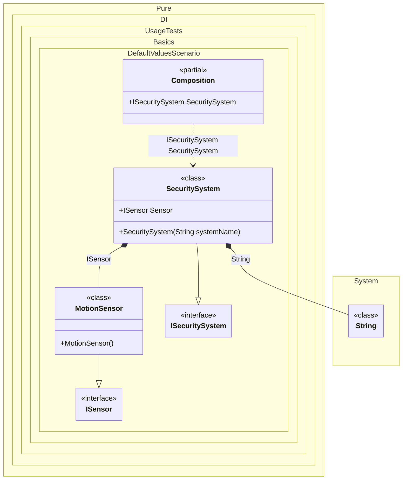

#### Default values

This example shows how to use default values in dependency injection when explicit injection is not possible.
When this occurs: you need this feature while building the composition and calling roots.
What it solves: provides a clear setup pattern and expected behavior without extra boilerplate or manual wiring.
How it is solved in the example: shows the minimal DI configuration and how the result is used in code.


```c#
using Shouldly;
using Pure.DI;

DI.Setup(nameof(Composition))
    .Bind<ISensor>().To<MotionSensor>()
    .Bind<ISecuritySystem>().To<SecuritySystem>()

    // Composition root
    .Root<ISecuritySystem>("SecuritySystem");

var composition = new Composition();
var securitySystem = composition.SecuritySystem;
securitySystem.Sensor.ShouldBeOfType<MotionSensor>();
securitySystem.SystemName.ShouldBe("Home Guard");

interface ISensor;

class MotionSensor : ISensor;

interface ISecuritySystem
{
    string SystemName { get; }

    ISensor Sensor { get; }
}

// If injection cannot be performed explicitly,
// the default value will be used
class SecuritySystem(string systemName = "Home Guard") : ISecuritySystem
{
    public string SystemName { get; } = systemName;

    // The 'required' modifier ensures that the property is set during initialization.
    // The default value 'new MotionSensor()' provides a fallback
    // if no dependency is injected.
    public required ISensor Sensor { get; init; } = new MotionSensor();
}
```

<details>
<summary>Running this code sample locally</summary>

- Make sure you have the [.NET SDK 10.0](https://dotnet.microsoft.com/en-us/download/dotnet/10.0) or later installed
```bash
dotnet --list-sdk
```
- Create a net10.0 (or later) console application
```bash
dotnet new console -n Sample
```
- Add references to the NuGet packages
  - [Pure.DI](https://www.nuget.org/packages/Pure.DI)
  - [Shouldly](https://www.nuget.org/packages/Shouldly)
```bash
dotnet add package Pure.DI
dotnet add package Shouldly
```
- Copy the example code into the _Program.cs_ file

You are ready to run the example 🚀
```bash
dotnet run
```

</details>

The key points are:
- Default constructor arguments can be used for simple values
- The DI container will use these defaults if no explicit bindings are provided

This example shows how to handle default values in a dependency injection scenario:
- **Constructor Default Argument**: The `SecuritySystem` class has a constructor with a default value for the name parameter. If no value is provided, "Home Guard" will be used.
- **Required Property with Default**: The `Sensor` property is marked as required but has a default instantiation. This ensures that:
  - The property must be set
  - If no explicit injection occurs, a default value will be used
What it shows:
- Demonstrates the scenario setup and resulting object graph in Pure.DI.

Important points:
- Highlights the key configuration choices and their effect on resolution.

Useful when:
- You want a concrete template for applying this feature in a composition.


The following partial class will be generated:

```c#
partial class Composition
{
  public ISecuritySystem SecuritySystem
  {
    [MethodImpl(MethodImplOptions.AggressiveInlining)]
    get
    {
      return new SecuritySystem("Home Guard")
      {
        Sensor = new MotionSensor()
      };
    }
  }
}
```

Class diagram:



