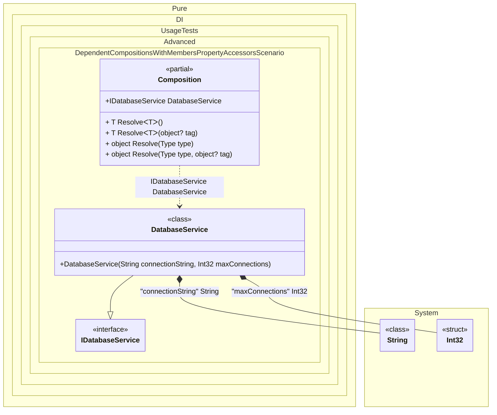

#### Dependent compositions with setup context members and property accessors

This scenario shows how to copy referenced members and implement custom property accessors via partial methods.
When this occurs: you need base setup properties with logic, but the dependent composition must remain parameterless.
What it solves: keeps Unity-friendly composition while letting the user implement property logic.
How it is solved in the example: uses DependsOn(..., SetupContextKind.Members) and implements partial get_ methods.


```c#
using Pure.DI;
using static Pure.DI.CompositionKind;

var composition = new Composition
{
	ConnectionString = "Server=prod-db.example.com;Database=AppDb;"
};

var service = composition.DatabaseService;

interface IDatabaseService
{
	string ConnectionString { get; }
	int MaxConnections { get; }
}

class DatabaseService(
	[Tag("connectionString")] string connectionString,
	[Tag("maxConnections")] int maxConnections) : IDatabaseService
{
	public string ConnectionString { get; } = connectionString;
	public int MaxConnections { get; } = maxConnections;
}

/// <summary>
/// Base composition providing database configuration properties
/// </summary>
internal partial class BaseComposition
{
	/// <summary>
	/// Connection string - simple property with field-backed accessor (no custom logic)
	/// </summary>
	public string ConnectionString { get; set; } = "";

	/// <summary>
	/// Maximum number of connections - property with custom getter logic
	/// </summary>
	private int _maxConnections = 100;

	public int MaxConnections
	{
		get => _maxConnections;
		set => _maxConnections = value;
	}

	private void Setup()
	{
		DI.Setup(nameof(BaseComposition), Internal)
			.Bind<string>("connectionString").To(_ => ConnectionString)
			.Bind<int>("maxConnections").To(_ => MaxConnections);
	}
}

/// <summary>
/// Dependent composition implementing custom accessor logic for properties
/// </summary>
internal partial class Composition
{
	/// <summary>
	/// MaxConnections backing field
	/// </summary>
	private int _maxConnections = 100;

	/// <summary>
	/// Custom accessor logic: returns configured value + 1 to ensure minimum buffer
	/// </summary>
	private partial int get__MaxConnections() => _maxConnections + 1;

	/// <summary>
	/// Setter for MaxConnections
	/// </summary>
	public void SetMaxConnections(int value) => _maxConnections = value;

	private void Setup()
	{
		DI.Setup(nameof(Composition))
			.DependsOn(nameof(BaseComposition), SetupContextKind.Members)
			.Bind<IDatabaseService>().To<DatabaseService>()
			.Root<IDatabaseService>("DatabaseService");
	}
}
```

<details>
<summary>Running this code sample locally</summary>

- Make sure you have the [.NET SDK 10.0](https://dotnet.microsoft.com/en-us/download/dotnet/10.0) or later installed
```bash
dotnet --list-sdk
```
- Create a net10.0 (or later) console application
```bash
dotnet new console -n Sample
```
- Add a reference to the NuGet package
  - [Pure.DI](https://www.nuget.org/packages/Pure.DI)
```bash
dotnet add package Pure.DI
```
- Copy the example code into the _Program.cs_ file

You are ready to run the example 🚀
```bash
dotnet run
```

</details>

What it shows:
- Custom property logic via partial accessor methods.
- Properties with simple field-backed accessors (no logic).

Important points:
- Accessor logic is not copied; the user provides partial implementations.
- Simple property accessors (field-backed) can be used without partial methods.

Example demonstrates:
  1. BaseComposition provides connection string and max connections properties
  2. ConnectionString has simple field-backed accessor (no logic)
  3. MaxConnections has custom getter logic via partial method
  4. Dependent Composition implements custom accessor logic for MaxConnections

Useful when:
- Properties include custom logic and are referenced by bindings in a dependent setup.
- Some properties are simple field-backed while others have custom logic.


The following partial class will be generated:

```c#
partial class Composition
{
  public string ConnectionString { get; set; } = "";

  public int MaxConnections { get => get__MaxConnections(); }

  private partial int get__MaxConnections();

  public IDatabaseService DatabaseService
  {
    [MethodImpl(MethodImplOptions.AggressiveInlining)]
    get
    {
      string transientString31 = ConnectionString;
      int transientInt3232 = MaxConnections;
      return new DatabaseService(transientString31, transientInt3232);
    }
  }

  [MethodImpl(MethodImplOptions.AggressiveInlining)]
  public T Resolve<T>()
  {
    return Resolver<T>.Value.Resolve(this);
  }

  [MethodImpl(MethodImplOptions.AggressiveInlining)]
  public T Resolve<T>(object? tag)
  {
    return Resolver<T>.Value.ResolveByTag(this, tag);
  }

  [MethodImpl(MethodImplOptions.AggressiveInlining)]
  public object Resolve(Type type)
  {
    #if NETCOREAPP3_0_OR_GREATER
    var index = (int)(_bucketSize * (((uint)type.TypeHandle.GetHashCode()) % 1));
    #else
    var index = (int)(_bucketSize * (((uint)RuntimeHelpers.GetHashCode(type)) % 1));
    #endif
    ref var pair = ref _buckets[index];
    return Object.ReferenceEquals(pair.Key, type) ? pair.Value.Resolve(this) : Resolve(type, index);
  }

  [MethodImpl(MethodImplOptions.NoInlining)]
  private object Resolve(Type type, int index)
  {
    var finish = index + _bucketSize;
    while (++index < finish)
    {
      ref var pair = ref _buckets[index];
      if (Object.ReferenceEquals(pair.Key, type))
      {
        return pair.Value.Resolve(this);
      }
    }

    throw new CannotResolveException($"{CannotResolveMessage} {OfTypeMessage} {type}.", type, null);
  }

  [MethodImpl(MethodImplOptions.AggressiveInlining)]
  public object Resolve(Type type, object? tag)
  {
    #if NETCOREAPP3_0_OR_GREATER
    var index = (int)(_bucketSize * (((uint)type.TypeHandle.GetHashCode()) % 1));
    #else
    var index = (int)(_bucketSize * (((uint)RuntimeHelpers.GetHashCode(type)) % 1));
    #endif
    ref var pair = ref _buckets[index];
    return Object.ReferenceEquals(pair.Key, type) ? pair.Value.ResolveByTag(this, tag) : Resolve(type, tag, index);
  }

  [MethodImpl(MethodImplOptions.NoInlining)]
  private object Resolve(Type type, object? tag, int index)
  {
    var finish = index + _bucketSize;
    while (++index < finish)
    {
      ref var pair = ref _buckets[index];
      if (Object.ReferenceEquals(pair.Key, type))
      {
        return pair.Value.ResolveByTag(this, tag);
      }
    }

    throw new CannotResolveException($"{CannotResolveMessage} \"{tag}\" {OfTypeMessage} {type}.", type, tag);
  }

  private readonly static uint _bucketSize;
  private readonly static Pair<IResolver<Composition, object>>[] _buckets;

  static Composition()
  {
    var valResolver_0000 = new Resolver_0000();
    Resolver<IDatabaseService>.Value = valResolver_0000;
    _buckets = Buckets<IResolver<Composition, object>>.Create(
      1,
      out _bucketSize,
      new Pair<IResolver<Composition, object>>[1]
      {
         new Pair<IResolver<Composition, object>>(typeof(IDatabaseService), valResolver_0000)
      });
  }

  private const string CannotResolveMessage = "Cannot resolve composition root ";
  private const string OfTypeMessage = "of type ";

  private class Resolver<T>: IResolver<Composition, T>
  {
    public static IResolver<Composition, T> Value = new Resolver<T>();

    public virtual T Resolve(Composition composite)
    {
      throw new CannotResolveException($"{CannotResolveMessage}{OfTypeMessage}{typeof(T)}.", typeof(T), null);
    }

    public virtual T ResolveByTag(Composition composite, object tag)
    {
      throw new CannotResolveException($"{CannotResolveMessage}\"{tag}\" {OfTypeMessage}{typeof(T)}.", typeof(T), tag);
    }
  }

  private sealed class Resolver_0000: Resolver<IDatabaseService>
  {
    public override IDatabaseService Resolve(Composition composition)
    {
      return composition.DatabaseService;
    }

    public override IDatabaseService ResolveByTag(Composition composition, object tag)
    {
      switch (tag)
      {
        case null:
          return composition.DatabaseService;

        default:
          return base.ResolveByTag(composition, tag);
      }
    }
  }
}
```

Class diagram:



