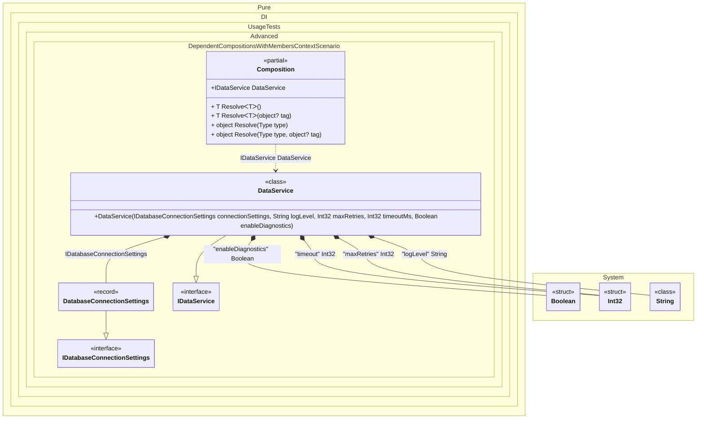

#### Dependent compositions with setup context members

This scenario shows how to copy referenced members from a base setup into the dependent composition.
When this occurs: you want to reuse base setup state without passing a separate context instance.
What it solves: lets dependent compositions access base setup members directly (Unity-friendly, no constructor args).
How it is solved in the example: uses DependsOn(..., SetupContextKind.Members) and sets members on the composition instance. The name parameter is optional; methods are declared partial and implemented by the user.


```c#
var composition = new Composition
{
    ConnectionSettings = new DatabaseConnectionSettings("prod-db.example.com", 5432, "app_database"),
    LogLevel = "Info",
    MaxRetries = 5
};

var service = composition.DataService;

interface IDataService
{
    string GetStatus();
}

/// <summary>
/// Data service using connection settings and logging configuration
/// </summary>
class DataService(
    IDatabaseConnectionSettings connectionSettings,
    [Tag("logLevel")] string logLevel,
    [Tag("maxRetries")] int maxRetries,
    [Tag("timeout")] int timeoutMs,
    [Tag("enableDiagnostics")] bool enableDiagnostics) : IDataService
{
    public string GetStatus() => enableDiagnostics
        ? $"Database: {connectionSettings.DatabaseName}@{connectionSettings.Host}:{connectionSettings.Port}, " +
          $"LogLevel: {logLevel}, " +
          $"MaxRetries: {maxRetries}, " +
          $"Timeout: {timeoutMs}ms"
        : "OK";
}

/// <summary>
/// Base composition providing database connection settings, default timeout, and diagnostics flag
/// </summary>
internal partial class BaseComposition
{
    /// <summary>
    /// Enable detailed diagnostics logging (protected field accessible in derived compositions via DependsOn)
    /// </summary>
    protected bool EnableDiagnostics = false;

    public DatabaseConnectionSettings ConnectionSettings { get; set; } = new("", 0, "");

    int GetDefaultTimeout() => 5000;

    private void Setup()
    {
        DI.Setup(nameof(BaseComposition), Internal)
            .Bind<IDatabaseConnectionSettings>().To(_ => ConnectionSettings)
            .Bind("enableDiagnostics").To(_ => EnableDiagnostics)
            .Bind("timeout").To(_ => GetDefaultTimeout());
    }
}

/// <summary>
/// Dependent composition extending the base with logging level and max retries, and enabling diagnostics
/// </summary>
internal partial class Composition
{
    /// <summary>
    /// Constructor enables diagnostics by default
    /// </summary>
    public Composition() => EnableDiagnostics = true;

    /// <summary>
    /// Application logging level
    /// </summary>
    public string LogLevel { get; set; } = "Warning";

    /// <summary>
    /// Maximum number of retry attempts
    /// </summary>
    public int MaxRetries { get; set; } = 3;

    private void Setup()
    {
        DI.Setup(nameof(Composition))
            .DependsOn(nameof(BaseComposition), SetupContextKind.Members)
            .Bind<string>("logLevel").To(_ => LogLevel)
            .Bind<int>("maxRetries").To(_ => MaxRetries)
            .Bind<IDataService>().To<DataService>()
            .Root<IDataService>("DataService");
    }

    /// <summary>
    /// Implementation of partial method from base composition
    /// </summary>
    private partial int GetDefaultTimeout() => 5000;
}

/// <summary>
/// Database connection settings
/// </summary>
record DatabaseConnectionSettings(string Host, int Port, string DatabaseName) : IDatabaseConnectionSettings;

/// <summary>
/// Database connection settings interface
/// </summary>
interface IDatabaseConnectionSettings
{
    string Host { get; }

    int Port { get; }

    string DatabaseName { get; }
}
```

<details>
<summary>Running this code sample locally</summary>

- Make sure you have the [.NET SDK 10.0](https://dotnet.microsoft.com/en-us/download/dotnet/10.0) or later installed
```bash
dotnet --list-sdk
```
- Create a net10.0 (or later) console application
```bash
dotnet new console -n Sample
```
- Add a reference to the NuGet package
  - [Pure.DI](https://www.nuget.org/packages/Pure.DI)
```bash
dotnet add package Pure.DI
```
- Copy the example code into the _Program.cs_ file

You are ready to run the example 🚀
```bash
dotnet run
```

</details>

What it shows:
- Setup context members copied into the dependent composition.
- Realistic scenario: configuring database connection and logging for a data service.

Important points:
- The composition remains parameterless and can be configured via its own members.

Example demonstrates:
  1. BaseComposition provides database connection settings, default timeout, and a protected diagnostics field
  2. Dependent Composition adds logging level and max retries configuration
  3. DataService uses all settings including the protected field for conditional output
  4. Protected field 'EnableDiagnostics' from BaseComposition is accessible in Composition via DependsOn
  5. Composition's constructor sets EnableDiagnostics to true to enable detailed status

Note: SetupContextKind.Members copies both public and protected members to the dependent composition.

Useful when:
- Base setup has instance members initialized by the host or framework.
- You need to extend configuration with additional settings in derived compositions.


The following partial class will be generated:

```c#
partial class Composition
{
  protected bool EnableDiagnostics = false;

  public DatabaseConnectionSettings ConnectionSettings { get; set; } = new("", 0, "");

  private partial int GetDefaultTimeout();

  public IDataService DataService
  {
    [MethodImpl(MethodImplOptions.AggressiveInlining)]
    get
    {
      DatabaseConnectionSettings transientDatabaseConnectionSettings25 = ConnectionSettings;
      string transientString26 = LogLevel;
      int transientInt3227 = MaxRetries;
      int transientInt3228 = GetDefaultTimeout();
      bool transientBoolean29 = EnableDiagnostics;
      return new DataService(transientDatabaseConnectionSettings25, transientString26, transientInt3227, transientInt3228, transientBoolean29);
    }
  }

  [MethodImpl(MethodImplOptions.AggressiveInlining)]
  public T Resolve<T>()
  {
    return Resolver<T>.Value.Resolve(this);
  }

  [MethodImpl(MethodImplOptions.AggressiveInlining)]
  public T Resolve<T>(object? tag)
  {
    return Resolver<T>.Value.ResolveByTag(this, tag);
  }

  [MethodImpl(MethodImplOptions.AggressiveInlining)]
  public object Resolve(Type type)
  {
    #if NETCOREAPP3_0_OR_GREATER
    var index = (int)(_bucketSize * (((uint)type.TypeHandle.GetHashCode()) % 1));
    #else
    var index = (int)(_bucketSize * (((uint)RuntimeHelpers.GetHashCode(type)) % 1));
    #endif
    ref var pair = ref _buckets[index];
    return Object.ReferenceEquals(pair.Key, type) ? pair.Value.Resolve(this) : Resolve(type, index);
  }

  [MethodImpl(MethodImplOptions.NoInlining)]
  private object Resolve(Type type, int index)
  {
    var finish = index + _bucketSize;
    while (++index < finish)
    {
      ref var pair = ref _buckets[index];
      if (Object.ReferenceEquals(pair.Key, type))
      {
        return pair.Value.Resolve(this);
      }
    }

    throw new CannotResolveException($"{CannotResolveMessage} {OfTypeMessage} {type}.", type, null);
  }

  [MethodImpl(MethodImplOptions.AggressiveInlining)]
  public object Resolve(Type type, object? tag)
  {
    #if NETCOREAPP3_0_OR_GREATER
    var index = (int)(_bucketSize * (((uint)type.TypeHandle.GetHashCode()) % 1));
    #else
    var index = (int)(_bucketSize * (((uint)RuntimeHelpers.GetHashCode(type)) % 1));
    #endif
    ref var pair = ref _buckets[index];
    return Object.ReferenceEquals(pair.Key, type) ? pair.Value.ResolveByTag(this, tag) : Resolve(type, tag, index);
  }

  [MethodImpl(MethodImplOptions.NoInlining)]
  private object Resolve(Type type, object? tag, int index)
  {
    var finish = index + _bucketSize;
    while (++index < finish)
    {
      ref var pair = ref _buckets[index];
      if (Object.ReferenceEquals(pair.Key, type))
      {
        return pair.Value.ResolveByTag(this, tag);
      }
    }

    throw new CannotResolveException($"{CannotResolveMessage} \"{tag}\" {OfTypeMessage} {type}.", type, tag);
  }

  private readonly static uint _bucketSize;
  private readonly static Pair<IResolver<Composition, object>>[] _buckets;

  static Composition()
  {
    var valResolver_0000 = new Resolver_0000();
    Resolver<IDataService>.Value = valResolver_0000;
    _buckets = Buckets<IResolver<Composition, object>>.Create(
      1,
      out _bucketSize,
      new Pair<IResolver<Composition, object>>[1]
      {
         new Pair<IResolver<Composition, object>>(typeof(IDataService), valResolver_0000)
      });
  }

  private const string CannotResolveMessage = "Cannot resolve composition root ";
  private const string OfTypeMessage = "of type ";

  private class Resolver<T>: IResolver<Composition, T>
  {
    public static IResolver<Composition, T> Value = new Resolver<T>();

    public virtual T Resolve(Composition composite)
    {
      throw new CannotResolveException($"{CannotResolveMessage}{OfTypeMessage}{typeof(T)}.", typeof(T), null);
    }

    public virtual T ResolveByTag(Composition composite, object tag)
    {
      throw new CannotResolveException($"{CannotResolveMessage}\"{tag}\" {OfTypeMessage}{typeof(T)}.", typeof(T), tag);
    }
  }

  private sealed class Resolver_0000: Resolver<IDataService>
  {
    public override IDataService Resolve(Composition composition)
    {
      return composition.DataService;
    }

    public override IDataService ResolveByTag(Composition composition, object tag)
    {
      switch (tag)
      {
        case null:
          return composition.DataService;

        default:
          return base.ResolveByTag(composition, tag);
      }
    }
  }
}
```

Class diagram:



