#### Dependent compositions with setup context members

This scenario shows how to copy referenced members from a base setup into the dependent composition.
When this occurs: you want to reuse base setup state without passing a separate context instance.
What it solves: lets dependent compositions access base setup members directly (Unity-friendly, no constructor args).
How it is solved in the example: uses DependsOn(..., SetupContextKind.Members) and sets members on the composition instance. The name parameter is optional; methods are declared partial and implemented by the user.


```c#
var composition = new Composition
{
    Settings = new AppSettings("prod", 3),
    Retries = 4
};

var service = composition.Service;

interface IService
{
    string Report { get; }
}

class Service(IAppSettings settings, [Tag("retries")] int retries) : IService
{
    public string Report { get; } = $"env={settings.Environment}, retries={retries}";
}

internal partial class BaseComposition
{
    public AppSettings Settings { get; set; } = new("", 0);

    private int GetRetries() => 3;

    private void Setup()
    {
        DI.Setup(nameof(BaseComposition), Internal)
            .Bind<IAppSettings>().To(_ => Settings)
            .Bind<int>("retries").To(_ => GetRetries());
    }
}

internal partial class Composition
{
    public int Retries { get; set; }

    private void Setup()
    {
        DI.Setup(nameof(Composition))
            .DependsOn(nameof(BaseComposition), SetupContextKind.Members)
            .Bind<IService>().To<Service>()
            .Root<IService>("Service");
    }

    private partial int GetRetries() => Retries;
}

record AppSettings(string Environment, int RetryCount) : IAppSettings;

interface IAppSettings
{
    string Environment { get; }

    int RetryCount { get; }
}
```

<details>
<summary>Running this code sample locally</summary>

- Make sure you have the [.NET SDK 10.0](https://dotnet.microsoft.com/en-us/download/dotnet/10.0) or later installed
```bash
dotnet --list-sdk
```
- Create a net10.0 (or later) console application
```bash
dotnet new console -n Sample
```
- Add a reference to the NuGet package
  - [Pure.DI](https://www.nuget.org/packages/Pure.DI)
```bash
dotnet add package Pure.DI
```
- Copy the example code into the _Program.cs_ file

You are ready to run the example 🚀
```bash
dotnet run
```

</details>

What it shows:
- Setup context members copied into the dependent composition.

Important points:
- The composition remains parameterless and can be configured via its own members.

Useful when:
- Base setup has instance members initialized by the host or framework.


The following partial class will be generated:

```c#
partial class Composition
{
  public AppSettings Settings { get; set; } = new("", 0);

  private partial int GetRetries();

  public IService Service
  {
    [MethodImpl(MethodImplOptions.AggressiveInlining)]
    get
    {
      AppSettings transientAppSettings25 = Settings;
      int transientInt3226 = GetRetries();
      return new Service(transientAppSettings25, transientInt3226);
    }
  }

  [MethodImpl(MethodImplOptions.AggressiveInlining)]
  public T Resolve<T>()
  {
    return Resolver<T>.Value.Resolve(this);
  }

  [MethodImpl(MethodImplOptions.AggressiveInlining)]
  public T Resolve<T>(object? tag)
  {
    return Resolver<T>.Value.ResolveByTag(this, tag);
  }

  [MethodImpl(MethodImplOptions.AggressiveInlining)]
  public object Resolve(Type type)
  {
    #if NETCOREAPP3_0_OR_GREATER
    var index = (int)(_bucketSize * (((uint)type.TypeHandle.GetHashCode()) % 1));
    #else
    var index = (int)(_bucketSize * (((uint)RuntimeHelpers.GetHashCode(type)) % 1));
    #endif
    ref var pair = ref _buckets[index];
    return Object.ReferenceEquals(pair.Key, type) ? pair.Value.Resolve(this) : Resolve(type, index);
  }

  [MethodImpl(MethodImplOptions.NoInlining)]
  private object Resolve(Type type, int index)
  {
    var finish = index + _bucketSize;
    while (++index < finish)
    {
      ref var pair = ref _buckets[index];
      if (Object.ReferenceEquals(pair.Key, type))
      {
        return pair.Value.Resolve(this);
      }
    }

    throw new CannotResolveException($"{CannotResolveMessage} {OfTypeMessage} {type}.", type, null);
  }

  [MethodImpl(MethodImplOptions.AggressiveInlining)]
  public object Resolve(Type type, object? tag)
  {
    #if NETCOREAPP3_0_OR_GREATER
    var index = (int)(_bucketSize * (((uint)type.TypeHandle.GetHashCode()) % 1));
    #else
    var index = (int)(_bucketSize * (((uint)RuntimeHelpers.GetHashCode(type)) % 1));
    #endif
    ref var pair = ref _buckets[index];
    return Object.ReferenceEquals(pair.Key, type) ? pair.Value.ResolveByTag(this, tag) : Resolve(type, tag, index);
  }

  [MethodImpl(MethodImplOptions.NoInlining)]
  private object Resolve(Type type, object? tag, int index)
  {
    var finish = index + _bucketSize;
    while (++index < finish)
    {
      ref var pair = ref _buckets[index];
      if (Object.ReferenceEquals(pair.Key, type))
      {
        return pair.Value.ResolveByTag(this, tag);
      }
    }

    throw new CannotResolveException($"{CannotResolveMessage} \"{tag}\" {OfTypeMessage} {type}.", type, tag);
  }

  private readonly static uint _bucketSize;
  private readonly static Pair<IResolver<Composition, object>>[] _buckets;

  static Composition()
  {
    var valResolver_0000 = new Resolver_0000();
    Resolver<IService>.Value = valResolver_0000;
    _buckets = Buckets<IResolver<Composition, object>>.Create(
      1,
      out _bucketSize,
      new Pair<IResolver<Composition, object>>[1]
      {
         new Pair<IResolver<Composition, object>>(typeof(IService), valResolver_0000)
      });
  }

  private const string CannotResolveMessage = "Cannot resolve composition root ";
  private const string OfTypeMessage = "of type ";

  private class Resolver<T>: IResolver<Composition, T>
  {
    public static IResolver<Composition, T> Value = new Resolver<T>();

    public virtual T Resolve(Composition composite)
    {
      throw new CannotResolveException($"{CannotResolveMessage}{OfTypeMessage}{typeof(T)}.", typeof(T), null);
    }

    public virtual T ResolveByTag(Composition composite, object tag)
    {
      throw new CannotResolveException($"{CannotResolveMessage}\"{tag}\" {OfTypeMessage}{typeof(T)}.", typeof(T), tag);
    }
  }

  private sealed class Resolver_0000: Resolver<IService>
  {
    public override IService Resolve(Composition composition)
    {
      return composition.Service;
    }

    public override IService ResolveByTag(Composition composition, object tag)
    {
      switch (tag)
      {
        case null:
          return composition.Service;

        default:
          return base.ResolveByTag(composition, tag);
      }
    }
  }
}
```

Class diagram:

```mermaid
---
 config:
  maxTextSize: 2147483647
  maxEdges: 2147483647
  class:
   hideEmptyMembersBox: true
---
classDiagram
	AppSettings --|> IAppSettings
	Service --|> IService
	Composition ..> Service : IService Service
	Service *--  AppSettings : IAppSettings
	Service *--  Int32 : "retries"  Int32
	namespace Pure.DI.UsageTests.Advanced.DependentCompositionsWithMembersContextScenario {
		class AppSettings {
				<<record>>
		}
		class Composition {
		<<partial>>
		+IService Service
		+ T ResolveᐸTᐳ()
		+ T ResolveᐸTᐳ(object? tag)
		+ object Resolve(Type type)
		+ object Resolve(Type type, object? tag)
		}
		class IAppSettings {
			<<interface>>
		}
		class IService {
			<<interface>>
		}
		class Service {
				<<class>>
			+Service(IAppSettings settings, Int32 retries)
		}
	}
	namespace System {
		class Int32 {
				<<struct>>
		}
	}
```



