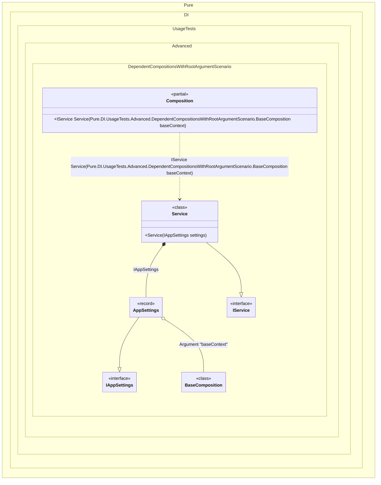

#### Dependent compositions with setup context root argument

This scenario shows how to pass an explicit setup context as a root argument.
When this occurs: you need external state from the base setup but cannot use a constructor (e.g., Unity MonoBehaviour).
What it solves: keeps the dependent composition safe while avoiding constructor arguments.
How it is solved in the example: uses DependsOn(..., SetupContextKind.RootArgument, name) and passes the base setup instance to the root method.


```c#
var baseContext = new BaseComposition { Settings = new AppSettings("staging", 2) };
var composition = new Composition();
var service = composition.Service(baseContext: baseContext);

interface IService
{
    string Report { get; }
}

class Service(IAppSettings settings) : IService
{
    public string Report { get; } = $"env={settings.Environment}, retries={settings.RetryCount}";
}

internal partial class BaseComposition
{
    internal AppSettings Settings { get; set; } = new("", 0);

    private void Setup()
    {
        DI.Setup(nameof(BaseComposition), Internal)
            .Bind<IAppSettings>().To(_ => Settings);
    }
}

internal partial class Composition
{
    private void Setup()
    {
        // Resolve = Off
        DI.Setup(nameof(Composition))
            .DependsOn(nameof(BaseComposition), SetupContextKind.RootArgument, "baseContext")
            .Bind<IService>().To<Service>()
            .Root<IService>("Service");
    }
}

record AppSettings(string Environment, int RetryCount) : IAppSettings;

interface IAppSettings
{
    string Environment { get; }

    int RetryCount { get; }
}
```

<details>
<summary>Running this code sample locally</summary>

- Make sure you have the [.NET SDK 10.0](https://dotnet.microsoft.com/en-us/download/dotnet/10.0) or later installed
```bash
dotnet --list-sdk
```
- Create a net10.0 (or later) console application
```bash
dotnet new console -n Sample
```
- Add a reference to the NuGet package
  - [Pure.DI](https://www.nuget.org/packages/Pure.DI)
```bash
dotnet add package Pure.DI
```
- Copy the example code into the _Program.cs_ file

You are ready to run the example 🚀
```bash
dotnet run
```

</details>

What it shows:
- Passing setup context into a root method.

Important points:
- The composition itself can still be created with a parameterless constructor.

Useful when:
- The host (like Unity) creates the composition instance.


The following partial class will be generated:

```c#
partial class Composition
{
#if NET9_0_OR_GREATER
  private readonly Lock _lock = new Lock();
#else
  private readonly Object _lock = new Object();
#endif

  [MethodImpl(MethodImplOptions.AggressiveInlining)]
  public IService Service(BaseComposition baseContext)
  {
    if (baseContext is null) throw new ArgumentNullException(nameof(baseContext));
    AppSettings transientAppSettings30;
    BaseComposition localBaseContext = baseContext;
    transientAppSettings30 = localBaseContext.Settings;
    return new Service(transientAppSettings30);
  }
}
```

Class diagram:



