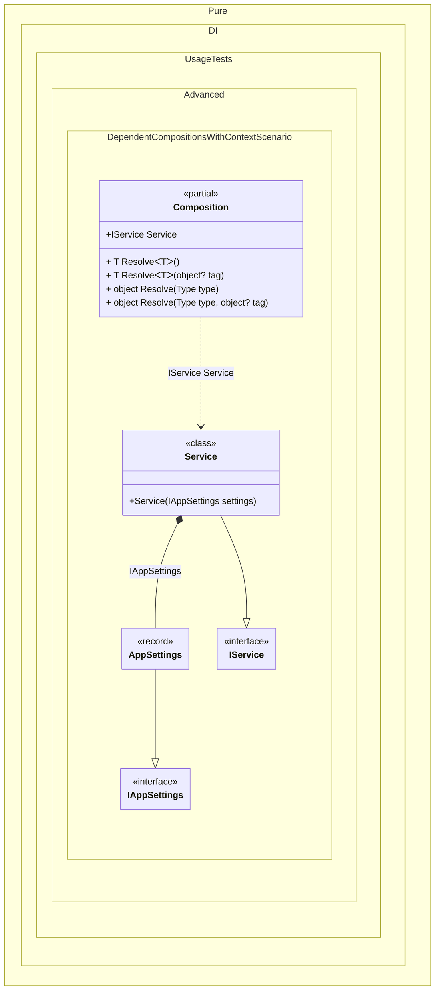

#### Dependent compositions with setup context

This scenario shows how to pass an explicit setup context when a dependent setup uses instance members.
When this occurs: you need base setup state (e.g., Unity-initialized fields) inside a dependent composition.
What it solves: avoids missing instance members in dependent compositions and keeps state access explicit.
How it is solved in the example: uses DependsOn(setupName, kind, name) and passes the base setup instance into the dependent composition.


```c#
using Pure.DI;
using static Pure.DI.CompositionKind;

var baseContext = new BaseComposition { Settings = new AppSettings("prod", 3) };
var composition = new Composition(baseContext);
var service = composition.Service;

interface IService
{
    string Report { get; }
}

class Service(IAppSettings settings) : IService
{
    public string Report { get; } = $"env={settings.Environment}, retries={settings.RetryCount}";
}

internal partial class BaseComposition
{
    internal AppSettings Settings { get; set; } = new("", 0);

    private void Setup()
    {
        DI.Setup(nameof(BaseComposition), Internal)
            .Bind<IAppSettings>().To(_ => Settings);
    }
}

internal partial class Composition
{
    private void Setup()
    {
        DI.Setup(nameof(Composition))
            .DependsOn(nameof(BaseComposition), SetupContextKind.Argument, "baseContext")
            .Bind<IService>().To<Service>()
            .Root<IService>("Service");
    }
}

record AppSettings(string Environment, int RetryCount) : IAppSettings;

interface IAppSettings
{
    string Environment { get; }

    int RetryCount { get; }
}
```

<details>
<summary>Running this code sample locally</summary>

- Make sure you have the [.NET SDK 10.0](https://dotnet.microsoft.com/en-us/download/dotnet/10.0) or later installed
```bash
dotnet --list-sdk
```
- Create a net10.0 (or later) console application
```bash
dotnet new console -n Sample
```
- Add a reference to the NuGet package
  - [Pure.DI](https://www.nuget.org/packages/Pure.DI)
```bash
dotnet add package Pure.DI
```
- Copy the example code into the _Program.cs_ file

You are ready to run the example 🚀
```bash
dotnet run
```

</details>

What it shows:
- Explicit setup context injection for dependent compositions.

Important points:
- The dependent composition receives the base setup instance via a constructor argument.

Useful when:
- Base setup has instance members initialized externally (e.g., Unity).


The following partial class will be generated:

```c#
partial class Composition
{
  private readonly BaseComposition baseContext;

  [OrdinalAttribute(128)]
  public Composition(BaseComposition baseContext)
  {
    this.baseContext = baseContext ?? throw new ArgumentNullException(nameof(baseContext));
  }

  public IService Service
  {
    [MethodImpl(MethodImplOptions.AggressiveInlining)]
    get
    {
      AppSettings transientAppSettings23 = baseContext.Settings;
      return new Service(transientAppSettings23);
    }
  }

  [MethodImpl(MethodImplOptions.AggressiveInlining)]
  public T Resolve<T>()
  {
    return Resolver<T>.Value.Resolve(this);
  }

  [MethodImpl(MethodImplOptions.AggressiveInlining)]
  public T Resolve<T>(object? tag)
  {
    return Resolver<T>.Value.ResolveByTag(this, tag);
  }

  [MethodImpl(MethodImplOptions.AggressiveInlining)]
  public object Resolve(Type type)
  {
    #if NETCOREAPP3_0_OR_GREATER
    var index = (int)(_bucketSize * (((uint)type.TypeHandle.GetHashCode()) % 1));
    #else
    var index = (int)(_bucketSize * (((uint)RuntimeHelpers.GetHashCode(type)) % 1));
    #endif
    ref var pair = ref _buckets[index];
    return Object.ReferenceEquals(pair.Key, type) ? pair.Value.Resolve(this) : Resolve(type, index);
  }

  [MethodImpl(MethodImplOptions.NoInlining)]
  private object Resolve(Type type, int index)
  {
    var finish = index + _bucketSize;
    while (++index < finish)
    {
      ref var pair = ref _buckets[index];
      if (Object.ReferenceEquals(pair.Key, type))
      {
        return pair.Value.Resolve(this);
      }
    }

    throw new CannotResolveException($"{CannotResolveMessage} {OfTypeMessage} {type}.", type, null);
  }

  [MethodImpl(MethodImplOptions.AggressiveInlining)]
  public object Resolve(Type type, object? tag)
  {
    #if NETCOREAPP3_0_OR_GREATER
    var index = (int)(_bucketSize * (((uint)type.TypeHandle.GetHashCode()) % 1));
    #else
    var index = (int)(_bucketSize * (((uint)RuntimeHelpers.GetHashCode(type)) % 1));
    #endif
    ref var pair = ref _buckets[index];
    return Object.ReferenceEquals(pair.Key, type) ? pair.Value.ResolveByTag(this, tag) : Resolve(type, tag, index);
  }

  [MethodImpl(MethodImplOptions.NoInlining)]
  private object Resolve(Type type, object? tag, int index)
  {
    var finish = index + _bucketSize;
    while (++index < finish)
    {
      ref var pair = ref _buckets[index];
      if (Object.ReferenceEquals(pair.Key, type))
      {
        return pair.Value.ResolveByTag(this, tag);
      }
    }

    throw new CannotResolveException($"{CannotResolveMessage} \"{tag}\" {OfTypeMessage} {type}.", type, tag);
  }

  private readonly static uint _bucketSize;
  private readonly static Pair<IResolver<Composition, object>>[] _buckets;

  static Composition()
  {
    var valResolver_0000 = new Resolver_0000();
    Resolver<IService>.Value = valResolver_0000;
    _buckets = Buckets<IResolver<Composition, object>>.Create(
      1,
      out _bucketSize,
      new Pair<IResolver<Composition, object>>[1]
      {
         new Pair<IResolver<Composition, object>>(typeof(IService), valResolver_0000)
      });
  }

  private const string CannotResolveMessage = "Cannot resolve composition root ";
  private const string OfTypeMessage = "of type ";

  private class Resolver<T>: IResolver<Composition, T>
  {
    public static IResolver<Composition, T> Value = new Resolver<T>();

    public virtual T Resolve(Composition composite)
    {
      throw new CannotResolveException($"{CannotResolveMessage}{OfTypeMessage}{typeof(T)}.", typeof(T), null);
    }

    public virtual T ResolveByTag(Composition composite, object tag)
    {
      throw new CannotResolveException($"{CannotResolveMessage}\"{tag}\" {OfTypeMessage}{typeof(T)}.", typeof(T), tag);
    }
  }

  private sealed class Resolver_0000: Resolver<IService>
  {
    public override IService Resolve(Composition composition)
    {
      return composition.Service;
    }

    public override IService ResolveByTag(Composition composition, object tag)
    {
      switch (tag)
      {
        case null:
          return composition.Service;

        default:
          return base.ResolveByTag(composition, tag);
      }
    }
  }
}
```

Class diagram:



