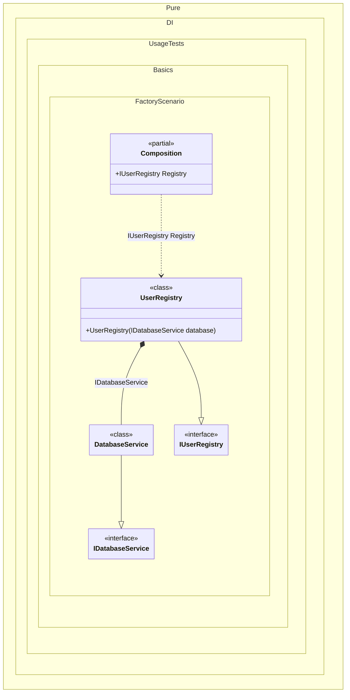

#### Factory

This example shows manual creation and initialization. The generator usually infers dependencies from constructors, but sometimes you need custom creation or setup logic.
When this occurs: you need this feature while building the composition and calling roots.
What it solves: provides a clear setup pattern and expected behavior without extra boilerplate or manual wiring.
How it is solved in the example: shows the minimal DI configuration and how the result is used in code.


```c#
using Shouldly;
using Pure.DI;

DI.Setup(nameof(Composition))
    .Bind<IDatabaseService>().To<DatabaseService>(ctx => {
        // Some logic for creating an instance.
        // For example, we need to manually initialize the connection.
        ctx.Inject(out DatabaseService service);
        service.Connect();
        return service;
    })
    .Bind<IUserRegistry>().To<UserRegistry>()

    // Composition root
    .Root<IUserRegistry>("Registry");

var composition = new Composition();
var registry = composition.Registry;
registry.Database.IsConnected.ShouldBeTrue();

interface IDatabaseService
{
    bool IsConnected { get; }
}

class DatabaseService : IDatabaseService
{
    public bool IsConnected { get; private set; }

    // Simulates a connection establishment that must be called explicitly
    public void Connect() => IsConnected = true;
}

interface IUserRegistry
{
    IDatabaseService Database { get; }
}

class UserRegistry(IDatabaseService database) : IUserRegistry
{
    public IDatabaseService Database { get; } = database;
}
```

<details>
<summary>Running this code sample locally</summary>

- Make sure you have the [.NET SDK 10.0](https://dotnet.microsoft.com/en-us/download/dotnet/10.0) or later installed
```bash
dotnet --list-sdk
```
- Create a net10.0 (or later) console application
```bash
dotnet new console -n Sample
```
- Add references to the NuGet packages
  - [Pure.DI](https://www.nuget.org/packages/Pure.DI)
  - [Shouldly](https://www.nuget.org/packages/Shouldly)
```bash
dotnet add package Pure.DI
dotnet add package Shouldly
```
- Copy the example code into the _Program.cs_ file

You are ready to run the example 🚀
```bash
dotnet run
```

</details>

There are scenarios where manual control over the creation process is required, such as
- When additional initialization logic is needed
- When complex construction steps are required
- When specific object states need to be set during creation

> [!IMPORTANT]
> The method `Inject()` cannot be used outside of the binding setup.
What it shows:
- Demonstrates the scenario setup and resulting object graph in Pure.DI.

Important points:
- Highlights the key configuration choices and their effect on resolution.

Useful when:
- You want a concrete template for applying this feature in a composition.


The following partial class will be generated:

```c#
partial class Composition
{
  public IUserRegistry Registry
  {
    [MethodImpl(MethodImplOptions.AggressiveInlining)]
    get
    {
      DatabaseService transientDatabaseService264;
      // Some logic for creating an instance.
      // For example, we need to manually initialize the connection.
      DatabaseService localService2 = new DatabaseService();
      localService2.Connect();
      transientDatabaseService264 = localService2;
      return new UserRegistry(transientDatabaseService264);
    }
  }
}
```

Class diagram:



