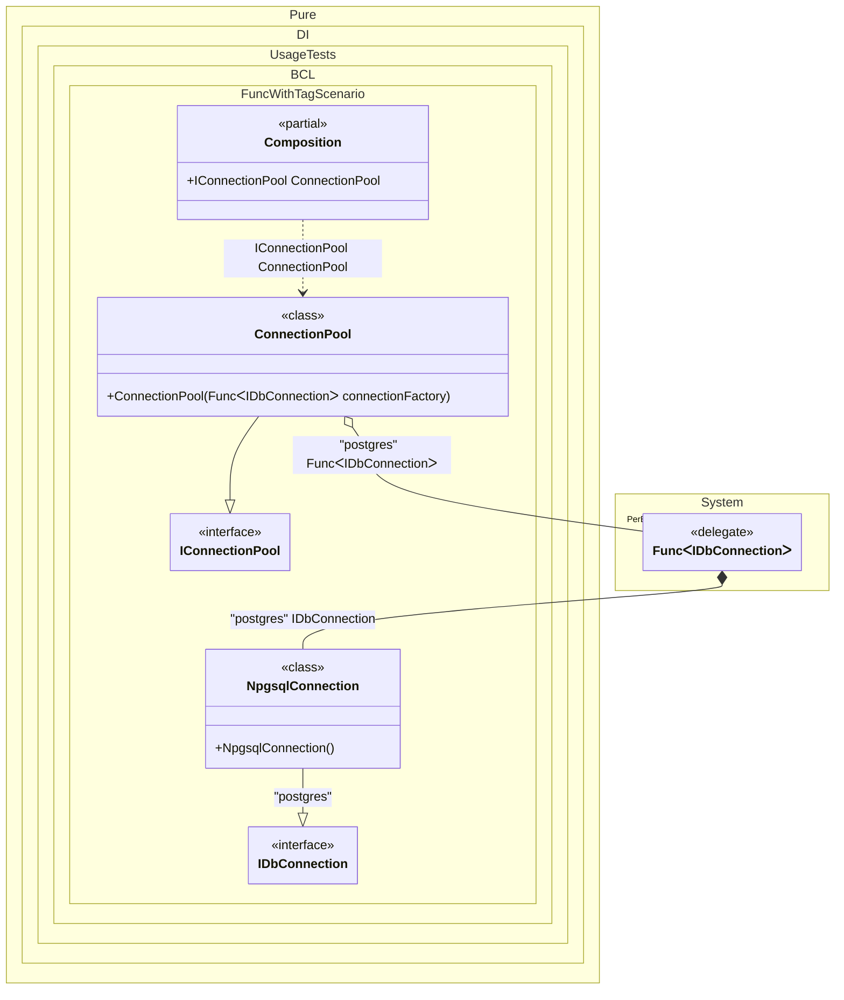

#### Func with tag

When this occurs: you need this feature while building the composition and calling roots.
What it solves: provides a clear setup pattern and expected behavior without extra boilerplate or manual wiring.
How it is solved in the example: shows the minimal DI configuration and how the result is used in code.


```c#
using Shouldly;
using Pure.DI;
using System.Collections.Immutable;

DI.Setup(nameof(Composition))
    .Bind<IDbConnection>("postgres").To<NpgsqlConnection>()
    .Bind<IConnectionPool>().To<ConnectionPool>()

    // Composition root
    .Root<IConnectionPool>("ConnectionPool");

var composition = new Composition();
var pool = composition.ConnectionPool;

// Check that the pool has created 3 connections
pool.Connections.Length.ShouldBe(3);
pool.Connections[0].ShouldBeOfType<NpgsqlConnection>();

interface IDbConnection;

// Specific implementation for PostgreSQL
class NpgsqlConnection : IDbConnection;

interface IConnectionPool
{
    ImmutableArray<IDbConnection> Connections { get; }
}

class ConnectionPool([Tag("postgres")] Func<IDbConnection> connectionFactory) : IConnectionPool
{
    public ImmutableArray<IDbConnection> Connections { get; } =
    [
        // Use the factory to create distinct connection instances
        connectionFactory(),
        connectionFactory(),
        connectionFactory()
    ];
}
```

<details>
<summary>Running this code sample locally</summary>

- Make sure you have the [.NET SDK 10.0](https://dotnet.microsoft.com/en-us/download/dotnet/10.0) or later installed
```bash
dotnet --list-sdk
```
- Create a net10.0 (or later) console application
```bash
dotnet new console -n Sample
```
- Add references to the NuGet packages
  - [Pure.DI](https://www.nuget.org/packages/Pure.DI)
  - [Shouldly](https://www.nuget.org/packages/Shouldly)
```bash
dotnet add package Pure.DI
dotnet add package Shouldly
```
- Copy the example code into the _Program.cs_ file

You are ready to run the example 🚀
```bash
dotnet run
```

</details>

What it shows:
- Demonstrates the scenario setup and resulting object graph in Pure.DI.

Important points:
- Highlights the key configuration choices and their effect on resolution.

Useful when:
- You want a concrete template for applying this feature in a composition.


The following partial class will be generated:

```c#
partial class Composition
{
  public IConnectionPool ConnectionPool
  {
    [MethodImpl(MethodImplOptions.AggressiveInlining)]
    get
    {
      Func<IDbConnection> transientFunc371 = new Func<IDbConnection>(
      [MethodImpl(MethodImplOptions.AggressiveInlining)]
      () =>
      {
        IDbConnection localValue22 = new NpgsqlConnection();
        return localValue22;
      });
      return new ConnectionPool(transientFunc371);
    }
  }
}
```

Class diagram:



