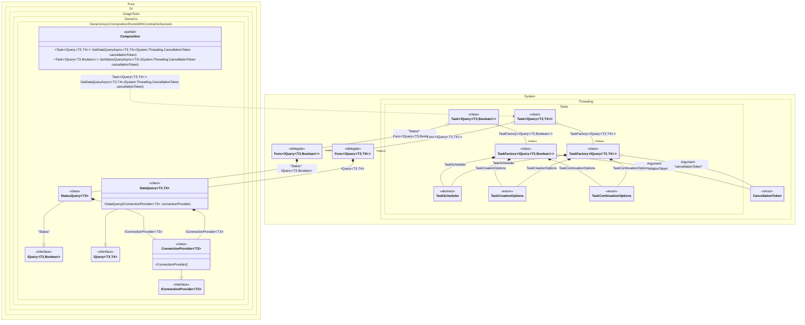

#### Generic async composition roots with constraints

> [!IMPORTANT]
> ``Resolve` methods cannot be used to resolve generic composition roots.


```c#
using Pure.DI;

DI.Setup(nameof(Composition))
    // Disable Resolve methods to keep the public API minimal
    .Hint(Hint.Resolve, "Off")
    .Bind().To<ConnectionProvider<TTDisposable>>()
    .Bind().To<DataQuery<TTDisposable, TTS>>()
    // Creates StatusQuery manually,
    // just for the sake of example
    .Bind("Status").To(ctx => {
        ctx.Inject(out IConnectionProvider<TTDisposable> connectionProvider);
        return new StatusQuery<TTDisposable>(connectionProvider);
    })

    // Specifies to use CancellationToken from the argument
    // when resolving a composition root
    .RootArg<CancellationToken>("cancellationToken")

    // Specifies to create a regular public method
    // to get a composition root of type Task<DataQuery<T, TStruct>>
    // with the name "GetDataQueryAsync"
    .Root<Task<IQuery<TTDisposable, TTS>>>("GetDataQueryAsync")

    // Specifies to create a regular public method
    // to get a composition root of type Task<StatusQuery<T>>
    // with the name "GetStatusQueryAsync"
    // using the "Status" tag
    .Root<Task<IQuery<TTDisposable, bool>>>("GetStatusQueryAsync", "Status");

var composition = new Composition();

// Resolves composition roots asynchronously
var query = await composition.GetDataQueryAsync<Stream, double>(CancellationToken.None);
var status = await composition.GetStatusQueryAsync<BinaryReader>(CancellationToken.None);

interface IConnectionProvider<T>
    where T : IDisposable;

class ConnectionProvider<T> : IConnectionProvider<T>
    where T : IDisposable;

interface IQuery<TConnection, TResult>
    where TConnection : IDisposable
    where TResult : struct;

class DataQuery<TConnection, TResult>(IConnectionProvider<TConnection> connectionProvider)
    : IQuery<TConnection, TResult>
    where TConnection : IDisposable
    where TResult : struct;

class StatusQuery<TConnection>(IConnectionProvider<TConnection> connectionProvider)
    : IQuery<TConnection, bool>
    where TConnection : IDisposable;
```

<details>
<summary>Running this code sample locally</summary>

- Make sure you have the [.NET SDK 10.0](https://dotnet.microsoft.com/en-us/download/dotnet/10.0) or later installed
```bash
dotnet --list-sdk
```
- Create a net10.0 (or later) console application
```bash
dotnet new console -n Sample
```
- Add a reference to the NuGet package
  - [Pure.DI](https://www.nuget.org/packages/Pure.DI)
```bash
dotnet add package Pure.DI
```
- Copy the example code into the _Program.cs_ file

You are ready to run the example 🚀
```bash
dotnet run
```

</details>

> [!IMPORTANT]
> The method `Inject()`cannot be used outside of the binding setup.

The following partial class will be generated:

```c#
partial class Composition
{
#if NET9_0_OR_GREATER
  private readonly Lock _lock = new Lock();
#else
  private readonly Object _lock = new Object();
#endif

  [MethodImpl(MethodImplOptions.AggressiveInlining)]
  public Task<IQuery<T3, bool>> GetStatusQueryAsync<T3>(CancellationToken cancellationToken)
    where T3: IDisposable
  {
    Task<IQuery<T3, bool>> transientTask426;
    // Injects an instance factory
    Func<IQuery<T3, bool>> transientFunc427 = new Func<IQuery<T3, bool>>(
    [MethodImpl(MethodImplOptions.AggressiveInlining)]
    () =>
    {
      StatusQuery<T3> transientStatusQuery429;
      IConnectionProvider<T3> localConnectionProvider = new ConnectionProvider<T3>();
      transientStatusQuery429 = new StatusQuery<T3>(localConnectionProvider);
      IQuery<T3, bool> localValue27 = transientStatusQuery429;
      return localValue27;
    });
    Func<IQuery<T3, bool>> localFactory6 = transientFunc427;
    // Injects a task factory creating and scheduling task objects
    TaskFactory<IQuery<T3, bool>> transientTaskFactory428;
    CancellationToken localCancellationToken3 = cancellationToken;
    TaskCreationOptions transientTaskCreationOptions432 = TaskCreationOptions.None;
    TaskCreationOptions localTaskCreationOptions2 = transientTaskCreationOptions432;
    TaskContinuationOptions transientTaskContinuationOptions433 = TaskContinuationOptions.None;
    TaskContinuationOptions localTaskContinuationOptions2 = transientTaskContinuationOptions433;
    TaskScheduler transientTaskScheduler434 = TaskScheduler.Default;
    TaskScheduler localTaskScheduler2 = transientTaskScheduler434;
    transientTaskFactory428 = new TaskFactory<IQuery<T3, bool>>(localCancellationToken3, localTaskCreationOptions2, localTaskContinuationOptions2, localTaskScheduler2);
    TaskFactory<IQuery<T3, bool>> localTaskFactory2 = transientTaskFactory428;
    // Creates and starts a task using the instance factory
    transientTask426 = localTaskFactory2.StartNew(localFactory6);
    return transientTask426;
  }

  [MethodImpl(MethodImplOptions.AggressiveInlining)]
  public Task<IQuery<T3, T4>> GetDataQueryAsync<T3, T4>(CancellationToken cancellationToken)
    where T3: IDisposable
    where T4: struct
  {
    Task<IQuery<T3, T4>> transientTask435;
    // Injects an instance factory
    Func<IQuery<T3, T4>> transientFunc436 = new Func<IQuery<T3, T4>>(
    [MethodImpl(MethodImplOptions.AggressiveInlining)]
    () =>
    {
      IQuery<T3, T4> localValue28 = new DataQuery<T3, T4>(new ConnectionProvider<T3>());
      return localValue28;
    });
    Func<IQuery<T3, T4>> localFactory7 = transientFunc436;
    // Injects a task factory creating and scheduling task objects
    TaskFactory<IQuery<T3, T4>> transientTaskFactory437;
    CancellationToken localCancellationToken4 = cancellationToken;
    TaskCreationOptions transientTaskCreationOptions441 = TaskCreationOptions.None;
    TaskCreationOptions localTaskCreationOptions3 = transientTaskCreationOptions441;
    TaskContinuationOptions transientTaskContinuationOptions442 = TaskContinuationOptions.None;
    TaskContinuationOptions localTaskContinuationOptions3 = transientTaskContinuationOptions442;
    TaskScheduler transientTaskScheduler443 = TaskScheduler.Default;
    TaskScheduler localTaskScheduler3 = transientTaskScheduler443;
    transientTaskFactory437 = new TaskFactory<IQuery<T3, T4>>(localCancellationToken4, localTaskCreationOptions3, localTaskContinuationOptions3, localTaskScheduler3);
    TaskFactory<IQuery<T3, T4>> localTaskFactory3 = transientTaskFactory437;
    // Creates and starts a task using the instance factory
    transientTask435 = localTaskFactory3.StartNew(localFactory7);
    return transientTask435;
  }
}
```

Class diagram:



