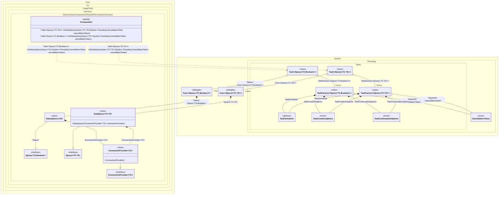

#### Generic async composition roots with constraints

>[!IMPORTANT]
>`Resolve` methods cannot be used to resolve generic composition roots.


```c#
using Pure.DI;

DI.Setup(nameof(Composition))
    // Disable Resolve methods to keep the public API minimal
    .Hint(Hint.Resolve, "Off")
    .Bind().To<ConnectionProvider<TTDisposable>>()
    .Bind().To<DataQuery<TTDisposable, TTS>>()
    // Creates StatusQuery manually,
    // just for the sake of example
    .Bind("Status").To(ctx => {
        ctx.Inject(out IConnectionProvider<TTDisposable> connectionProvider);
        return new StatusQuery<TTDisposable>(connectionProvider);
    })

    // Specifies to use CancellationToken from the argument
    // when resolving a composition root
    .RootArg<CancellationToken>("cancellationToken")

    // Specifies to create a regular public method
    // to get a composition root of type Task<DataQuery<T, TStruct>>
    // with the name "GetDataQueryAsync"
    .Root<Task<IQuery<TTDisposable, TTS>>>("GetDataQueryAsync")

    // Specifies to create a regular public method
    // to get a composition root of type Task<StatusQuery<T>>
    // with the name "GetStatusQueryAsync"
    // using the "Status" tag
    .Root<Task<IQuery<TTDisposable, bool>>>("GetStatusQueryAsync", "Status");

var composition = new Composition();

// Resolves composition roots asynchronously
var query = await composition.GetDataQueryAsync<Stream, double>(CancellationToken.None);
var status = await composition.GetStatusQueryAsync<BinaryReader>(CancellationToken.None);

interface IConnectionProvider<T>
    where T : IDisposable;

class ConnectionProvider<T> : IConnectionProvider<T>
    where T : IDisposable;

interface IQuery<TConnection, TResult>
    where TConnection : IDisposable
    where TResult : struct;

class DataQuery<TConnection, TResult>(IConnectionProvider<TConnection> connectionProvider)
    : IQuery<TConnection, TResult>
    where TConnection : IDisposable
    where TResult : struct;

class StatusQuery<TConnection>(IConnectionProvider<TConnection> connectionProvider)
    : IQuery<TConnection, bool>
    where TConnection : IDisposable;
```

<details>
<summary>Running this code sample locally</summary>

- Make sure you have the [.NET SDK 10.0](https://dotnet.microsoft.com/en-us/download/dotnet/10.0) or later installed
```bash
dotnet --list-sdk
```
- Create a net10.0 (or later) console application
```bash
dotnet new console -n Sample
```
- Add a reference to the NuGet package
  - [Pure.DI](https://www.nuget.org/packages/Pure.DI)
```bash
dotnet add package Pure.DI
```
- Copy the example code into the _Program.cs_ file

You are ready to run the example 🚀
```bash
dotnet run
```

</details>

>[!IMPORTANT]
>The method `Inject()` cannot be used outside of the binding setup.

The following partial class will be generated:

```c#
partial class Composition
{
  [MethodImpl(MethodImplOptions.AggressiveInlining)]
  public Task<IQuery<T2, bool>> GetStatusQueryAsync<T2>(CancellationToken cancellationToken)
    where T2: IDisposable
  {
    Task<IQuery<T2, bool>> transientTaskIQueryTTDisposableBoolean;
    // Creates the task value factory
    Func<IQuery<T2, bool>> perBlockFuncIQueryTTDisposableBoolean = new Func<IQuery<T2, bool>>(
    [MethodImpl(MethodImplOptions.AggressiveInlining)]
    () =>
    {
      // Creates a deferred value
      StatusQuery<T2> transientStatusQueryTTDisposable;
      IConnectionProvider<T2> localConnectionProvider = new ConnectionProvider<T2>();
      transientStatusQueryTTDisposable = new StatusQuery<T2>(localConnectionProvider);
      return transientStatusQueryTTDisposable;
    });
    Func<IQuery<T2, bool>> localFactory = perBlockFuncIQueryTTDisposableBoolean;
    // Creates the task factory
    TaskFactory<IQuery<T2, bool>> perBlockTaskFactoryIQueryTTDisposableBoolean;
    CancellationToken localCancellationToken = cancellationToken;
    TaskCreationOptions transientTaskCreationOptions = TaskCreationOptions.None;
    TaskCreationOptions localTaskCreationOptions = transientTaskCreationOptions;
    TaskContinuationOptions transientTaskContinuationOptions = TaskContinuationOptions.None;
    TaskContinuationOptions localTaskContinuationOptions = transientTaskContinuationOptions;
    TaskScheduler transientTaskScheduler = TaskScheduler.Default;
    TaskScheduler localTaskScheduler = transientTaskScheduler;
    perBlockTaskFactoryIQueryTTDisposableBoolean = new TaskFactory<IQuery<T2, bool>>(localCancellationToken, localTaskCreationOptions, localTaskContinuationOptions, localTaskScheduler);
    TaskFactory<IQuery<T2, bool>> localTaskFactory = perBlockTaskFactoryIQueryTTDisposableBoolean;
    // Starts the task
    transientTaskIQueryTTDisposableBoolean = localTaskFactory.StartNew(localFactory);
    return transientTaskIQueryTTDisposableBoolean;
  }

  [MethodImpl(MethodImplOptions.AggressiveInlining)]
  public Task<IQuery<T2, T3>> GetDataQueryAsync<T2, T3>(CancellationToken cancellationToken)
    where T2: IDisposable
    where T3: struct
  {
    Task<IQuery<T2, T3>> transientTaskIQueryTTDisposableTTS;
    // Creates the task value factory
    Func<IQuery<T2, T3>> perBlockFuncIQueryTTDisposableTTS = new Func<IQuery<T2, T3>>(
    [MethodImpl(MethodImplOptions.AggressiveInlining)]
    () =>
    {
      // Creates a deferred value
      return new DataQuery<T2, T3>(new ConnectionProvider<T2>());
    });
    Func<IQuery<T2, T3>> localFactory = perBlockFuncIQueryTTDisposableTTS;
    // Creates the task factory
    TaskFactory<IQuery<T2, T3>> perBlockTaskFactoryIQueryTTDisposableTTS;
    CancellationToken localCancellationToken = cancellationToken;
    TaskCreationOptions transientTaskCreationOptions = TaskCreationOptions.None;
    TaskCreationOptions localTaskCreationOptions = transientTaskCreationOptions;
    TaskContinuationOptions transientTaskContinuationOptions = TaskContinuationOptions.None;
    TaskContinuationOptions localTaskContinuationOptions = transientTaskContinuationOptions;
    TaskScheduler transientTaskScheduler = TaskScheduler.Default;
    TaskScheduler localTaskScheduler = transientTaskScheduler;
    perBlockTaskFactoryIQueryTTDisposableTTS = new TaskFactory<IQuery<T2, T3>>(localCancellationToken, localTaskCreationOptions, localTaskContinuationOptions, localTaskScheduler);
    TaskFactory<IQuery<T2, T3>> localTaskFactory = perBlockTaskFactoryIQueryTTDisposableTTS;
    // Starts the task
    transientTaskIQueryTTDisposableTTS = localTaskFactory.StartNew(localFactory);
    return transientTaskIQueryTTDisposableTTS;
  }
}
```

Class diagram:


```mermaid
---
 config:
  class:
   hideEmptyMembersBox: true
---
classDiagram
	StatusQueryᐸT2ᐳ --|> IQueryᐸT2ˏBooleanᐳ : "Status"
	DataQueryᐸT2ˏT3ᐳ --|> IQueryᐸT2ˏT3ᐳ
	ConnectionProviderᐸT2ᐳ --|> IConnectionProviderᐸT2ᐳ
	Composition ..> TaskᐸIQueryᐸT2ˏBooleanᐳᐳ : TaskᐸIQueryᐸT2ˏBooleanᐳᐳ GetStatusQueryAsyncᐸT2ᐳ(System.Threading.CancellationToken cancellationToken)
	Composition ..> TaskᐸIQueryᐸT2ˏT3ᐳᐳ : TaskᐸIQueryᐸT2ˏT3ᐳᐳ GetDataQueryAsyncᐸT2ˏT3ᐳ(System.Threading.CancellationToken cancellationToken)
	TaskᐸIQueryᐸT2ˏBooleanᐳᐳ o-- "PerBlock" FuncᐸIQueryᐸT2ˏBooleanᐳᐳ : "Status" FuncᐸIQueryᐸT2ˏBooleanᐳᐳ
	TaskᐸIQueryᐸT2ˏBooleanᐳᐳ o-- "PerBlock" TaskFactoryᐸIQueryᐸT2ˏBooleanᐳᐳ : TaskFactoryᐸIQueryᐸT2ˏBooleanᐳᐳ
	TaskᐸIQueryᐸT2ˏT3ᐳᐳ o-- "PerBlock" FuncᐸIQueryᐸT2ˏT3ᐳᐳ : FuncᐸIQueryᐸT2ˏT3ᐳᐳ
	TaskᐸIQueryᐸT2ˏT3ᐳᐳ o-- "PerBlock" TaskFactoryᐸIQueryᐸT2ˏT3ᐳᐳ : TaskFactoryᐸIQueryᐸT2ˏT3ᐳᐳ
	FuncᐸIQueryᐸT2ˏBooleanᐳᐳ *-- StatusQueryᐸT2ᐳ : "Status" IQueryᐸT2ˏBooleanᐳ
	TaskFactoryᐸIQueryᐸT2ˏBooleanᐳᐳ *-- TaskScheduler : TaskScheduler
	TaskFactoryᐸIQueryᐸT2ˏBooleanᐳᐳ *-- TaskCreationOptions : TaskCreationOptions
	TaskFactoryᐸIQueryᐸT2ˏBooleanᐳᐳ *-- TaskContinuationOptions : TaskContinuationOptions
	TaskFactoryᐸIQueryᐸT2ˏBooleanᐳᐳ o-- CancellationToken : Argument "cancellationToken"
	FuncᐸIQueryᐸT2ˏT3ᐳᐳ *-- DataQueryᐸT2ˏT3ᐳ : IQueryᐸT2ˏT3ᐳ
	TaskFactoryᐸIQueryᐸT2ˏT3ᐳᐳ *-- TaskScheduler : TaskScheduler
	TaskFactoryᐸIQueryᐸT2ˏT3ᐳᐳ *-- TaskCreationOptions : TaskCreationOptions
	TaskFactoryᐸIQueryᐸT2ˏT3ᐳᐳ *-- TaskContinuationOptions : TaskContinuationOptions
	TaskFactoryᐸIQueryᐸT2ˏT3ᐳᐳ o-- CancellationToken : Argument "cancellationToken"
	StatusQueryᐸT2ᐳ *-- ConnectionProviderᐸT2ᐳ : IConnectionProviderᐸT2ᐳ
	DataQueryᐸT2ˏT3ᐳ *-- ConnectionProviderᐸT2ᐳ : IConnectionProviderᐸT2ᐳ
	namespace Pure.DI.UsageTests.Generics.GenericAsyncCompositionRootsWithConstraintsScenario {
		class Composition {
		<<partial>>
		+TaskᐸIQueryᐸT2ˏT3ᐳᐳ GetDataQueryAsyncᐸT2ˏT3ᐳ(System.Threading.CancellationToken cancellationToken)
		+TaskᐸIQueryᐸT2ˏBooleanᐳᐳ GetStatusQueryAsyncᐸT2ᐳ(System.Threading.CancellationToken cancellationToken)
		}
		class ConnectionProviderᐸT2ᐳ {
				<<class>>
			+ConnectionProvider()
		}
		class DataQueryᐸT2ˏT3ᐳ {
				<<class>>
			+DataQuery(IConnectionProviderᐸT2ᐳ connectionProvider)
		}
		class IConnectionProviderᐸT2ᐳ {
			<<interface>>
		}
		class IQueryᐸT2ˏBooleanᐳ {
			<<interface>>
		}
		class IQueryᐸT2ˏT3ᐳ {
			<<interface>>
		}
		class StatusQueryᐸT2ᐳ {
				<<class>>
		}
	}
	namespace System {
		class FuncᐸIQueryᐸT2ˏBooleanᐳᐳ {
				<<delegate>>
		}
		class FuncᐸIQueryᐸT2ˏT3ᐳᐳ {
				<<delegate>>
		}
	}
	namespace System.Threading {
		class CancellationToken {
				<<struct>>
		}
	}
	namespace System.Threading.Tasks {
		class TaskContinuationOptions {
				<<enum>>
		}
		class TaskCreationOptions {
				<<enum>>
		}
		class TaskFactoryᐸIQueryᐸT2ˏBooleanᐳᐳ {
				<<class>>
		}
		class TaskFactoryᐸIQueryᐸT2ˏT3ᐳᐳ {
				<<class>>
		}
		class TaskScheduler {
				<<abstract>>
		}
		class TaskᐸIQueryᐸT2ˏBooleanᐳᐳ {
				<<class>>
		}
		class TaskᐸIQueryᐸT2ˏT3ᐳᐳ {
				<<class>>
		}
	}
```

