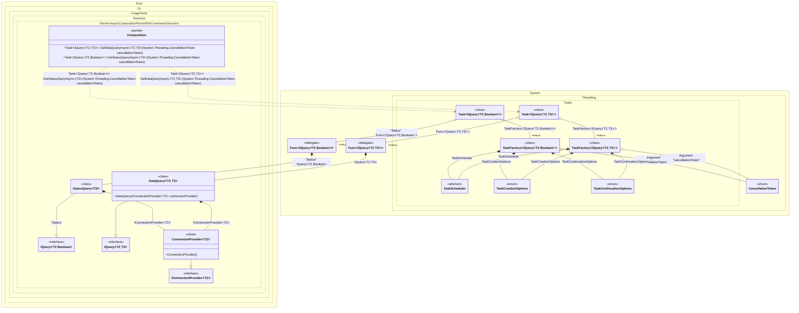

#### Generic async composition roots with constraints

>[!IMPORTANT]
>`Resolve` methods cannot be used to resolve generic composition roots.


```c#
using Pure.DI;

DI.Setup(nameof(Composition))
    // Disable Resolve methods to keep the public API minimal
    .Hint(Hint.Resolve, "Off")
    .Bind().To<ConnectionProvider<TTDisposable>>()
    .Bind().To<DataQuery<TTDisposable, TTS>>()
    // Creates StatusQuery manually,
    // just for the sake of example
    .Bind("Status").To(ctx => {
        ctx.Inject(out IConnectionProvider<TTDisposable> connectionProvider);
        return new StatusQuery<TTDisposable>(connectionProvider);
    })

    // Specifies to use CancellationToken from the argument
    // when resolving a composition root
    .RootArg<CancellationToken>("cancellationToken")

    // Specifies to create a regular public method
    // to get a composition root of type Task<DataQuery<T, TStruct>>
    // with the name "GetDataQueryAsync"
    .Root<Task<IQuery<TTDisposable, TTS>>>("GetDataQueryAsync")

    // Specifies to create a regular public method
    // to get a composition root of type Task<StatusQuery<T>>
    // with the name "GetStatusQueryAsync"
    // using the "Status" tag
    .Root<Task<IQuery<TTDisposable, bool>>>("GetStatusQueryAsync", "Status");

var composition = new Composition();

// Resolves composition roots asynchronously
var query = await composition.GetDataQueryAsync<Stream, double>(CancellationToken.None);
var status = await composition.GetStatusQueryAsync<BinaryReader>(CancellationToken.None);

interface IConnectionProvider<T>
    where T : IDisposable;

class ConnectionProvider<T> : IConnectionProvider<T>
    where T : IDisposable;

interface IQuery<TConnection, TResult>
    where TConnection : IDisposable
    where TResult : struct;

class DataQuery<TConnection, TResult>(IConnectionProvider<TConnection> connectionProvider)
    : IQuery<TConnection, TResult>
    where TConnection : IDisposable
    where TResult : struct;

class StatusQuery<TConnection>(IConnectionProvider<TConnection> connectionProvider)
    : IQuery<TConnection, bool>
    where TConnection : IDisposable;
```

<details>
<summary>Running this code sample locally</summary>

- Make sure you have the [.NET SDK 10.0](https://dotnet.microsoft.com/en-us/download/dotnet/10.0) or later installed
```bash
dotnet --list-sdk
```
- Create a net10.0 (or later) console application
```bash
dotnet new console -n Sample
```
- Add a reference to the NuGet package
  - [Pure.DI](https://www.nuget.org/packages/Pure.DI)
```bash
dotnet add package Pure.DI
```
- Copy the example code into the _Program.cs_ file

You are ready to run the example 🚀
```bash
dotnet run
```

</details>

>[!IMPORTANT]
>The method `Inject()` cannot be used outside of the binding setup.

The following partial class will be generated:

```c#
partial class Composition
{
#if NET9_0_OR_GREATER
  private readonly Lock _lock = new Lock();
#else
  private readonly Object _lock = new Object();
#endif

  [MethodImpl(MethodImplOptions.AggressiveInlining)]
  public Task<IQuery<T2, bool>> GetStatusQueryAsync<T2>(CancellationToken cancellationToken)
    where T2: IDisposable
  {
    Task<IQuery<T2, bool>> transientTask485;
    // Injects an instance factory
    Func<IQuery<T2, bool>> perBlockFunc486 = new Func<IQuery<T2, bool>>(
    [MethodImpl(MethodImplOptions.AggressiveInlining)]
    () =>
    {
      StatusQuery<T2> transientStatusQuery488;
      IConnectionProvider<T2> localConnectionProvider = new ConnectionProvider<T2>();
      transientStatusQuery488 = new StatusQuery<T2>(localConnectionProvider);
      return transientStatusQuery488;
    });
    Func<IQuery<T2, bool>> localFactory6 = perBlockFunc486;
    // Injects a task factory creating and scheduling task objects
    TaskFactory<IQuery<T2, bool>> perBlockTaskFactory487;
    CancellationToken localCancellationToken3 = cancellationToken;
    TaskCreationOptions transientTaskCreationOptions491 = TaskCreationOptions.None;
    TaskCreationOptions localTaskCreationOptions2 = transientTaskCreationOptions491;
    TaskContinuationOptions transientTaskContinuationOptions492 = TaskContinuationOptions.None;
    TaskContinuationOptions localTaskContinuationOptions2 = transientTaskContinuationOptions492;
    TaskScheduler transientTaskScheduler493 = TaskScheduler.Default;
    TaskScheduler localTaskScheduler2 = transientTaskScheduler493;
    perBlockTaskFactory487 = new TaskFactory<IQuery<T2, bool>>(localCancellationToken3, localTaskCreationOptions2, localTaskContinuationOptions2, localTaskScheduler2);
    TaskFactory<IQuery<T2, bool>> localTaskFactory2 = perBlockTaskFactory487;
    // Creates and starts a task using the instance factory
    transientTask485 = localTaskFactory2.StartNew(localFactory6);
    return transientTask485;
  }

  [MethodImpl(MethodImplOptions.AggressiveInlining)]
  public Task<IQuery<T2, T3>> GetDataQueryAsync<T2, T3>(CancellationToken cancellationToken)
    where T2: IDisposable
    where T3: struct
  {
    Task<IQuery<T2, T3>> transientTask494;
    // Injects an instance factory
    Func<IQuery<T2, T3>> perBlockFunc495 = new Func<IQuery<T2, T3>>(
    [MethodImpl(MethodImplOptions.AggressiveInlining)]
    () =>
    {
      return new DataQuery<T2, T3>(new ConnectionProvider<T2>());
    });
    Func<IQuery<T2, T3>> localFactory7 = perBlockFunc495;
    // Injects a task factory creating and scheduling task objects
    TaskFactory<IQuery<T2, T3>> perBlockTaskFactory496;
    CancellationToken localCancellationToken4 = cancellationToken;
    TaskCreationOptions transientTaskCreationOptions500 = TaskCreationOptions.None;
    TaskCreationOptions localTaskCreationOptions3 = transientTaskCreationOptions500;
    TaskContinuationOptions transientTaskContinuationOptions501 = TaskContinuationOptions.None;
    TaskContinuationOptions localTaskContinuationOptions3 = transientTaskContinuationOptions501;
    TaskScheduler transientTaskScheduler502 = TaskScheduler.Default;
    TaskScheduler localTaskScheduler3 = transientTaskScheduler502;
    perBlockTaskFactory496 = new TaskFactory<IQuery<T2, T3>>(localCancellationToken4, localTaskCreationOptions3, localTaskContinuationOptions3, localTaskScheduler3);
    TaskFactory<IQuery<T2, T3>> localTaskFactory3 = perBlockTaskFactory496;
    // Creates and starts a task using the instance factory
    transientTask494 = localTaskFactory3.StartNew(localFactory7);
    return transientTask494;
  }
}
```

Class diagram:


```mermaid
---
 config:
  maxTextSize: 2147483647
  maxEdges: 2147483647
  class:
   hideEmptyMembersBox: true
---
classDiagram
	StatusQueryᐸT2ᐳ --|> IQueryᐸT2ˏBooleanᐳ : "Status" 
	DataQueryᐸT2ˏT3ᐳ --|> IQueryᐸT2ˏT3ᐳ
	ConnectionProviderᐸT2ᐳ --|> IConnectionProviderᐸT2ᐳ
	Composition ..> TaskᐸIQueryᐸT2ˏBooleanᐳᐳ : TaskᐸIQueryᐸT2ˏBooleanᐳᐳ GetStatusQueryAsyncᐸT2ᐳ(System.Threading.CancellationToken cancellationToken)
	Composition ..> TaskᐸIQueryᐸT2ˏT3ᐳᐳ : TaskᐸIQueryᐸT2ˏT3ᐳᐳ GetDataQueryAsyncᐸT2ˏT3ᐳ(System.Threading.CancellationToken cancellationToken)
	TaskᐸIQueryᐸT2ˏBooleanᐳᐳ o-- "PerBlock" FuncᐸIQueryᐸT2ˏBooleanᐳᐳ : "Status"  FuncᐸIQueryᐸT2ˏBooleanᐳᐳ
	TaskᐸIQueryᐸT2ˏBooleanᐳᐳ o-- "PerBlock" TaskFactoryᐸIQueryᐸT2ˏBooleanᐳᐳ : TaskFactoryᐸIQueryᐸT2ˏBooleanᐳᐳ
	TaskᐸIQueryᐸT2ˏT3ᐳᐳ o-- "PerBlock" FuncᐸIQueryᐸT2ˏT3ᐳᐳ : FuncᐸIQueryᐸT2ˏT3ᐳᐳ
	TaskᐸIQueryᐸT2ˏT3ᐳᐳ o-- "PerBlock" TaskFactoryᐸIQueryᐸT2ˏT3ᐳᐳ : TaskFactoryᐸIQueryᐸT2ˏT3ᐳᐳ
	FuncᐸIQueryᐸT2ˏBooleanᐳᐳ *--  StatusQueryᐸT2ᐳ : "Status"  IQueryᐸT2ˏBooleanᐳ
	TaskFactoryᐸIQueryᐸT2ˏBooleanᐳᐳ *--  TaskScheduler : TaskScheduler
	TaskFactoryᐸIQueryᐸT2ˏBooleanᐳᐳ *--  TaskCreationOptions : TaskCreationOptions
	TaskFactoryᐸIQueryᐸT2ˏBooleanᐳᐳ *--  TaskContinuationOptions : TaskContinuationOptions
	TaskFactoryᐸIQueryᐸT2ˏBooleanᐳᐳ o-- CancellationToken : Argument "cancellationToken"
	FuncᐸIQueryᐸT2ˏT3ᐳᐳ *--  DataQueryᐸT2ˏT3ᐳ : IQueryᐸT2ˏT3ᐳ
	TaskFactoryᐸIQueryᐸT2ˏT3ᐳᐳ *--  TaskScheduler : TaskScheduler
	TaskFactoryᐸIQueryᐸT2ˏT3ᐳᐳ *--  TaskCreationOptions : TaskCreationOptions
	TaskFactoryᐸIQueryᐸT2ˏT3ᐳᐳ *--  TaskContinuationOptions : TaskContinuationOptions
	TaskFactoryᐸIQueryᐸT2ˏT3ᐳᐳ o-- CancellationToken : Argument "cancellationToken"
	StatusQueryᐸT2ᐳ *--  ConnectionProviderᐸT2ᐳ : IConnectionProviderᐸT2ᐳ
	DataQueryᐸT2ˏT3ᐳ *--  ConnectionProviderᐸT2ᐳ : IConnectionProviderᐸT2ᐳ
	namespace Pure.DI.UsageTests.Generics.GenericAsyncCompositionRootsWithConstraintsScenario {
		class Composition {
		<<partial>>
		+TaskᐸIQueryᐸT2ˏT3ᐳᐳ GetDataQueryAsyncᐸT2ˏT3ᐳ(System.Threading.CancellationToken cancellationToken)
		+TaskᐸIQueryᐸT2ˏBooleanᐳᐳ GetStatusQueryAsyncᐸT2ᐳ(System.Threading.CancellationToken cancellationToken)
		}
		class ConnectionProviderᐸT2ᐳ {
				<<class>>
			+ConnectionProvider()
		}
		class DataQueryᐸT2ˏT3ᐳ {
				<<class>>
			+DataQuery(IConnectionProviderᐸT2ᐳ connectionProvider)
		}
		class IConnectionProviderᐸT2ᐳ {
			<<interface>>
		}
		class IQueryᐸT2ˏBooleanᐳ {
			<<interface>>
		}
		class IQueryᐸT2ˏT3ᐳ {
			<<interface>>
		}
		class StatusQueryᐸT2ᐳ {
				<<class>>
		}
	}
	namespace System {
		class FuncᐸIQueryᐸT2ˏBooleanᐳᐳ {
				<<delegate>>
		}
		class FuncᐸIQueryᐸT2ˏT3ᐳᐳ {
				<<delegate>>
		}
	}
	namespace System.Threading {
		class CancellationToken {
				<<struct>>
		}
	}
	namespace System.Threading.Tasks {
		class TaskContinuationOptions {
				<<enum>>
		}
		class TaskCreationOptions {
				<<enum>>
		}
		class TaskFactoryᐸIQueryᐸT2ˏBooleanᐳᐳ {
				<<class>>
		}
		class TaskFactoryᐸIQueryᐸT2ˏT3ᐳᐳ {
				<<class>>
		}
		class TaskScheduler {
				<<abstract>>
		}
		class TaskᐸIQueryᐸT2ˏBooleanᐳᐳ {
				<<class>>
		}
		class TaskᐸIQueryᐸT2ˏT3ᐳᐳ {
				<<class>>
		}
	}
```

