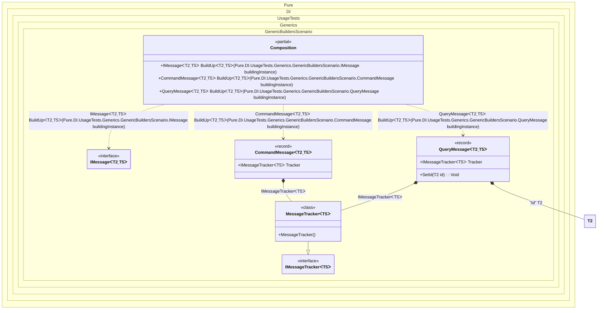

#### Generic builders

When this occurs: you need this feature while building the composition and calling roots.
What it solves: provides a clear setup pattern and expected behavior without extra boilerplate or manual wiring.
How it is solved in the example: shows the minimal DI configuration and how the result is used in code.


```c#
using Shouldly;
using Pure.DI;

DI.Setup(nameof(Composition))
    .Bind(Tag.Id).To(() => (TT)(object)Guid.NewGuid())
    .Bind().To<MessageTracker<TT>>()
    // Generic builder to inject dependencies into existing messages
    .Builders<IMessage<TT, TT2>>("BuildUp");

var composition = new Composition();

// A Query is created (e.g. by API controller), ID is missing
var query = new QueryMessage<Guid, string>();

// Composition injects dependencies and generates an ID
var queryWithDeps = composition.BuildUp(query);

queryWithDeps.Id.ShouldNotBe(Guid.Empty);
queryWithDeps.Tracker.ShouldBeOfType<MessageTracker<string>>();

// A Command is created, usually with a specific ID
var command = new CommandMessage<Guid, int>();

// Composition injects dependencies only
var commandWithDeps = composition.BuildUp(command);

commandWithDeps.Id.ShouldBe(Guid.Empty);
commandWithDeps.Tracker.ShouldBeOfType<MessageTracker<int>>();

// Works with abstract types/interfaces too
var queryMessage = new QueryMessage<Guid, double>();
queryMessage = composition.BuildUp(queryMessage);

queryMessage.ShouldBeOfType<QueryMessage<Guid, double>>();
queryMessage.Id.ShouldNotBe(Guid.Empty);
queryMessage.Tracker.ShouldBeOfType<MessageTracker<double>>();

interface IMessageTracker<T>;

class MessageTracker<T> : IMessageTracker<T>;

interface IMessage<out TId, TContent>
{
    TId Id { get; }

    IMessageTracker<TContent>? Tracker { get; }
}

record QueryMessage<TId, TContent> : IMessage<TId, TContent>
    where TId : struct
{
    public TId Id { get; private set; }

    [Dependency]
    public IMessageTracker<TContent>? Tracker { get; set; }

    // Injects a new ID
    [Dependency]
    public void SetId([Tag(Tag.Id)] TId id) => Id = id;
}

record CommandMessage<TId, TContent> : IMessage<TId, TContent>
    where TId : struct
{
    public TId Id { get; }

    [Dependency]
    public IMessageTracker<TContent>? Tracker { get; set; }
}
```

<details>
<summary>Running this code sample locally</summary>

- Make sure you have the [.NET SDK 10.0](https://dotnet.microsoft.com/en-us/download/dotnet/10.0) or later installed
```bash
dotnet --list-sdk
```
- Create a net10.0 (or later) console application
```bash
dotnet new console -n Sample
```
- Add references to the NuGet packages
  - [Pure.DI](https://www.nuget.org/packages/Pure.DI)
  - [Shouldly](https://www.nuget.org/packages/Shouldly)
```bash
dotnet add package Pure.DI
dotnet add package Shouldly
```
- Copy the example code into the _Program.cs_ file

You are ready to run the example 🚀
```bash
dotnet run
```

</details>

What it shows:
- Demonstrates the scenario setup and resulting object graph in Pure.DI.

Important points:
- Highlights the key configuration choices and their effect on resolution.

Useful when:
- You want a concrete template for applying this feature in a composition.


The following partial class will be generated:

```c#
partial class Composition
{
#if NET9_0_OR_GREATER
  private readonly Lock _lock = new Lock();
#else
  private readonly Object _lock = new Object();
#endif

  #pragma warning disable CS0162
  [MethodImpl(MethodImplOptions.NoInlining)]
  public IMessage<T2, T5> BuildUp<T2, T5>(IMessage<T2, T5> buildingInstance)
    where T2: struct
  {
    if (buildingInstance is null) throw new ArgumentNullException(nameof(buildingInstance));
    switch (buildingInstance)
    {
      case QueryMessage<T2, T5> QueryMessage_TT_TT2:
        return BuildUp(QueryMessage_TT_TT2);
      case CommandMessage<T2, T5> CommandMessage_TT_TT2:
        return BuildUp(CommandMessage_TT_TT2);
      default:
        throw new ArgumentException($"Unable to build an instance of typeof type {buildingInstance.GetType()}.", "buildingInstance");
    }
    return buildingInstance;
  }
  #pragma warning restore CS0162

  [MethodImpl(MethodImplOptions.AggressiveInlining)]
  public CommandMessage<T2, T5> BuildUp<T2, T5>(CommandMessage<T2, T5> buildingInstance)
    where T2: struct
  {
    if (buildingInstance is null) throw new ArgumentNullException(nameof(buildingInstance));
    CommandMessage<T2, T5> transientCommandMessage450;
    CommandMessage<T2, T5> localBuildingInstance10 = buildingInstance;
    localBuildingInstance10.Tracker = new MessageTracker<T5>();
    transientCommandMessage450 = localBuildingInstance10;
    return transientCommandMessage450;
  }

  [MethodImpl(MethodImplOptions.AggressiveInlining)]
  public QueryMessage<T2, T5> BuildUp<T2, T5>(QueryMessage<T2, T5> buildingInstance)
    where T2: struct
  {
    if (buildingInstance is null) throw new ArgumentNullException(nameof(buildingInstance));
    QueryMessage<T2, T5> transientQueryMessage453;
    QueryMessage<T2, T5> localBuildingInstance11 = buildingInstance;
    T2 transientTT456 = (T2)(object)Guid.NewGuid();
    localBuildingInstance11.Tracker = new MessageTracker<T5>();
    localBuildingInstance11.SetId(transientTT456);
    transientQueryMessage453 = localBuildingInstance11;
    return transientQueryMessage453;
  }
}
```

Class diagram:



