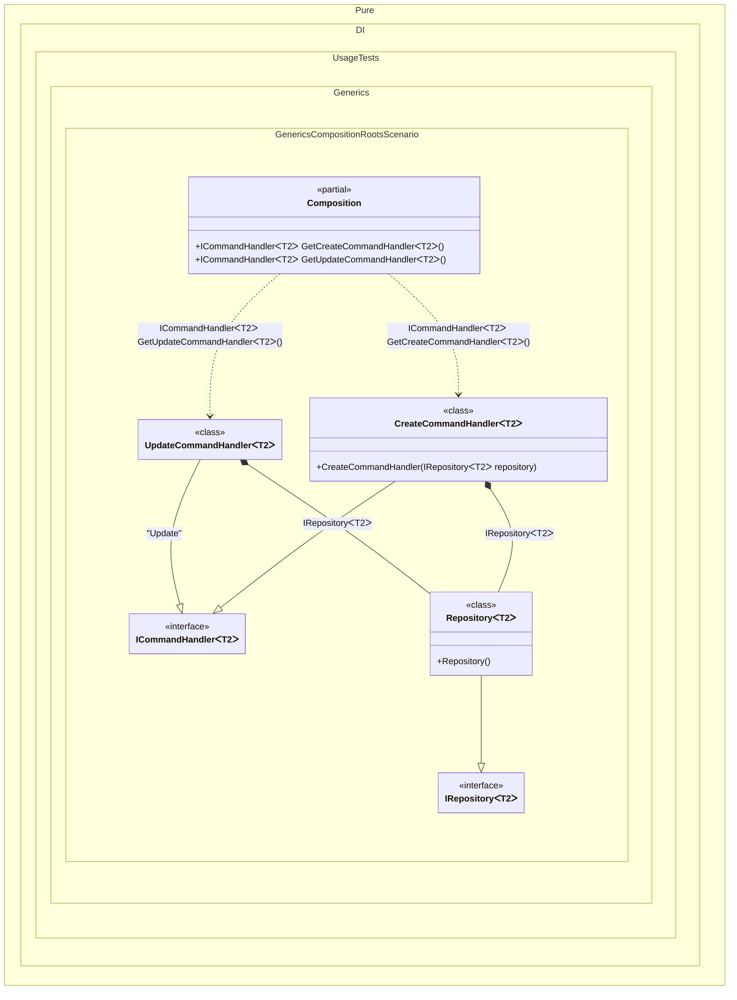

#### Generic composition roots

Sometimes you want to be able to create composition roots with type parameters. In this case, the composition root can only be represented by a method.
> [!IMPORTANT]
> ``Resolve()` methods cannot be used to resolve generic composition roots.
When this occurs: you need this feature while building the composition and calling roots.
What it solves: provides a clear setup pattern and expected behavior without extra boilerplate or manual wiring.
How it is solved in the example: shows the minimal DI configuration and how the result is used in code.


```c#
using Pure.DI;

DI.Setup(nameof(Composition))
    // Disable Resolve methods to keep the public API minimal
    .Hint(Hint.Resolve, "Off")
    .Bind().To<Repository<TT>>()
    .Bind().To<CreateCommandHandler<TT>>()
    // Creates UpdateCommandHandler manually,
    // just for the sake of example
    .Bind("Update").To(ctx => {
        ctx.Inject(out IRepository<TT> repository);
        return new UpdateCommandHandler<TT>(repository);
    })

    // Specifies to create a regular public method
    // to get a composition root of type ICommandHandler<T>
    // with the name "GetCreateCommandHandler"
    .Root<ICommandHandler<TT>>("GetCreateCommandHandler")

    // Specifies to create a regular public method
    // to get a composition root of type ICommandHandler<T>
    // with the name "GetUpdateCommandHandler"
    // using the "Update" tag
    .Root<ICommandHandler<TT>>("GetUpdateCommandHandler", "Update");

var composition = new Composition();

// createHandler = new CreateCommandHandler<int>(new Repository<int>());
var createHandler = composition.GetCreateCommandHandler<int>();

// updateHandler = new UpdateCommandHandler<string>(new Repository<string>());
var updateHandler = composition.GetUpdateCommandHandler<string>();

interface IRepository<T>;

class Repository<T> : IRepository<T>;

interface ICommandHandler<T>;

class CreateCommandHandler<T>(IRepository<T> repository) : ICommandHandler<T>;

class UpdateCommandHandler<T>(IRepository<T> repository) : ICommandHandler<T>;
```

<details>
<summary>Running this code sample locally</summary>

- Make sure you have the [.NET SDK 10.0](https://dotnet.microsoft.com/en-us/download/dotnet/10.0) or later installed
```bash
dotnet --list-sdk
```
- Create a net10.0 (or later) console application
```bash
dotnet new console -n Sample
```
- Add a reference to the NuGet package
  - [Pure.DI](https://www.nuget.org/packages/Pure.DI)
```bash
dotnet add package Pure.DI
```
- Copy the example code into the _Program.cs_ file

You are ready to run the example 🚀
```bash
dotnet run
```

</details>

> [!IMPORTANT]
> The method `Inject()`cannot be used outside of the binding setup.
What it shows:
- Demonstrates the scenario setup and resulting object graph in Pure.DI.

Important points:
- Highlights the key configuration choices and their effect on resolution.

Useful when:
- You want a concrete template for applying this feature in a composition.


The following partial class will be generated:

```c#
partial class Composition
{
  [MethodImpl(MethodImplOptions.AggressiveInlining)]
  public ICommandHandler<T2> GetUpdateCommandHandler<T2>()
  {
    UpdateCommandHandler<T2> transientUpdateCommandHandler457;
    IRepository<T2> localRepository = new Repository<T2>();
    transientUpdateCommandHandler457 = new UpdateCommandHandler<T2>(localRepository);
    return transientUpdateCommandHandler457;
  }

  [MethodImpl(MethodImplOptions.AggressiveInlining)]
  public ICommandHandler<T2> GetCreateCommandHandler<T2>()
  {
    return new CreateCommandHandler<T2>(new Repository<T2>());
  }
}
```

Class diagram:



