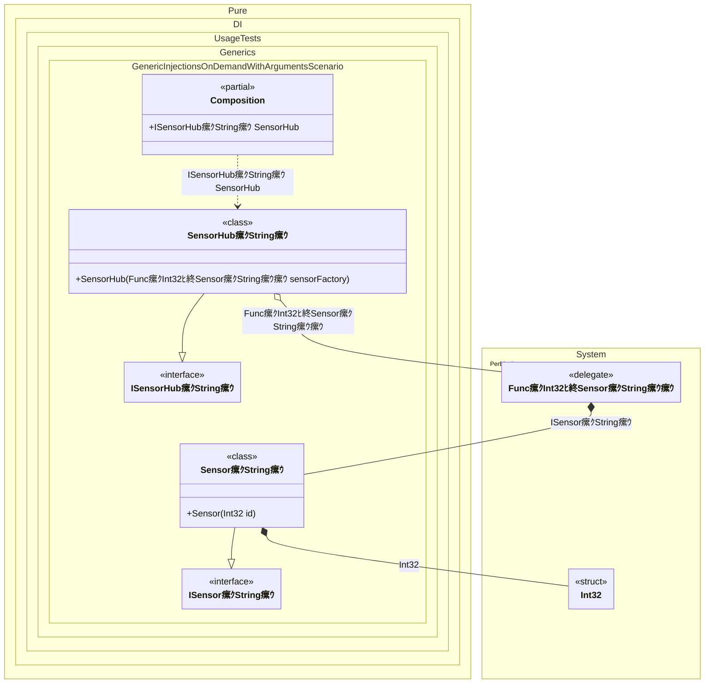

#### Generic injections on demand with arguments

Demonstrates how to create generic dependencies on demand with custom arguments using factory delegates.


```c#
using Shouldly;
using Pure.DI;
using System.Collections.Generic;

DI.Setup(nameof(Composition))
    .Bind().To<Sensor<TT>>()
    .Bind().To<SensorHub<TT>>()

    // Composition root
    .Root<ISensorHub<string>>("SensorHub");

var composition = new Composition();
var hub = composition.SensorHub;
var sensors = hub.Sensors;
sensors.Count.ShouldBe(2);
sensors[0].Id.ShouldBe(1);
sensors[1].Id.ShouldBe(2);

interface ISensor<out T>
{
    int Id { get; }
}

class Sensor<T>(int id) : ISensor<T>
{
    public int Id { get; } = id;
}

interface ISensorHub<out T>
{
    IReadOnlyList<ISensor<T>> Sensors { get; }
}

class SensorHub<T>(Func<int, ISensor<T>> sensorFactory) : ISensorHub<T>
{
    public IReadOnlyList<ISensor<T>> Sensors { get; } =
    [
        sensorFactory(1),
        sensorFactory(2)
    ];
}
```

<details>
<summary>Running this code sample locally</summary>

- Make sure you have the [.NET SDK 10.0](https://dotnet.microsoft.com/en-us/download/dotnet/10.0) or later installed
```bash
dotnet --list-sdk
```
- Create a net10.0 (or later) console application
```bash
dotnet new console -n Sample
```
- Add references to the NuGet packages
  - [Pure.DI](https://www.nuget.org/packages/Pure.DI)
  - [Shouldly](https://www.nuget.org/packages/Shouldly)
```bash
dotnet add package Pure.DI
dotnet add package Shouldly
```
- Copy the example code into the _Program.cs_ file

You are ready to run the example 🚀
```bash
dotnet run
```

</details>

>[!NOTE]
>Generic factories with arguments allow passing runtime parameters while maintaining type safety.

The following partial class will be generated:

```c#
partial class Composition
{
#if NET9_0_OR_GREATER
  private readonly Lock _lock = new Lock();
#else
  private readonly Object _lock = new Object();
#endif

  public ISensorHub<string> SensorHub
  {
    [MethodImpl(MethodImplOptions.AggressiveInlining)]
    get
    {
      Func<int, ISensor<string>> transientFunc469;
      Func<int, ISensor<string>> localFactory8 = new Func<int, ISensor<string>>((int localArg18) =>
      {
        lock (_lock)
        {
          int overriddenInt32 = localArg18;
          return new Sensor<string>(overriddenInt32);
        }
      });
      transientFunc469 = localFactory8;
      return new SensorHub<string>(transientFunc469);
    }
  }
}
```

Class diagram:



