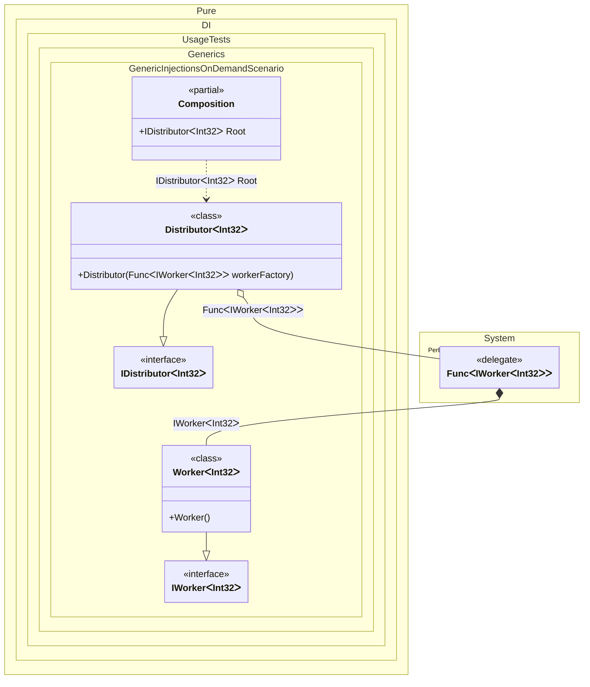

#### Generic injections on demand

When this occurs: you need this feature while building the composition and calling roots.
What it solves: provides a clear setup pattern and expected behavior without extra boilerplate or manual wiring.
How it is solved in the example: shows the minimal DI configuration and how the result is used in code.


```c#
using Shouldly;
using Pure.DI;
using System.Collections.Generic;

DI.Setup(nameof(Composition))
    .Bind().To<Worker<TT>>()
    .Bind().To<Distributor<TT>>()

    // Composition root
    .Root<IDistributor<int>>("Root");

var composition = new Composition();
var distributor = composition.Root;

// Check that the distributor has created 2 workers
distributor.Workers.Count.ShouldBe(2);

interface IWorker<T>;

class Worker<T> : IWorker<T>;

interface IDistributor<T>
{
    IReadOnlyList<IWorker<T>> Workers { get; }
}

class Distributor<T>(Func<IWorker<T>> workerFactory) : IDistributor<T>
{
    public IReadOnlyList<IWorker<T>> Workers { get; } =
    [
        // Creates the first instance of the worker
        workerFactory(),
        // Creates the second instance of the worker
        workerFactory()
    ];
}
```

<details>
<summary>Running this code sample locally</summary>

- Make sure you have the [.NET SDK 10.0](https://dotnet.microsoft.com/en-us/download/dotnet/10.0) or later installed
```bash
dotnet --list-sdk
```
- Create a net10.0 (or later) console application
```bash
dotnet new console -n Sample
```
- Add references to the NuGet packages
  - [Pure.DI](https://www.nuget.org/packages/Pure.DI)
  - [Shouldly](https://www.nuget.org/packages/Shouldly)
```bash
dotnet add package Pure.DI
dotnet add package Shouldly
```
- Copy the example code into the _Program.cs_ file

You are ready to run the example 🚀
```bash
dotnet run
```

</details>

What it shows:
- Demonstrates the scenario setup and resulting object graph in Pure.DI.

Important points:
- Highlights the key configuration choices and their effect on resolution.

Useful when:
- You want a concrete template for applying this feature in a composition.


The following partial class will be generated:

```c#
partial class Composition
{
  public IDistributor<int> Root
  {
    [MethodImpl(MethodImplOptions.AggressiveInlining)]
    get
    {
      Func<IWorker<int>> transientFunc466 = new Func<IWorker<int>>(
      [MethodImpl(MethodImplOptions.AggressiveInlining)]
      () =>
      {
        IWorker<int> localValue30 = new Worker<int>();
        return localValue30;
      });
      return new Distributor<int>(transientFunc466);
    }
  }
}
```

Class diagram:



