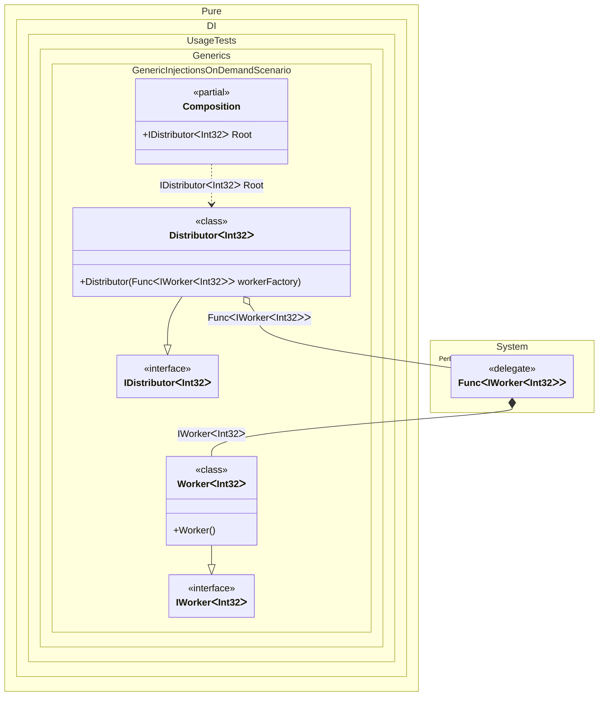

#### Generic injections on demand

Demonstrates how to create generic dependencies on demand using factory delegates with generic type parameters.


```c#
using Shouldly;
using Pure.DI;
using System.Collections.Generic;

DI.Setup(nameof(Composition))
    .Bind().To<Worker<TT>>()
    .Bind().To<Distributor<TT>>()

    // Composition root
    .Root<IDistributor<int>>("Root");

var composition = new Composition();
var distributor = composition.Root;

// Check that the distributor has created 2 workers
distributor.Workers.Count.ShouldBe(2);

interface IWorker<T>;

class Worker<T> : IWorker<T>;

interface IDistributor<T>
{
    IReadOnlyList<IWorker<T>> Workers { get; }
}

class Distributor<T>(Func<IWorker<T>> workerFactory) : IDistributor<T>
{
    public IReadOnlyList<IWorker<T>> Workers { get; } =
    [
        // Creates the first instance of the worker
        workerFactory(),
        // Creates the second instance of the worker
        workerFactory()
    ];
}
```

<details>
<summary>Running this code sample locally</summary>

- Make sure you have the [.NET SDK 10.0](https://dotnet.microsoft.com/en-us/download/dotnet/10.0) or later installed
```bash
dotnet --list-sdk
```
- Create a net10.0 (or later) console application
```bash
dotnet new console -n Sample
```
- Add references to the NuGet packages
  - [Pure.DI](https://www.nuget.org/packages/Pure.DI)
  - [Shouldly](https://www.nuget.org/packages/Shouldly)
```bash
dotnet add package Pure.DI
dotnet add package Shouldly
```
- Copy the example code into the _Program.cs_ file

You are ready to run the example 🚀
```bash
dotnet run
```

</details>

>[!NOTE]
>Generic on-demand injection provides flexibility for creating instances with different type parameters as needed.

The following partial class will be generated:

```c#
partial class Composition
{
  public IDistributor<int> Root
  {
    [MethodImpl(MethodImplOptions.AggressiveInlining)]
    get
    {
      Func<IWorker<int>> perBlockFuncIWorkerInt32 = new Func<IWorker<int>>(
      [MethodImpl(MethodImplOptions.AggressiveInlining)]
      () =>
      {
        return new Worker<int>();
      });
      return new Distributor<int>(perBlockFuncIWorkerInt32);
    }
  }
}
```

Class diagram:


```mermaid
---
 config:
  class:
   hideEmptyMembersBox: true
---
classDiagram
	DistributorᐸInt32ᐳ --|> IDistributorᐸInt32ᐳ
	WorkerᐸInt32ᐳ --|> IWorkerᐸInt32ᐳ
	Composition ..> DistributorᐸInt32ᐳ : IDistributorᐸInt32ᐳ Root
	DistributorᐸInt32ᐳ o-- "PerBlock" FuncᐸIWorkerᐸInt32ᐳᐳ : FuncᐸIWorkerᐸInt32ᐳᐳ
	FuncᐸIWorkerᐸInt32ᐳᐳ *-- WorkerᐸInt32ᐳ : IWorkerᐸInt32ᐳ
	namespace Pure.DI.UsageTests.Generics.GenericInjectionsOnDemandScenario {
		class Composition {
		<<partial>>
		+IDistributorᐸInt32ᐳ Root
		}
		class DistributorᐸInt32ᐳ {
				<<class>>
			+Distributor(FuncᐸIWorkerᐸInt32ᐳᐳ workerFactory)
		}
		class IDistributorᐸInt32ᐳ {
			<<interface>>
		}
		class IWorkerᐸInt32ᐳ {
			<<interface>>
		}
		class WorkerᐸInt32ᐳ {
				<<class>>
			+Worker()
		}
	}
	namespace System {
		class FuncᐸIWorkerᐸInt32ᐳᐳ {
				<<delegate>>
		}
	}
```

