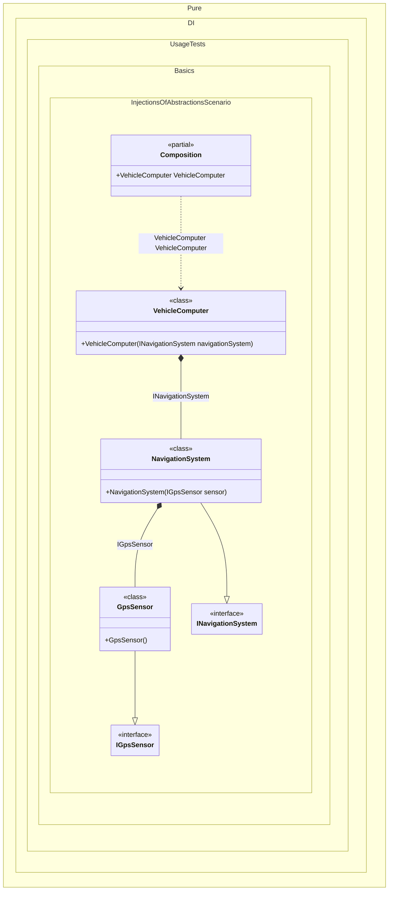

#### Injections of abstractions

This example shows the recommended approach: depend on abstractions and bind them to implementations.


```c#
using Pure.DI;

DI.Setup(nameof(Composition))
    // Binding abstractions to their implementations:
    // The interface IGpsSensor is bound to the implementation GpsSensor
    .Bind<IGpsSensor>().To<GpsSensor>()
    // The interface INavigationSystem is bound to the implementation NavigationSystem
    .Bind<INavigationSystem>().To<NavigationSystem>()

    // Specifies to create a composition root
    // of type "VehicleComputer" with the name "VehicleComputer"
    .Root<VehicleComputer>("VehicleComputer");

var composition = new Composition();

// Usage:
// var vehicleComputer = new VehicleComputer(new NavigationSystem(new GpsSensor()));
var vehicleComputer = composition.VehicleComputer;

vehicleComputer.StartTrip();

// The sensor abstraction
interface IGpsSensor;

// The sensor implementation
class GpsSensor : IGpsSensor;

// The service abstraction
interface INavigationSystem
{
    void Navigate();
}

// The service implementation
class NavigationSystem(IGpsSensor sensor) : INavigationSystem
{
    public void Navigate()
    {
        // Navigation logic using the sensor...
    }
}

// The consumer of the abstraction
partial class VehicleComputer(INavigationSystem navigationSystem)
{
    public void StartTrip() => navigationSystem.Navigate();
}
```

<details>
<summary>Running this code sample locally</summary>

- Make sure you have the [.NET SDK 10.0](https://dotnet.microsoft.com/en-us/download/dotnet/10.0) or later installed
```bash
dotnet --list-sdk
```
- Create a net10.0 (or later) console application
```bash
dotnet new console -n Sample
```
- Add a reference to the NuGet package
  - [Pure.DI](https://www.nuget.org/packages/Pure.DI)
```bash
dotnet add package Pure.DI
```
- Copy the example code into the _Program.cs_ file

You are ready to run the example 🚀
```bash
dotnet run
```

</details>

The binding chain maps abstractions to concrete types so the generator can build a fully concrete object graph. This keeps consumers decoupled and allows swapping implementations. A single implementation can satisfy multiple abstractions.
> [!TIP]
> If a binding is missing, injection still works when the consumer requests a concrete type (not an abstraction).


The following partial class will be generated:

```c#
partial class Composition
{
  public VehicleComputer VehicleComputer
  {
    [MethodImpl(MethodImplOptions.AggressiveInlining)]
    get
    {
      return new VehicleComputer(new NavigationSystem(new GpsSensor()));
    }
  }
}
```

Class diagram:



