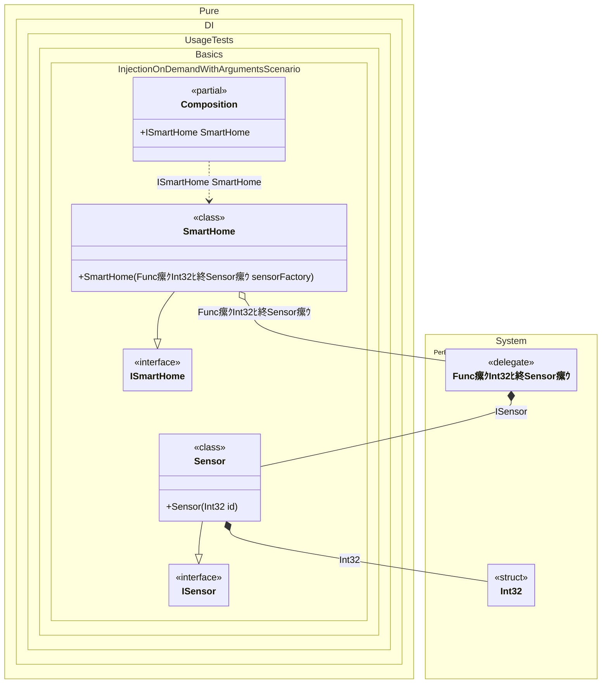

#### Injections on demand with arguments

This example uses a parameterized factory so dependencies can be created with runtime arguments. The service creates sensors with specific IDs at instantiation time.
When this occurs: you need this feature while building the composition and calling roots.
What it solves: provides a clear setup pattern and expected behavior without extra boilerplate or manual wiring.
How it is solved in the example: shows the minimal DI configuration and how the result is used in code.


```c#
using Shouldly;
using Pure.DI;
using System.Collections.Generic;

DI.Setup(nameof(Composition))
    .Bind().To<Sensor>()
    .Bind().To<SmartHome>()

    // Composition root
    .Root<ISmartHome>("SmartHome");

var composition = new Composition();
var smartHome = composition.SmartHome;
var sensors = smartHome.Sensors;

sensors.Count.ShouldBe(2);
sensors[0].Id.ShouldBe(101);
sensors[1].Id.ShouldBe(102);

interface ISensor
{
    int Id { get; }
}

class Sensor(int id) : ISensor
{
    public int Id { get; } = id;
}

interface ISmartHome
{
    IReadOnlyList<ISensor> Sensors { get; }
}

class SmartHome(Func<int, ISensor> sensorFactory) : ISmartHome
{
    public IReadOnlyList<ISensor> Sensors { get; } =
    [
        // Use the injected factory to create a sensor with ID 101
        sensorFactory(101),

        // Create another sensor with ID 102
        sensorFactory(102)
    ];
}
```

<details>
<summary>Running this code sample locally</summary>

- Make sure you have the [.NET SDK 10.0](https://dotnet.microsoft.com/en-us/download/dotnet/10.0) or later installed
```bash
dotnet --list-sdk
```
- Create a net10.0 (or later) console application
```bash
dotnet new console -n Sample
```
- Add references to the NuGet packages
  - [Pure.DI](https://www.nuget.org/packages/Pure.DI)
  - [Shouldly](https://www.nuget.org/packages/Shouldly)
```bash
dotnet add package Pure.DI
dotnet add package Shouldly
```
- Copy the example code into the _Program.cs_ file

You are ready to run the example 🚀
```bash
dotnet run
```

</details>

Delayed dependency instantiation:
- Injection of dependencies requiring runtime parameters
- Creation of distinct instances with different configurations
- Type-safe resolution of dependencies with constructor arguments
What it shows:
- Demonstrates the scenario setup and resulting object graph in Pure.DI.

Important points:
- Highlights the key configuration choices and their effect on resolution.

Useful when:
- You want a concrete template for applying this feature in a composition.


The following partial class will be generated:

```c#
partial class Composition
{
#if NET9_0_OR_GREATER
  private readonly Lock _lock = new Lock();
#else
  private readonly Object _lock = new Object();
#endif

  public ISmartHome SmartHome
  {
    [MethodImpl(MethodImplOptions.AggressiveInlining)]
    get
    {
      Func<int, ISensor> transientFunc255;
      Func<int, ISensor> localFactory1 = new Func<int, ISensor>((int localArg18) =>
      {
        lock (_lock)
        {
          int overriddenInt32 = localArg18;
          ISensor localValue18 = new Sensor(overriddenInt32);
          return localValue18;
        }
      });
      transientFunc255 = localFactory1;
      return new SmartHome(transientFunc255);
    }
  }
}
```

Class diagram:



