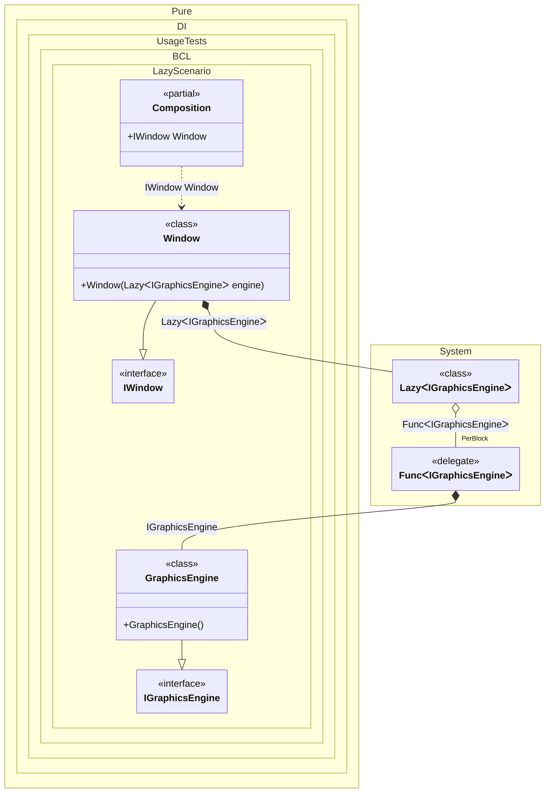

#### Lazy

When this occurs: you need this feature while building the composition and calling roots.
What it solves: provides a clear setup pattern and expected behavior without extra boilerplate or manual wiring.
How it is solved in the example: shows the minimal DI configuration and how the result is used in code.


```c#
using Shouldly;
using Pure.DI;

DI.Setup(nameof(Composition))
    .Bind<IGraphicsEngine>().To<GraphicsEngine>()
    .Bind<IWindow>().To<Window>()

    // Composition root
    .Root<IWindow>("Window");

var composition = new Composition();
var window = composition.Window;

// The graphics engine is created only when it is first accessed
window.Engine.ShouldBe(window.Engine);

interface IGraphicsEngine;

class GraphicsEngine : IGraphicsEngine;

interface IWindow
{
    IGraphicsEngine Engine { get; }
}

class Window(Lazy<IGraphicsEngine> engine) : IWindow
{
    public IGraphicsEngine Engine => engine.Value;
}
```

<details>
<summary>Running this code sample locally</summary>

- Make sure you have the [.NET SDK 10.0](https://dotnet.microsoft.com/en-us/download/dotnet/10.0) or later installed
```bash
dotnet --list-sdk
```
- Create a net10.0 (or later) console application
```bash
dotnet new console -n Sample
```
- Add references to the NuGet packages
  - [Pure.DI](https://www.nuget.org/packages/Pure.DI)
  - [Shouldly](https://www.nuget.org/packages/Shouldly)
```bash
dotnet add package Pure.DI
dotnet add package Shouldly
```
- Copy the example code into the _Program.cs_ file

You are ready to run the example 🚀
```bash
dotnet run
```

</details>

What it shows:
- Demonstrates the scenario setup and resulting object graph in Pure.DI.

Important points:
- Highlights the key configuration choices and their effect on resolution.

Useful when:
- You want a concrete template for applying this feature in a composition.


The following partial class will be generated:

```c#
partial class Composition
{
  public IWindow Window
  {
    [MethodImpl(MethodImplOptions.AggressiveInlining)]
    get
    {
      Lazy<IGraphicsEngine> transientLazy359;
      // Injects an instance factory
      Func<IGraphicsEngine> transientFunc360 = new Func<IGraphicsEngine>(
      [MethodImpl(MethodImplOptions.AggressiveInlining)]
      () =>
      {
        IGraphicsEngine localValue23 = new GraphicsEngine();
        return localValue23;
      });
      Func<IGraphicsEngine> localFactory3 = transientFunc360;
      // Creates an instance that supports lazy initialization
      transientLazy359 = new Lazy<IGraphicsEngine>(localFactory3, true);
      return new Window(transientLazy359);
    }
  }
}
```

Class diagram:



