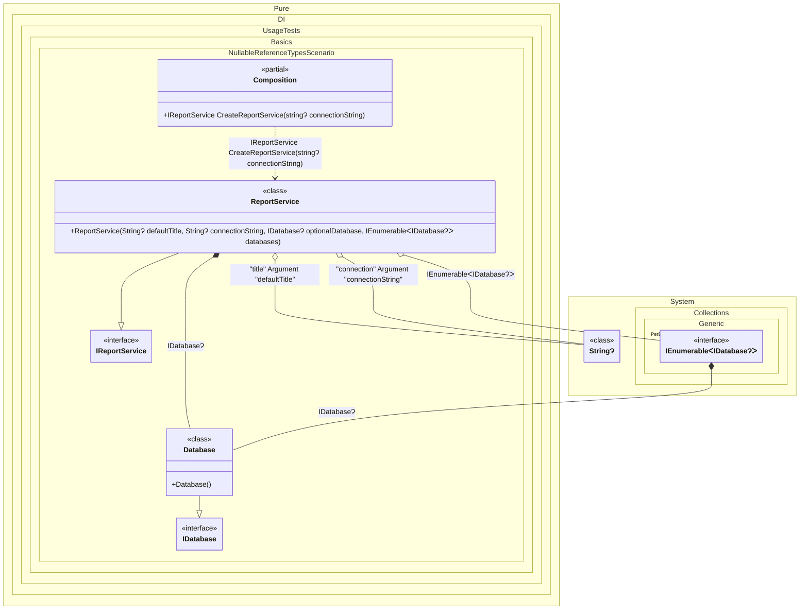

#### Nullable reference types

Pure.DI preserves nullable reference type annotations when it reads dependency contracts, builds the graph, and generates composition members.
Use nullable dependencies for values that are allowed to be absent. A nullable root or composition argument does not get a generated null check, while a non-null reference argument still does.
A non-null binding can satisfy a nullable dependency request. This is useful for optional constructor parameters, nullable factory results, and nullable collection elements.
>[!TIP]
>`T?` means that the consumer can handle `null`; it does not mean that a missing binding is ignored. If no binding or auto-binding can provide the type, Pure.DI still reports the graph error.
>[!NOTE]
>When a nullable reference type is used as a generic argument, the generic type must allow nullable arguments. For example, prefer `where T : class?` over `where T : class` for contracts such as `IBox<string?>`; otherwise the C# compiler reports a nullable constraint warning before Pure.DI analyzes the graph.


```c#
using Shouldly;
using Pure.DI;
using System.Collections.Generic;
using System.Linq;

DI.Setup(nameof(Composition))
    .Hint(Hint.Resolve, "Off")
    .Bind<IDatabase>().To<Database>()
    .Bind<IReportService>().To<ReportService>()

    // Nullable composition argument: no generated null check
    .Arg<string?>("defaultTitle", "title")

    // Nullable root argument: no generated null check
    .RootArg<string?>("connectionString", "connection")

    // Composition root
    .Root<IReportService>("CreateReportService");

var composition = new Composition(defaultTitle: null);
var reportService = composition.CreateReportService(connectionString: null);

reportService.DefaultTitle.ShouldBeNull();
reportService.ConnectionString.ShouldBeNull();
reportService.OptionalDatabase.ShouldNotBeNull();
reportService.Databases.Count.ShouldBe(1);

interface IDatabase;

class Database : IDatabase;

interface IReportService
{
    string? DefaultTitle { get; }

    string? ConnectionString { get; }

    IDatabase? OptionalDatabase { get; }

    IReadOnlyList<IDatabase?> Databases { get; }
}

class ReportService(
    [Tag("title")] string? defaultTitle,
    [Tag("connection")] string? connectionString,
    IDatabase? optionalDatabase,
    IEnumerable<IDatabase?> databases)
    : IReportService
{
    public string? DefaultTitle { get; } = defaultTitle;

    public string? ConnectionString { get; } = connectionString;

    public IDatabase? OptionalDatabase { get; } = optionalDatabase;

    public IReadOnlyList<IDatabase?> Databases { get; } = databases.ToList();
}
```

<details>
<summary>Running this code sample locally</summary>

- Make sure you have the [.NET SDK 10.0](https://dotnet.microsoft.com/en-us/download/dotnet/10.0) or later installed
```bash
dotnet --list-sdk
```
- Create a net10.0 (or later) console application
```bash
dotnet new console -n Sample
```
- Add references to the NuGet packages
  - [Pure.DI](https://www.nuget.org/packages/Pure.DI)
  - [Shouldly](https://www.nuget.org/packages/Shouldly)
```bash
dotnet add package Pure.DI
dotnet add package Shouldly
```
- Copy the example code into the _Program.cs_ file

You are ready to run the example 🚀
```bash
dotnet run
```

</details>

Limitations: nullable annotations describe compile-time contracts. They are not runtime validation rules and do not replace explicit domain validation.
Common pitfalls:
- Using `T?` to hide a missing binding instead of modelling an optional value.
- Forgetting tags for nullable primitive values when several values of the same type exist.
- Assuming `IEnumerable<T?>` changes the lifetime of elements; lifetime still comes from the matched bindings.
- Declaring generic contracts with `where T : class` and then consuming them as `T?`; use a nullable-aware constraint such as `where T : class?` when nullable generic arguments are valid.
See also: [Composition arguments](composition-arguments.md), [Root arguments](root-arguments.md), [Injection on demand](injection-on-demand.md).

The following partial class will be generated:

```c#
partial class Composition
{
  private readonly string? _argDefaultTitle;

  [OrdinalAttribute(128)]
  public Composition(string? defaultTitle)
  {
    _argDefaultTitle = defaultTitle;
  }

  [MethodImpl(MethodImplOptions.AggressiveInlining)]
  public IReportService CreateReportService(string? connectionString)
  {
    [MethodImpl(MethodImplOptions.AggressiveInlining)]
    IEnumerable<IDatabase?> EnumerationOf_perBlockIEnumerable313()
    {
      yield return new Database();
    }

    return new ReportService(_argDefaultTitle, connectionString, new Database(), EnumerationOf_perBlockIEnumerable313());
  }
}
```

Class diagram:



