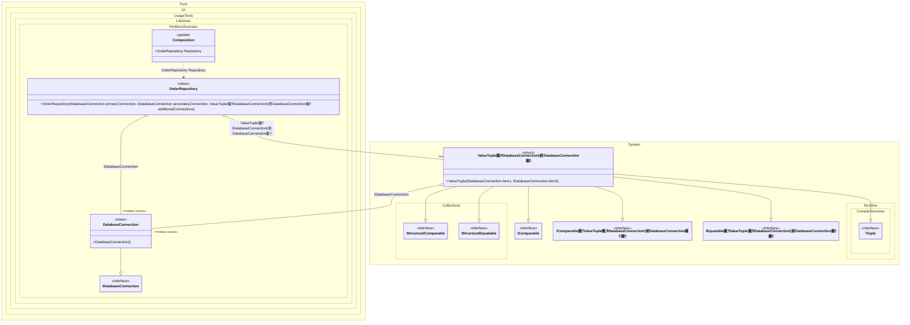

#### PerBlock

The _PerBlock_ lifetime does not guarantee that there will be a single dependency instance for each instance of the composition root (as for the _PerResolve_ lifetime), but is useful for reducing the number of instances of a type.
When this occurs: you need this feature while building the composition and calling roots.
What it solves: provides a clear setup pattern and expected behavior without extra boilerplate or manual wiring.
How it is solved in the example: shows the minimal DI configuration and how the result is used in code.


```c#
using Shouldly;
using Pure.DI;
using static Pure.DI.Lifetime;

DI.Setup(nameof(Composition))
    // Bind DatabaseConnection with PerBlock lifetime:
    // Ensures a single connection per composition root (e.g., per user request),
    // but a new one for each new root - useful for batch operations without full singleton overhead.
    .Bind().As(PerBlock).To<DatabaseConnection>()
    // Bind a tuple of two connections as Singleton:
    // This shares the same connection globally, simulating a cached or shared resource.
    .Bind().As(Singleton).To<(IDatabaseConnection conn3, IDatabaseConnection conn4)>()

    // Composition root - represents the main service entry point.
    .Root<OrderRepository>("Repository");

var composition = new Composition();

// Simulate the first user request or batch operation
var repository1 = composition.Repository;
repository1.ProcessOrder("ORD-2025-54546");

// Check that within one repository (one block), connections are shared for consistency
repository1.PrimaryConnection.ShouldBe(repository1.SecondaryConnection);
repository1.OtherConnection.ShouldBe(repository1.FallbackConnection);
repository1.PrimaryConnection.ShouldBe(repository1.OtherConnection);

// Simulate the second user request or batch - should have a new PerBlock connection
var repository2 = composition.Repository;
repository2.PrimaryConnection.ShouldNotBe(repository1.PrimaryConnection);

// Interface for database connection - in a real world, this could handle SQL queries
interface IDatabaseConnection;

// Implementation of database connection - transient-like but controlled by lifetime
class DatabaseConnection : IDatabaseConnection;

// Repository for handling orders, injecting multiple connections for demonstration
// In real-world, this could process orders in a batch, sharing connection within the batch
class OrderRepository(
    IDatabaseConnection primaryConnection,
    IDatabaseConnection secondaryConnection,
    (IDatabaseConnection otherConnection, IDatabaseConnection fallbackConnection) additionalConnections)
{
    // Public properties for connections - in practice, these would be private and used in methods
    public IDatabaseConnection PrimaryConnection { get; } = primaryConnection;

    public IDatabaseConnection SecondaryConnection { get; } = secondaryConnection;

    public IDatabaseConnection OtherConnection { get; } = additionalConnections.otherConnection;

    public IDatabaseConnection FallbackConnection { get; } = additionalConnections.fallbackConnection;

    // Example real-world method: Process an order using the shared connection
    public void ProcessOrder(string orderId)
    {
        // Use PrimaryConnection to query database, e.g.,
        // "SELECT * FROM Orders WHERE Id = @orderId"
    }
}
```

<details>
<summary>Running this code sample locally</summary>

- Make sure you have the [.NET SDK 10.0](https://dotnet.microsoft.com/en-us/download/dotnet/10.0) or later installed
```bash
dotnet --list-sdk
```
- Create a net10.0 (or later) console application
```bash
dotnet new console -n Sample
```
- Add references to the NuGet packages
  - [Pure.DI](https://www.nuget.org/packages/Pure.DI)
  - [Shouldly](https://www.nuget.org/packages/Shouldly)
```bash
dotnet add package Pure.DI
dotnet add package Shouldly
```
- Copy the example code into the _Program.cs_ file

You are ready to run the example 🚀
```bash
dotnet run
```

</details>

What it shows:
- Demonstrates the scenario setup and resulting object graph in Pure.DI.

Important points:
- Highlights the key configuration choices and their effect on resolution.

Useful when:
- You want a concrete template for applying this feature in a composition.


The following partial class will be generated:

```c#
partial class Composition
{
#if NET9_0_OR_GREATER
  private readonly Lock _lock = new Lock();
#else
  private readonly Object _lock = new Object();
#endif

  private (IDatabaseConnection conn3, IDatabaseConnection conn4) _singletonValueTuple54;
  private bool _singletonValueTuple54Created;

  public OrderRepository Repository
  {
    [MethodImpl(MethodImplOptions.AggressiveInlining)]
    get
    {
      var perBlockDatabaseConnection531 = new DatabaseConnection();
      if (!_singletonValueTuple54Created)
        lock (_lock)
          if (!_singletonValueTuple54Created)
          {
            _singletonValueTuple54 = (perBlockDatabaseConnection531, perBlockDatabaseConnection531);
            Thread.MemoryBarrier();
            _singletonValueTuple54Created = true;
          }

      return new OrderRepository(perBlockDatabaseConnection531, perBlockDatabaseConnection531, _singletonValueTuple54);
    }
  }
}
```

Class diagram:



