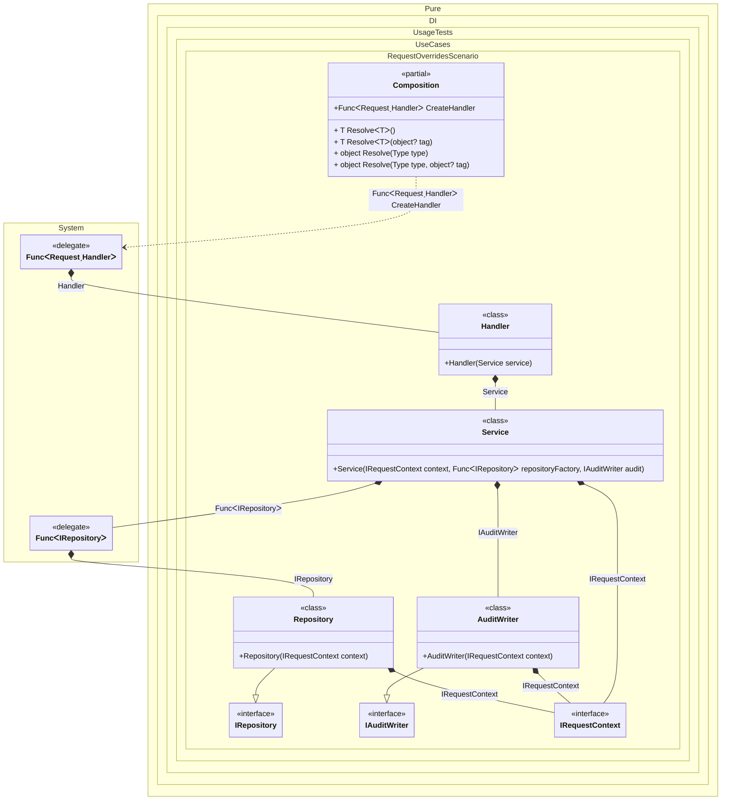

#### Request overrides

When this occurs: you need per-request overrides with different scopes for nested services.
What it solves: applies request data to the main workflow while keeping background or system dependencies isolated.
How it is solved in the example: uses nested factories and overrides to select the nearest context.


```c#
using Pure.DI;

var composition = new Composition();

var handler = composition.CreateHandler(new Request("tenant-a", "user-1"));

record Request(string TenantId, string UserId);

interface IRequestContext
{
    string TenantId { get; }

    string UserId { get; }

    bool IsSystem { get; }
}

class RequestContext(string tenantId, string userId, bool isSystem) : IRequestContext
{
    public static RequestContext System => new("system", "system", true);

    public string TenantId { get; } = tenantId;

    public string UserId { get; } = userId;

    public bool IsSystem { get; } = isSystem;
}

interface IRepository
{
    IRequestContext Context { get; }
}

class Repository(IRequestContext context) : IRepository
{
    public IRequestContext Context { get; } = context;
}

interface IAuditWriter
{
    IRequestContext Context { get; }
}

class AuditWriter(IRequestContext context) : IAuditWriter
{
    public IRequestContext Context { get; } = context;
}

class Service(
    IRequestContext context,
    Func<IRepository> repositoryFactory,
    IAuditWriter audit)
{
    public IRequestContext Context { get; } = context;

    public IRepository Repository { get; } = repositoryFactory();

    public IAuditWriter Audit { get; } = audit;
}

class Handler(Service service)
{
    public Service Service { get; } = service;
}

partial class Composition
{
    private void Setup() =>

```

<details>
<summary>Running this code sample locally</summary>

- Make sure you have the [.NET SDK 10.0](https://dotnet.microsoft.com/en-us/download/dotnet/10.0) or later installed
```bash
dotnet --list-sdk
```
- Create a net10.0 (or later) console application
```bash
dotnet new console -n Sample
```
- Add a reference to the NuGet package
  - [Pure.DI](https://www.nuget.org/packages/Pure.DI)
```bash
dotnet add package Pure.DI
```
- Copy the example code into the _Program.cs_ file

You are ready to run the example 🚀
```bash
dotnet run
```

</details>

What it shows:
- Demonstrates override precedence across nested factories.
- Shows that the closest override wins for deeper dependencies.

Important points:
- Multiple overrides for the same type pick the nearest one in the graph.
- The last override on the same level wins.

Useful when:
- You handle multi-tenant requests and need system services to run under a system context.

The following partial class will be generated:

```c#
partial class Composition
{
#if NET9_0_OR_GREATER
  private readonly Lock _lock = new Lock();
#else
  private readonly Object _lock = new Object();
#endif

  public Func<Request, Handler> CreateHandler
  {
    [MethodImpl(MethodImplOptions.AggressiveInlining)]
    get
    {
      Func<Request, Handler> transientFunc595 = request =>
      {
        // Outer override applies to the request handler and its main workflow.
        IRequestContext overriddenIRequestContext6 = new RequestContext(request.TenantId, request.UserId, false);
        Func<IRepository> transientFunc599 =
        [MethodImpl(MethodImplOptions.AggressiveInlining)]
        () =>
        {
          // Inner override applies to repository dependencies only.
          IRequestContext overriddenIRequestContext6 = RequestContext.System;
          IRepository localRepository1 = new Repository(overriddenIRequestContext6);
          return localRepository1;
        };
        Handler localHandler1 = new Handler(new Service(overriddenIRequestContext6, transientFunc599, new AuditWriter(overriddenIRequestContext6)));
        return localHandler1;
      };
      return transientFunc595;
    }
  }

  [MethodImpl(MethodImplOptions.AggressiveInlining)]
  public T Resolve<T>()
  {
    return Resolver<T>.Value.Resolve(this);
  }

  [MethodImpl(MethodImplOptions.AggressiveInlining)]
  public T Resolve<T>(object? tag)
  {
    return Resolver<T>.Value.ResolveByTag(this, tag);
  }

  [MethodImpl(MethodImplOptions.AggressiveInlining)]
  public object Resolve(Type type)
  {
    #if NETCOREAPP3_0_OR_GREATER
    var index = (int)(_bucketSize * (((uint)type.TypeHandle.GetHashCode()) % 1));
    #else
    var index = (int)(_bucketSize * (((uint)RuntimeHelpers.GetHashCode(type)) % 1));
    #endif
    ref var pair = ref _buckets[index];
    return Object.ReferenceEquals(pair.Key, type) ? pair.Value.Resolve(this) : Resolve(type, index);
  }

  [MethodImpl(MethodImplOptions.NoInlining)]
  private object Resolve(Type type, int index)
  {
    var finish = index + _bucketSize;
    while (++index < finish)
    {
      ref var pair = ref _buckets[index];
      if (Object.ReferenceEquals(pair.Key, type))
      {
        return pair.Value.Resolve(this);
      }
    }

    throw new CannotResolveException($"{CannotResolveMessage} {OfTypeMessage} {type}.", type, null);
  }

  [MethodImpl(MethodImplOptions.AggressiveInlining)]
  public object Resolve(Type type, object? tag)
  {
    #if NETCOREAPP3_0_OR_GREATER
    var index = (int)(_bucketSize * (((uint)type.TypeHandle.GetHashCode()) % 1));
    #else
    var index = (int)(_bucketSize * (((uint)RuntimeHelpers.GetHashCode(type)) % 1));
    #endif
    ref var pair = ref _buckets[index];
    return Object.ReferenceEquals(pair.Key, type) ? pair.Value.ResolveByTag(this, tag) : Resolve(type, tag, index);
  }

  [MethodImpl(MethodImplOptions.NoInlining)]
  private object Resolve(Type type, object? tag, int index)
  {
    var finish = index + _bucketSize;
    while (++index < finish)
    {
      ref var pair = ref _buckets[index];
      if (Object.ReferenceEquals(pair.Key, type))
      {
        return pair.Value.ResolveByTag(this, tag);
      }
    }

    throw new CannotResolveException($"{CannotResolveMessage} \"{tag}\" {OfTypeMessage} {type}.", type, tag);
  }

  private readonly static uint _bucketSize;
  private readonly static Pair<IResolver<Composition, object>>[] _buckets;

  static Composition()
  {
    var valResolver_0000 = new Resolver_0000();
    Resolver<Func<Request, Handler>>.Value = valResolver_0000;
    _buckets = Buckets<IResolver<Composition, object>>.Create(
      1,
      out _bucketSize,
      new Pair<IResolver<Composition, object>>[1]
      {
         new Pair<IResolver<Composition, object>>(typeof(Func<Request, Handler>), valResolver_0000)
      });
  }

  private const string CannotResolveMessage = "Cannot resolve composition root ";
  private const string OfTypeMessage = "of type ";

  private class Resolver<T>: IResolver<Composition, T>
  {
    public static IResolver<Composition, T> Value = new Resolver<T>();

    public virtual T Resolve(Composition composite)
    {
      throw new CannotResolveException($"{CannotResolveMessage}{OfTypeMessage}{typeof(T)}.", typeof(T), null);
    }

    public virtual T ResolveByTag(Composition composite, object tag)
    {
      throw new CannotResolveException($"{CannotResolveMessage}\"{tag}\" {OfTypeMessage}{typeof(T)}.", typeof(T), tag);
    }
  }

  private sealed class Resolver_0000: Resolver<Func<Request, Handler>>
  {
    public override Func<Request, Handler> Resolve(Composition composition)
    {
      return composition.CreateHandler;
    }

    public override Func<Request, Handler> ResolveByTag(Composition composition, object tag)
    {
      switch (tag)
      {
        case null:
          return composition.CreateHandler;

        default:
          return base.ResolveByTag(composition, tag);
      }
    }
  }
}
```

Class diagram:



