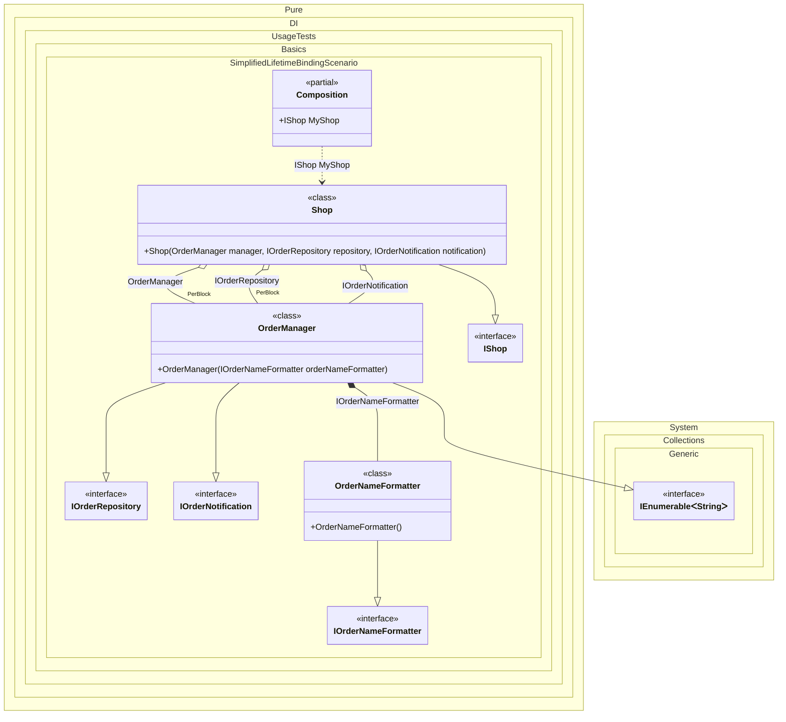

#### Simplified lifetime-specific bindings

You can use the `Transient<>()`, `Singleton<>()`, `PerResolve<>()`, etc. methods. In this case binding will be performed for the implementation type itself, and if the implementation is not an abstract type or structure, for all abstract but NOT special types that are directly implemented.
When this occurs: you need this feature while building the composition and calling roots.
What it solves: provides a clear setup pattern and expected behavior without extra boilerplate or manual wiring.
How it is solved in the example: shows the minimal DI configuration and how the result is used in code.


```c#
using System.Collections;
using Pure.DI;

// Specifies to create a partial class "Composition"
DI.Setup(nameof(Composition))
    // The equivalent of the following:
    // .Bind<IOrderRepository, IOrderNotification, OrderManager>()
    //   .As(Lifetime.PerBlock)
    //   .To<OrderManager>()
    .PerBlock<OrderManager>()
    // The equivalent of the following:
    // .Bind<IShop, Shop>()
    //   .As(Lifetime.Transient)
    //   .To<Shop>()
    // .Bind<IOrderNameFormatter, OrderNameFormatter>()
    //   .As(Lifetime.Transient)
    //   .To<OrderNameFormatter>()
    .Transient<Shop, OrderNameFormatter>()

    // Specifies to create a property "MyShop"
    .Root<IShop>("MyShop");

var composition = new Composition();
var shop = composition.MyShop;

interface IManager;

class ManagerBase : IManager;

interface IOrderRepository;

interface IOrderNotification;

class OrderManager(IOrderNameFormatter orderNameFormatter) :
    ManagerBase,
    IOrderRepository,
    IOrderNotification,
    IDisposable,
    IEnumerable<string>
{
    public void Dispose() {}

    public IEnumerator<string> GetEnumerator() =>
        new List<string>
        {
            orderNameFormatter.Format(1),
            orderNameFormatter.Format(2)
        }.GetEnumerator();

    IEnumerator IEnumerable.GetEnumerator() => GetEnumerator();
}

interface IOrderNameFormatter
{
    string Format(int orderId);
}

class OrderNameFormatter : IOrderNameFormatter
{
    public string Format(int orderId) => $"Order #{orderId}";
}

interface IShop;

class Shop(
    OrderManager manager,
    IOrderRepository repository,
    IOrderNotification notification)
    : IShop;
```

<details>
<summary>Running this code sample locally</summary>

- Make sure you have the [.NET SDK 10.0](https://dotnet.microsoft.com/en-us/download/dotnet/10.0) or later installed
```bash
dotnet --list-sdk
```
- Create a net10.0 (or later) console application
```bash
dotnet new console -n Sample
```
- Add a reference to the NuGet package
  - [Pure.DI](https://www.nuget.org/packages/Pure.DI)
```bash
dotnet add package Pure.DI
```
- Copy the example code into the _Program.cs_ file

You are ready to run the example 🚀
```bash
dotnet run
```

</details>

These methods perform the binding with appropriate lifetime:

- with the implementation type itself
- and if it is NOT an abstract type or structure
  - with all abstract types that it directly implements
  - exceptions are special types

Special types will not be added to bindings:

- `System.Object`
- `System.Enum`
- `System.MulticastDelegate`
- `System.Delegate`
- `System.Collections.IEnumerable`
- `System.Collections.Generic.IEnumerable<T>`
- `System.Collections.Generic.IList<T>`
- `System.Collections.Generic.ICollection<T>`
- `System.Collections.IEnumerator`
- `System.Collections.Generic.IEnumerator<T>`
- `System.Collections.Generic.IReadOnlyList<T>`
- `System.Collections.Generic.IReadOnlyCollection<T>`
- `System.IDisposable`
- `System.IAsyncResult`
- `System.AsyncCallback`

If you want to add your own special type, use the `SpecialType<T>()` call.

For class `OrderManager`, the `PerBlock<OrderManager>()` binding will be equivalent to the `Bind<IOrderRepository, IOrderNotification, OrderManager>().As(Lifetime.PerBlock).To<OrderManager>()` binding. The types `IDisposable`, `IEnumerable<string>` did not get into the binding because they are special from the list above. `ManagerBase` did not get into the binding because it is not abstract. `IManager` is not included because it is not implemented directly by class `OrderManager`.

|    |                       |                                                   |
|----|-----------------------|---------------------------------------------------|
| ✅ | `OrderManager`        | implementation type itself                        |
| ✅ | `IOrderRepository`    | directly implements                               |
| ✅ | `IOrderNotification`  | directly implements                               |
| ❌ | `IDisposable`         | special type                                      |
| ❌ | `IEnumerable<string>` | special type                                      |
| ❌ | `ManagerBase`         | non-abstract                                      |
| ❌ | `IManager`            | is not directly implemented by class OrderManager |
What it shows:
- Demonstrates the scenario setup and resulting object graph in Pure.DI.

Important points:
- Highlights the key configuration choices and their effect on resolution.

Useful when:
- You want a concrete template for applying this feature in a composition.


The following partial class will be generated:

```c#
partial class Composition
{
  public IShop MyShop
  {
    [MethodImpl(MethodImplOptions.AggressiveInlining)]
    get
    {
      var perBlockOrderManager315 = new OrderManager(new OrderNameFormatter());
      return new Shop(perBlockOrderManager315, perBlockOrderManager315, perBlockOrderManager315);
    }
  }
}
```

Class diagram:



