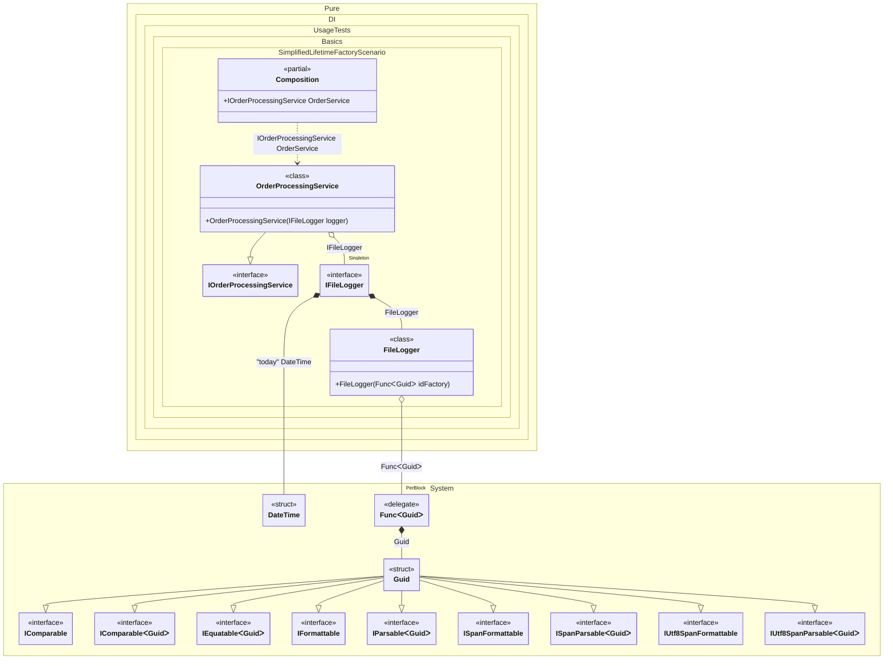

#### Simplified lifetime-specific factory

When this occurs: you need this feature while building the composition and calling roots.
What it solves: provides a clear setup pattern and expected behavior without extra boilerplate or manual wiring.
How it is solved in the example: shows the minimal DI configuration and how the result is used in code.


```c#
using Shouldly;
using Pure.DI;

DI.Setup(nameof(Composition))
    .Transient(Guid.NewGuid)
    .Transient(() => DateTime.Today, "today")
    // Injects FileLogger and DateTime instances
    // and performs further initialization logic
    // defined in the lambda function to set up the log file name
    .Singleton<FileLogger, DateTime, IFileLogger>((
        FileLogger logger,
        [Tag("today")] DateTime date) => {
        logger.Init($"app-{date:yyyy-MM-dd}.log");
        return logger;
    })
    .Transient<OrderProcessingService>()

    // Composition root
    .Root<IOrderProcessingService>("OrderService");

var composition = new Composition();
var service = composition.OrderService;

service.Logger.FileName.ShouldBe($"app-{DateTime.Today:yyyy-MM-dd}.log");

interface IFileLogger
{
    string FileName { get; }

    void Log(string message);
}

class FileLogger(Func<Guid> idFactory) : IFileLogger
{
    public string FileName { get; private set; } = "";

    public void Init(string fileName) => FileName = fileName;

    public void Log(string message)
    {
        var id = idFactory();
        // Write to file
    }
}

interface IOrderProcessingService
{
    IFileLogger Logger { get; }
}

class OrderProcessingService(IFileLogger logger) : IOrderProcessingService
{
    public IFileLogger Logger { get; } = logger;
}
```

<details>
<summary>Running this code sample locally</summary>

- Make sure you have the [.NET SDK 10.0](https://dotnet.microsoft.com/en-us/download/dotnet/10.0) or later installed
```bash
dotnet --list-sdk
```
- Create a net10.0 (or later) console application
```bash
dotnet new console -n Sample
```
- Add references to the NuGet packages
  - [Pure.DI](https://www.nuget.org/packages/Pure.DI)
  - [Shouldly](https://www.nuget.org/packages/Shouldly)
```bash
dotnet add package Pure.DI
dotnet add package Shouldly
```
- Copy the example code into the _Program.cs_ file

You are ready to run the example 🚀
```bash
dotnet run
```

</details>

What it shows:
- Demonstrates the scenario setup and resulting object graph in Pure.DI.

Important points:
- Highlights the key configuration choices and their effect on resolution.

Useful when:
- You want a concrete template for applying this feature in a composition.


The following partial class will be generated:

```c#
partial class Composition
{
#if NET9_0_OR_GREATER
  private readonly Lock _lock = new Lock();
#else
  private readonly Object _lock = new Object();
#endif

  private IFileLogger? _singletonIFileLogger53;

  public IOrderProcessingService OrderService
  {
    [MethodImpl(MethodImplOptions.AggressiveInlining)]
    get
    {
      if (_singletonIFileLogger53 is null)
        lock (_lock)
          if (_singletonIFileLogger53 is null)
          {
            Func<Guid> transientFunc325 = new Func<Guid>(
            [MethodImpl(MethodImplOptions.AggressiveInlining)]
            () =>
            {
              Guid transientGuid326 = Guid.NewGuid();
              Guid localValue19 = transientGuid326;
              return localValue19;
            });
            FileLogger localLogger5 = new FileLogger(transientFunc325);
            DateTime transientDateTime324 = DateTime.Today;
            DateTime localDate1 = transientDateTime324;
            localLogger5.Init($"app-{localDate1:yyyy-MM-dd}.log");
            _singletonIFileLogger53 = localLogger5;
          }

      return new OrderProcessingService(_singletonIFileLogger53);
    }
  }
}
```

Class diagram:



