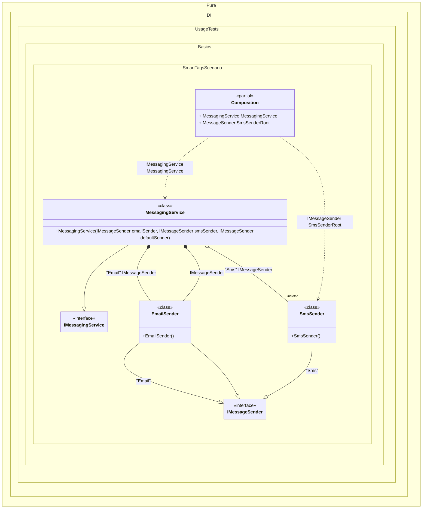

#### Smart tags

Large object graphs often need many tags. String tags are error-prone and easy to mistype. Prefer `Enum` values as tags, and Pure.DI helps make this safe.

When the compiler cannot determine a tag value, Pure.DI generates a constant inside `Pure.DI.Tag`. For the example below, the generated constants would look like this:

```c#
namespace Pure.DI
{
  internal partial class Tag
  {
    public const string Abc = "Abc";
    public const string Xyz = "Xyz";
  }
}
```
This enables safe refactoring and compiler-checked tag usage, reducing errors.


The example below also uses the `using static Pure.DI.Tag;` directive to access tags in `Pure.DI.Tag` without specifying a type name:


```c#
using Shouldly;
using Pure.DI;

using static Pure.DI.Tag;
using static Pure.DI.Lifetime;

DI.Setup(nameof(Composition))
    // The `default` tag is used to resolve dependencies
    // when the tag was not specified by the consumer
    .Bind<IMessageSender>(Email, default).To<EmailSender>()
    .Bind<IMessageSender>(Sms).As(Singleton).To<SmsSender>()
    .Bind<IMessagingService>().To<MessagingService>()

    // "SmsSenderRoot" is root name, Sms is tag
    .Root<IMessageSender>("SmsSenderRoot", Sms)

    // Specifies to create the composition root named "Root"
    .Root<IMessagingService>("MessagingService");

var composition = new Composition();
var messagingService = composition.MessagingService;
messagingService.EmailSender.ShouldBeOfType<EmailSender>();
messagingService.SmsSender.ShouldBeOfType<SmsSender>();
messagingService.SmsSender.ShouldBe(composition.SmsSenderRoot);
messagingService.DefaultSender.ShouldBeOfType<EmailSender>();

interface IMessageSender;

class EmailSender : IMessageSender;

class SmsSender : IMessageSender;

interface IMessagingService
{
    IMessageSender EmailSender { get; }

    IMessageSender SmsSender { get; }

    IMessageSender DefaultSender { get; }
}

class MessagingService(
    [Tag(Email)] IMessageSender emailSender,
    [Tag(Sms)] IMessageSender smsSender,
    IMessageSender defaultSender)
    : IMessagingService
{
    public IMessageSender EmailSender { get; } = emailSender;

    public IMessageSender SmsSender { get; } = smsSender;

    public IMessageSender DefaultSender { get; } = defaultSender;
}
```

<details>
<summary>Running this code sample locally</summary>

- Make sure you have the [.NET SDK 10.0](https://dotnet.microsoft.com/en-us/download/dotnet/10.0) or later installed
```bash
dotnet --list-sdk
```
- Create a net10.0 (or later) console application
```bash
dotnet new console -n Sample
```
- Add references to the NuGet packages
  - [Pure.DI](https://www.nuget.org/packages/Pure.DI)
  - [Shouldly](https://www.nuget.org/packages/Shouldly)
```bash
dotnet add package Pure.DI
dotnet add package Shouldly
```
- Copy the example code into the _Program.cs_ file

You are ready to run the example 🚀
```bash
dotnet run
```

</details>

The following partial class will be generated:

```c#
partial class Composition
{
#if NET9_0_OR_GREATER
  private readonly Lock _lock = new Lock();
#else
  private readonly Object _lock = new Object();
#endif

  private SmsSender? _singletonSmsSender52;

  public IMessageSender SmsSenderRoot
  {
    [MethodImpl(MethodImplOptions.AggressiveInlining)]
    get
    {
      EnsureSmsSenderSmsExists1();
      return _singletonSmsSender52;
      [MethodImpl(MethodImplOptions.AggressiveInlining)]
      void EnsureSmsSenderSmsExists1()
      {
        if (_singletonSmsSender52 is null)
          lock (_lock)
            if (_singletonSmsSender52 is null)
            {
              _singletonSmsSender52 = new SmsSender();
            }
      }
    }
  }

  public IMessagingService MessagingService
  {
    [MethodImpl(MethodImplOptions.AggressiveInlining)]
    get
    {
      EnsureSmsSenderSmsExists();
      return new MessagingService(new EmailSender(), _singletonSmsSender52, new EmailSender());
      [MethodImpl(MethodImplOptions.AggressiveInlining)]
      void EnsureSmsSenderSmsExists()
      {
        if (_singletonSmsSender52 is null)
          lock (_lock)
            if (_singletonSmsSender52 is null)
            {
              _singletonSmsSender52 = new SmsSender();
            }
      }
    }
  }
}
```

Class diagram:



