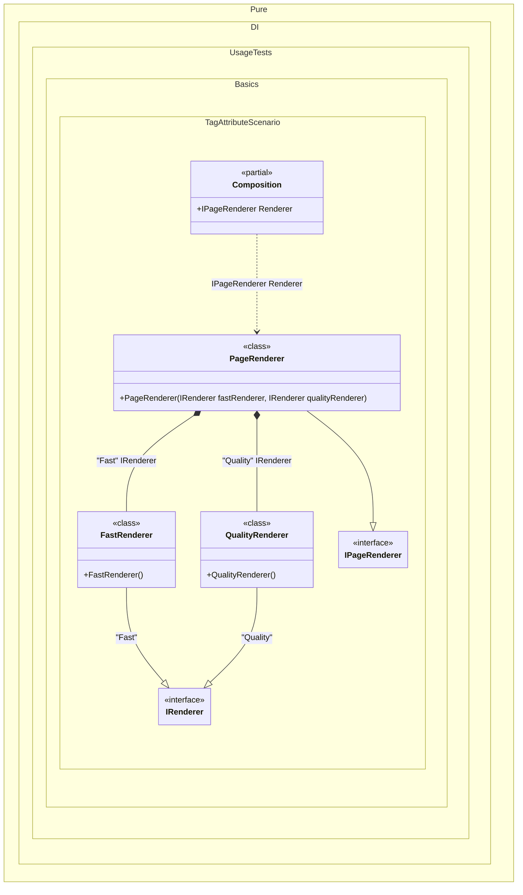

#### Tag attribute

Tags let you choose among multiple implementations of the same contract.
When this occurs: you need this feature while building the composition and calling roots.
What it solves: provides a clear setup pattern and expected behavior without extra boilerplate or manual wiring.
How it is solved in the example: shows the minimal DI configuration and how the result is used in code.


```c#
using Shouldly;
using Pure.DI;

DI.Setup(nameof(Composition))
    .Bind("Fast").To<FastRenderer>()
    .Bind("Quality").To<QualityRenderer>()
    .Bind().To<PageRenderer>()

    // Composition root
    .Root<IPageRenderer>("Renderer");

var composition = new Composition();
var pageRenderer = composition.Renderer;
pageRenderer.FastRenderer.ShouldBeOfType<FastRenderer>();
pageRenderer.QualityRenderer.ShouldBeOfType<QualityRenderer>();

interface IRenderer;

class FastRenderer : IRenderer;

class QualityRenderer : IRenderer;

interface IPageRenderer
{
    IRenderer FastRenderer { get; }

    IRenderer QualityRenderer { get; }
}

class PageRenderer(
    [Tag("Fast")] IRenderer fastRenderer,
    [Tag("Quality")] IRenderer qualityRenderer)
    : IPageRenderer
{
    public IRenderer FastRenderer { get; } = fastRenderer;

    public IRenderer QualityRenderer { get; } = qualityRenderer;
}
```

<details>
<summary>Running this code sample locally</summary>

- Make sure you have the [.NET SDK 10.0](https://dotnet.microsoft.com/en-us/download/dotnet/10.0) or later installed
```bash
dotnet --list-sdk
```
- Create a net10.0 (or later) console application
```bash
dotnet new console -n Sample
```
- Add references to the NuGet packages
  - [Pure.DI](https://www.nuget.org/packages/Pure.DI)
  - [Shouldly](https://www.nuget.org/packages/Shouldly)
```bash
dotnet add package Pure.DI
dotnet add package Shouldly
```
- Copy the example code into the _Program.cs_ file

You are ready to run the example 🚀
```bash
dotnet run
```

</details>

A tag can be a constant, a type, a [smart tag](smart-tags.md), or an enum value. The `Tag` attribute is part of the API, but you can define your own in any assembly or namespace.
What it shows:
- Demonstrates the scenario setup and resulting object graph in Pure.DI.

Important points:
- Highlights the key configuration choices and their effect on resolution.

Useful when:
- You want a concrete template for applying this feature in a composition.


The following partial class will be generated:

```c#
partial class Composition
{
  public IPageRenderer Renderer
  {
    [MethodImpl(MethodImplOptions.AggressiveInlining)]
    get
    {
      return new PageRenderer(new FastRenderer(), new QualityRenderer());
    }
  }
}
```

Class diagram:



