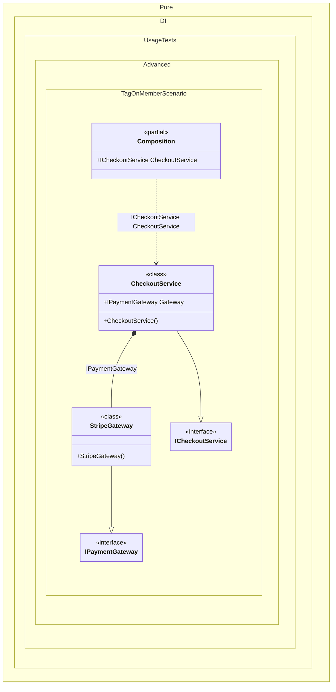

#### Tag on a member

The wildcards `*` and `?` are supported.
When this occurs: you need this feature while building the composition and calling roots.
What it solves: provides a clear setup pattern and expected behavior without extra boilerplate or manual wiring.
How it is solved in the example: shows the minimal DI configuration and how the result is used in code.


```c#
using Shouldly;
using Pure.DI;

DI.Setup(nameof(Composition))
    .Bind().To<PayPalGateway>()
    // Binds StripeGateway to the "Gateway" property of the "CheckoutService" class.
    // This lets you override the injected dependency for a specific member
    // without changing the class definition.
    .Bind(Tag.OnMember<CheckoutService>(nameof(CheckoutService.Gateway)))
    .To<StripeGateway>()
    .Bind<ICheckoutService>().To<CheckoutService>()

    // Specifies to create the composition root named "Root"
    .Root<ICheckoutService>("CheckoutService");

var composition = new Composition();
var checkoutService = composition.CheckoutService;

// Checks that the property was injected with the specific implementation
checkoutService.Gateway.ShouldBeOfType<StripeGateway>();

interface IPaymentGateway;

class PayPalGateway : IPaymentGateway;

class StripeGateway : IPaymentGateway;

interface ICheckoutService
{
    IPaymentGateway Gateway { get; }
}

class CheckoutService : ICheckoutService
{
    public required IPaymentGateway Gateway { init; get; }
}
```

<details>
<summary>Running this code sample locally</summary>

- Make sure you have the [.NET SDK 10.0](https://dotnet.microsoft.com/en-us/download/dotnet/10.0) or later installed
```bash
dotnet --list-sdk
```
- Create a net10.0 (or later) console application
```bash
dotnet new console -n Sample
```
- Add references to the NuGet packages
  - [Pure.DI](https://www.nuget.org/packages/Pure.DI)
  - [Shouldly](https://www.nuget.org/packages/Shouldly)
```bash
dotnet add package Pure.DI
dotnet add package Shouldly
```
- Copy the example code into the _Program.cs_ file

You are ready to run the example 🚀
```bash
dotnet run
```

</details>

> [!WARNING]
> Each potentially injectable argument, property, or field contains an additional tag. This tag can be used to specify what can be injected there. This will only work if the binding type and the tag match. So while this approach can be useful for specifying what to enter, it can be more expensive to maintain and less reliable, so it is recommended to use attributes like `[Tag(...)]` instead.
What it shows:
- Demonstrates the scenario setup and resulting object graph in Pure.DI.

Important points:
- Highlights the key configuration choices and their effect on resolution.

Useful when:
- You want a concrete template for applying this feature in a composition.


The following partial class will be generated:

```c#
partial class Composition
{
  public ICheckoutService CheckoutService
  {
    [MethodImpl(MethodImplOptions.AggressiveInlining)]
    get
    {
      return new CheckoutService()
      {
        Gateway = new StripeGateway()
      };
    }
  }
}
```

Class diagram:



