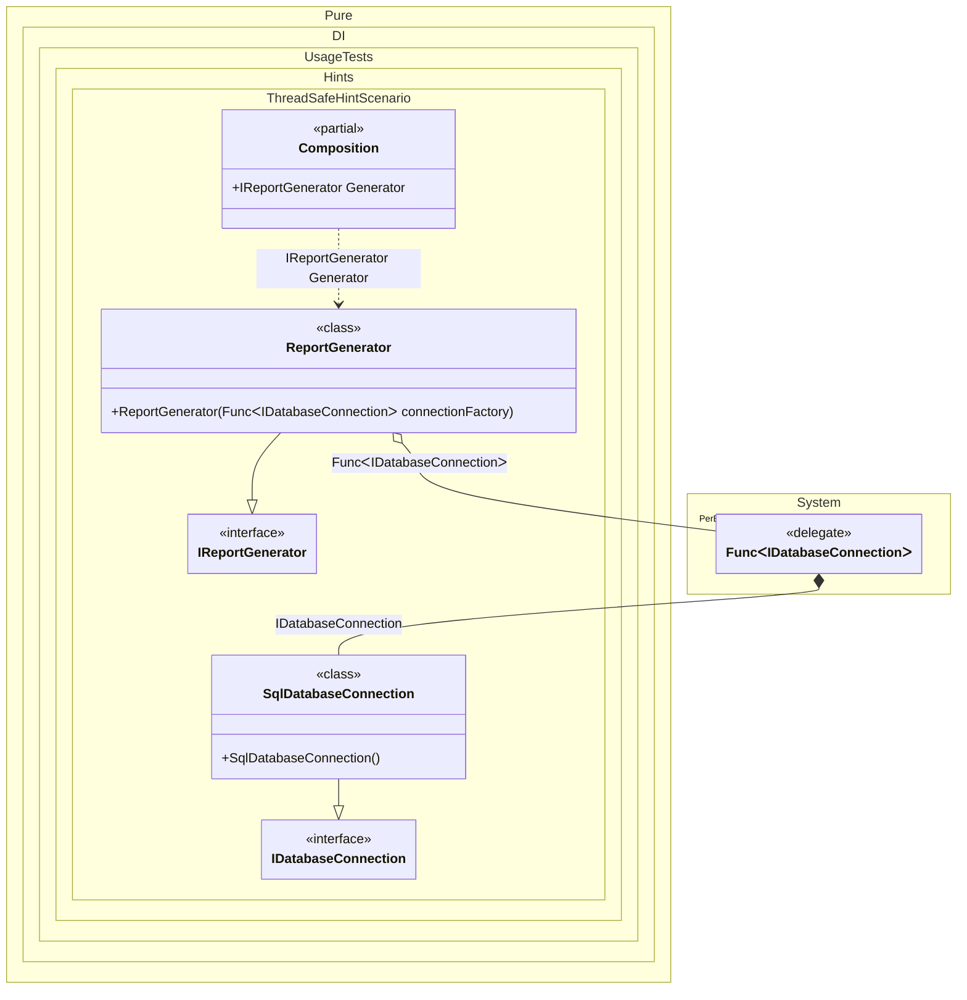

#### ThreadSafe hint

Hints are used to fine-tune code generation. The _ThreadSafe_ hint determines whether object composition will be created in a thread-safe manner. This hint is _On_ by default. It is good practice not to use threads when creating an object graph, in which case this hint can be turned off, which will lead to a slight increase in performance.
In addition, setup hints can be comments before the _Setup_ method in the form ```hint = value```, for example: `// ThreadSafe = Off`.


```c#
using Pure.DI;
using static Pure.DI.Hint;

DI.Setup(nameof(Composition))
    // Disabling thread-safety can improve performance.
    // This is safe when the object graph is resolved on a single thread,
    // for example at application startup.
    .Hint(ThreadSafe, "Off")
    .Bind().To<SqlDatabaseConnection>()
    .Bind().As(Lifetime.Singleton).To<ReportGenerator>()
    .Root<IReportGenerator>("Generator");

var composition = new Composition();
var reportGenerator = composition.Generator;

interface IDatabaseConnection;

class SqlDatabaseConnection : IDatabaseConnection;

interface IReportGenerator;

class ReportGenerator(Func<IDatabaseConnection> connectionFactory) : IReportGenerator;
```

<details>
<summary>Running this code sample locally</summary>

- Make sure you have the [.NET SDK 10.0](https://dotnet.microsoft.com/en-us/download/dotnet/10.0) or later installed
```bash
dotnet --list-sdk
```
- Create a net10.0 (or later) console application
```bash
dotnet new console -n Sample
```
- Add a reference to the NuGet package
  - [Pure.DI](https://www.nuget.org/packages/Pure.DI)
```bash
dotnet add package Pure.DI
```
- Copy the example code into the _Program.cs_ file

You are ready to run the example 🚀
```bash
dotnet run
```

</details>

For more hints, see [this](README.md#setup-hints) page.

The following partial class will be generated:

```c#
partial class Composition
{

  private ReportGenerator? _singletonReportGenerator52;

  public IReportGenerator Generator
  {
    [MethodImpl(MethodImplOptions.AggressiveInlining)]
    get
    {
      if (_singletonReportGenerator52 is null)
      {
        Func<IDatabaseConnection> transientFunc484 = new Func<IDatabaseConnection>(
        [MethodImpl(MethodImplOptions.AggressiveInlining)]
        () =>
        {
          IDatabaseConnection localValue31 = new SqlDatabaseConnection();
          return localValue31;
        });
        _singletonReportGenerator52 = new ReportGenerator(transientFunc484);
      }

      return _singletonReportGenerator52;
    }
  }
}
```

Class diagram:



