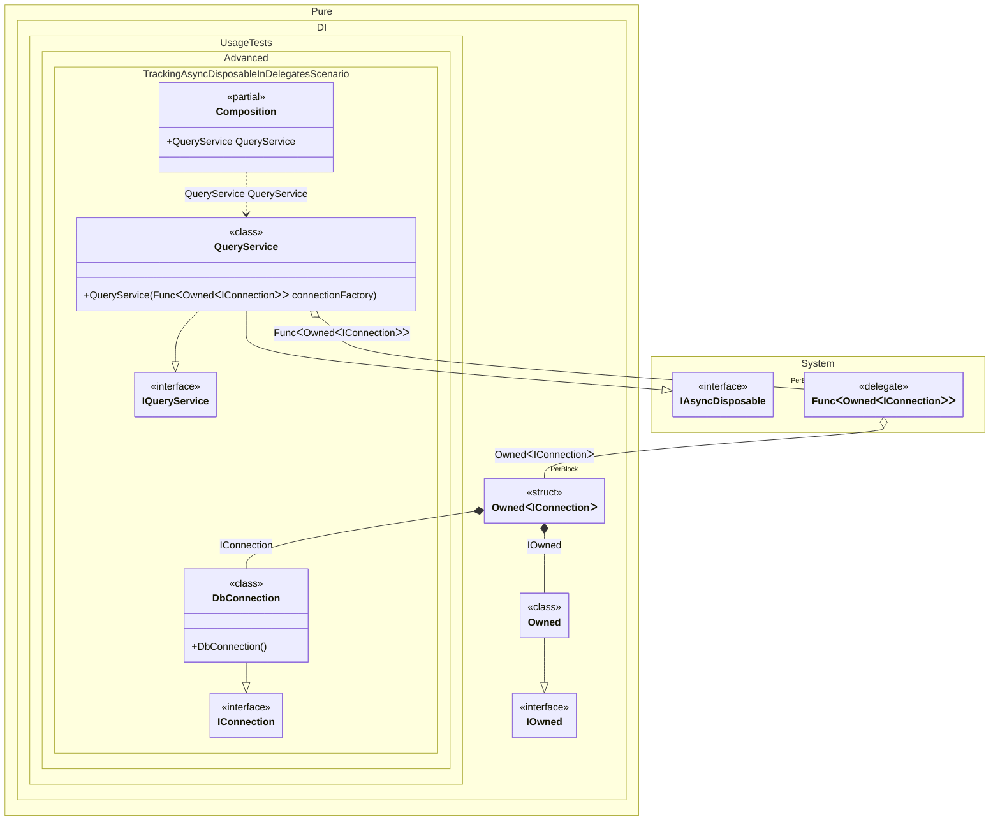

#### Tracking async disposable instances in delegates

Demonstrates how async disposable instances created within delegate factories are tracked and disposed properly when the composition is disposed.


```c#
using Shouldly;
using Pure.DI;

var composition = new Composition();
var queryService1 = composition.QueryService;
var queryService2 = composition.QueryService;

await queryService2.DisposeAsync();

// Checks that the disposable instances
// associated with queryService2 have been disposed of
queryService2.Connection.IsDisposed.ShouldBeTrue();

// Checks that the disposable instances
// associated with queryService1 have not been disposed of
queryService1.Connection.IsDisposed.ShouldBeFalse();

await queryService1.DisposeAsync();

// Checks that the disposable instances
// associated with queryService1 have been disposed of
queryService1.Connection.IsDisposed.ShouldBeTrue();

interface IConnection
{
    bool IsDisposed { get; }
}

class DbConnection : IConnection, IAsyncDisposable
{
    public bool IsDisposed { get; private set; }

    public ValueTask DisposeAsync()
    {
        IsDisposed = true;
        return ValueTask.CompletedTask;
    }
}

interface IQueryService
{
    public IConnection Connection { get; }
}

class QueryService(Func<Owned<IConnection>> connectionFactory)
    : IQueryService, IAsyncDisposable
{
    // The Owned<T> generic type lets you manage the lifetime of a dependency
    // explicitly. In this case, the QueryService creates the connection
    // using a factory and takes ownership of it.
    private readonly Owned<IConnection> _connection = connectionFactory();

    public IConnection Connection => _connection.Value;

    public ValueTask DisposeAsync()
    {
        // When the service is disposed, it also disposes of the connection it owns
        return _connection.DisposeAsync();
    }
}

partial class Composition
{
    static void Setup() =>

        DI.Setup()
            .Bind<IConnection>().To<DbConnection>()
            .Bind().To<QueryService>()

            // Composition root
            .Root<QueryService>("QueryService");
}
```

<details>
<summary>Running this code sample locally</summary>

- Make sure you have the [.NET SDK 10.0](https://dotnet.microsoft.com/en-us/download/dotnet/10.0) or later installed
```bash
dotnet --list-sdk
```
- Create a net10.0 (or later) console application
```bash
dotnet new console -n Sample
```
- Add references to the NuGet packages
  - [Pure.DI](https://www.nuget.org/packages/Pure.DI)
  - [Shouldly](https://www.nuget.org/packages/Shouldly)
```bash
dotnet add package Pure.DI
dotnet add package Shouldly
```
- Copy the example code into the _Program.cs_ file

You are ready to run the example 🚀
```bash
dotnet run
```

</details>

>[!NOTE]
>Async disposable tracking in delegates ensures proper async cleanup even when instances are created dynamically through factory delegates.

The following partial class will be generated:

```c#
partial class Composition
{
#if NET9_0_OR_GREATER
  private readonly Lock _lock = new Lock();
#else
  private readonly Object _lock = new Object();
#endif

  public QueryService QueryService
  {
    [MethodImpl(MethodImplOptions.AggressiveInlining)]
    get
    {
      var perBlockOwned126 = new Owned();
      Func<Owned<IConnection>> transientFunc125 = new Func<Owned<IConnection>>(
      [MethodImpl(MethodImplOptions.AggressiveInlining)]
      () =>
      {
        Owned<IConnection> transientOwned127;
        // Creates the owner of an instance
        Owned transientOwned128;
        Owned localOwned1 = perBlockOwned126;
        transientOwned128 = localOwned1;
        lock (_lock)
        {
          perBlockOwned126.Add(transientOwned128);
        }

        IOwned localOwned = transientOwned128;
        var transientDbConnection129 = new DbConnection();
        lock (_lock)
        {
          perBlockOwned126.Add(transientDbConnection129);
        }

        IConnection localValue2 = transientDbConnection129;
        transientOwned127 = new Owned<IConnection>(localValue2, localOwned);
        lock (_lock)
        {
          perBlockOwned126.Add(transientOwned127);
        }

        return transientOwned127;
      });
      return new QueryService(transientFunc125);
    }
  }
}
```

Class diagram:



