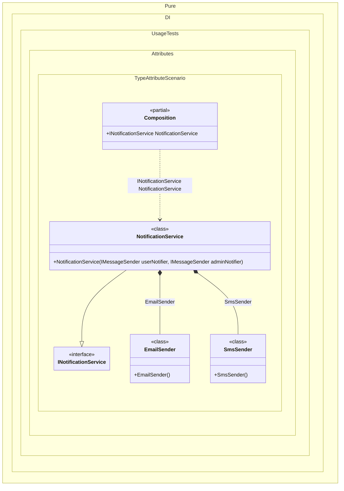

#### Type attribute

Use the `Type` attribute to force a specific injected type, overriding the inferred type from the parameter or member.
When this occurs: you need this feature while building the composition and calling roots.
What it solves: provides a clear setup pattern and expected behavior without extra boilerplate or manual wiring.
How it is solved in the example: shows the minimal DI configuration and how the result is used in code.


```c#
using Shouldly;
using Pure.DI;

DI.Setup(nameof(Composition))
    .Bind().To<NotificationService>()

    // Composition root
    .Root<INotificationService>("NotificationService");

var composition = new Composition();
var notificationService = composition.NotificationService;
notificationService.UserNotifier.ShouldBeOfType<EmailSender>();
notificationService.AdminNotifier.ShouldBeOfType<SmsSender>();

interface IMessageSender;

class EmailSender : IMessageSender;

class SmsSender : IMessageSender;

interface INotificationService
{
    IMessageSender UserNotifier { get; }

    IMessageSender AdminNotifier { get; }
}

class NotificationService(
    // The [Type] attribute forces the injection of a specific type,
    // overriding the default resolution behavior.
    [Type(typeof(EmailSender))] IMessageSender userNotifier,
    [Type(typeof(SmsSender))] IMessageSender adminNotifier)
    : INotificationService
{
    public IMessageSender UserNotifier { get; } = userNotifier;

    public IMessageSender AdminNotifier { get; } = adminNotifier;
}
```

<details>
<summary>Running this code sample locally</summary>

- Make sure you have the [.NET SDK 10.0](https://dotnet.microsoft.com/en-us/download/dotnet/10.0) or later installed
```bash
dotnet --list-sdk
```
- Create a net10.0 (or later) console application
```bash
dotnet new console -n Sample
```
- Add references to the NuGet packages
  - [Pure.DI](https://www.nuget.org/packages/Pure.DI)
  - [Shouldly](https://www.nuget.org/packages/Shouldly)
```bash
dotnet add package Pure.DI
dotnet add package Shouldly
```
- Copy the example code into the _Program.cs_ file

You are ready to run the example 🚀
```bash
dotnet run
```

</details>

The `Type` attribute is part of the API, but you can define your own in any assembly or namespace.
What it shows:
- Demonstrates the scenario setup and resulting object graph in Pure.DI.

Important points:
- Highlights the key configuration choices and their effect on resolution.

Useful when:
- You want a concrete template for applying this feature in a composition.


The following partial class will be generated:

```c#
partial class Composition
{
  public INotificationService NotificationService
  {
    [MethodImpl(MethodImplOptions.AggressiveInlining)]
    get
    {
      return new NotificationService(new EmailSender(), new SmsSender());
    }
  }
}
```

Class diagram:



