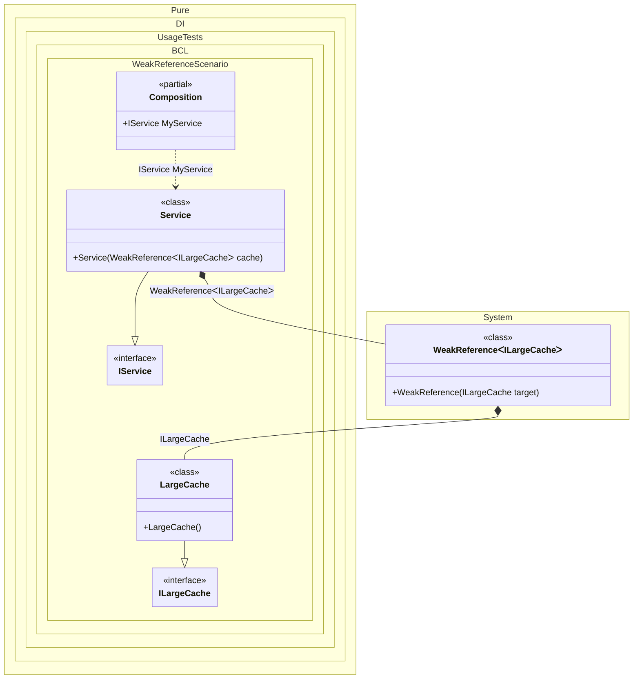

#### Weak Reference

When this occurs: you need this feature while building the composition and calling roots.
What it solves: provides a clear setup pattern and expected behavior without extra boilerplate or manual wiring.
How it is solved in the example: shows the minimal DI configuration and how the result is used in code.


```c#
using Pure.DI;

DI.Setup(nameof(Composition))
    .Bind<ILargeCache>().To<LargeCache>()
    .Bind<IService>().To<Service>()

    // Composition root
    .Root<IService>("MyService");

var composition = new Composition();
var service = composition.MyService;

// Represents a large memory object (e.g., a cache of images or large datasets)
interface ILargeCache;

class LargeCache : ILargeCache;

interface IService;

class Service(WeakReference<ILargeCache> cache) : IService
{
    public ILargeCache? Cache =>
        // Tries to retrieve the target object from the WeakReference.
        // If the object has been collected by the GC, it returns null.
        cache.TryGetTarget(out var value)
            ? value
            : null;
}
```

<details>
<summary>Running this code sample locally</summary>

- Make sure you have the [.NET SDK 10.0](https://dotnet.microsoft.com/en-us/download/dotnet/10.0) or later installed
```bash
dotnet --list-sdk
```
- Create a net10.0 (or later) console application
```bash
dotnet new console -n Sample
```
- Add a reference to the NuGet package
  - [Pure.DI](https://www.nuget.org/packages/Pure.DI)
```bash
dotnet add package Pure.DI
```
- Copy the example code into the _Program.cs_ file

You are ready to run the example 🚀
```bash
dotnet run
```

</details>

What it shows:
- Demonstrates the scenario setup and resulting object graph in Pure.DI.

Important points:
- Highlights the key configuration choices and their effect on resolution.

Useful when:
- You want a concrete template for applying this feature in a composition.


The following partial class will be generated:

```c#
partial class Composition
{
  public IService MyService
  {
    [MethodImpl(MethodImplOptions.AggressiveInlining)]
    get
    {
      return new Service(new WeakReference<ILargeCache>(new LargeCache()));
    }
  }
}
```

Class diagram:



